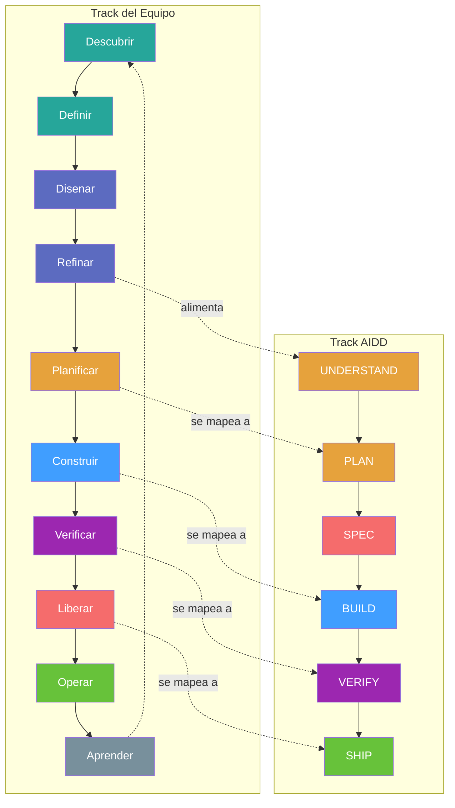

# Flujo de Trabajo SDLC — Ciclo de Vida Completo del Equipo

> Desde el descubrimiento del producto hasta el monitoreo en produccion — el Ciclo de Vida de Desarrollo de Software completo potenciado con AIDD.

**Ultima Actualizacion**: 2026-02-19
**Estado**: Documento Vivo

---

## Tabla de Contenidos

1. [Vision General](#1-vision-general)
2. [Roles del Equipo](#2-roles-del-equipo)
3. [Fases del Ciclo de Vida](#3-fases-del-ciclo-de-vida)
4. [Fase 1: Descubrir](#4-fase-1-descubrir)
5. [Fase 2: Definir](#5-fase-2-definir)
6. [Fase 3: Disenar](#6-fase-3-disenar)
7. [Fase 4: Refinar](#7-fase-4-refinar)
8. [Fase 5: Planificar](#8-fase-5-planificar)
9. [Fase 6: Construir](#9-fase-6-construir)
10. [Fase 7: Verificar](#10-fase-7-verificar)
11. [Fase 8: Liberar](#11-fase-8-liberar)
12. [Fase 9: Operar](#12-fase-9-operar)
13. [Fase 10: Aprender](#13-fase-10-aprender)
14. [Metricas y KPIs](#14-metricas-y-kpis)
15. [Gestion de Deuda Tecnica](#15-gestion-de-deuda-tecnica)
16. [Referencias Cruzadas](#16-referencias-cruzadas)

---

## 1. Vision General

Este documento describe el Ciclo de Vida de Desarrollo de Software (SDLC) completo para equipos que usan principios Agile con AIDD (AI-Driven Development). Cubre el camino completo desde el descubrimiento del producto hasta las operaciones en produccion, integrando los flujos de trabajo del equipo humano con las fases de desarrollo asistidas por IA.

**Audiencia**: Product Owners, Facilitadores, Desarrolladores, Ingenieros QA, Disenadores UX, Ingenieros DevOps — todos los involucrados en el ciclo de vida del producto.

**Filosofia Agile**: Esta guia es agnostica en cuanto a metodologia. Describe principios y ceremonias que funcionan con Scrum, Kanban, SAFe o cualquier enfoque basado en iteraciones. Adapta la duracion de la iteracion, frecuencia de ceremonias y nombres de roles al contexto de tu equipo.

**Relacion con WORKFLOW.md**: [`WORKFLOW.md`](WORKFLOW.md) describe el pipeline del asistente de IA (Brainstorm → Plan → Execute → Test → Review → Ship). Este documento lo envuelve, cubriendo el ciclo de vida completo del equipo que rodea y alimenta esas sesiones de desarrollo asistido por IA.

### Ciclo de Vida en un Vistazo


### Mapeo SDLC-AIDD

| Fase SDLC  | Equivalente AIDD                    | Integracion                                    |
| ---------- | ----------------------------------- | ---------------------------------------------- |
| Descubrir  | —                                   | Solo equipo: descubrimiento de producto        |
| Definir    | —                                   | Solo equipo: estrategia y backlog              |
| Diseñar    | Full-stack-feature etapas 1-4       | Arquitectura y UX asistida por IA              |
| Refinar    | Product workflow (Spec/Gherkin/DoR) | Especificacion asistida por IA                 |
| Planificar | UNDERSTAND + PLAN                   | Descomposicion asistida por IA                 |
| Construir  | SPEC + BUILD                        | Implementacion asistida por IA                 |
| Verificar  | VERIFY                              | Testing asistido por IA                        |
| Liberar    | SHIP + pipeline de despliegue       | Commit asistido por IA + despliegue del equipo |
| Operar     | —                                   | Solo equipo: operaciones en produccion         |
| Aprender   | Memory layer + retro artifact       | La memoria de IA informa futuras sesiones      |

---

## 2. Roles del Equipo

### Mapeo de Roles a Agentes

Los roles tradicionales del equipo se mapean a los agentes equivalentes de AIDD. Los agentes de IA potencian los roles humanos — no los reemplazan.

| Rol                    | Responsabilidades                                                     | Agente AIDD                                    |
| ---------------------- | --------------------------------------------------------------------- | ---------------------------------------------- |
| Product Owner          | Vision, backlog, prioridades, criterios de aceptacion                 | Master Orchestrator (clasificacion de entrada) |
| Facilitador            | Proceso, ceremonias, bloqueos, salud del equipo                       | Orchestrator (cumplimiento del pipeline)       |
| Desarrollador          | Implementacion, revision de codigo, decisiones tecnicas               | Fullstack Agent, Interface Artisan             |
| Ingeniero QA           | Estrategia de pruebas, automatizacion, cobertura, UAT                 | Quality Engineer                               |
| Disenador UX           | Investigacion de usuarios, wireframes, usabilidad, sistemas de diseno | Design Architect, Experience Engineer          |
| Ingeniero de Seguridad | Modelado de amenazas, auditorias, cumplimiento                        | Security Architect                             |
| Ingeniero DevOps       | CI/CD, infraestructura, monitoreo, despliegues                        | Platform Engineer                              |

### Matriz RACI

**R** = Responsable, **A** = Accountable (Rinde cuentas), **C** = Consultado, **I** = Informado

| Fase       | PO      | Facilitador | Desarrollador | QA      | UX      | DevOps  |
| ---------- | ------- | ----------- | ------------- | ------- | ------- | ------- |
| Descubrir  | **A/R** | I           | C             | C       | **R**   | I       |
| Definir    | **A/R** | C           | C             | C       | **R**   | I       |
| Disenar    | C       | I           | **R**         | C       | **A/R** | C       |
| Refinar    | **A**   | **R**       | **R**         | **R**   | C       | I       |
| Planificar | C       | **R**       | **A/R**       | C       | I       | C       |
| Construir  | I       | I           | **A/R**       | C       | C       | C       |
| Verificar  | C       | I           | **R**         | **A/R** | C       | C       |
| Liberar    | I       | I           | **R**         | **R**   | I       | **A/R** |
| Operar     | I       | I           | C             | C       | I       | **A/R** |
| Aprender   | **A/R** | **R**       | **R**         | **R**   | **R**   | **R**   |

---

## 3. Fases del Ciclo de Vida

El ciclo de vida tiene dos tracks paralelos que convergen durante el desarrollo:

- **Track del Equipo** (10 fases): Cubre el ciclo de vida completo del producto desde el descubrimiento hasta las operaciones. Dirigido por humanos con asistencia de IA donde aplique.
- **Track AIDD** (6 fases): Cubre el pipeline de desarrollo asistido por IA desde la comprension hasta el envio. Se ejecuta dentro de las fases Construir-Verificar-Liberar del equipo.



El punto de convergencia es **Refinar**: una vez que las historias cumplen la Definicion de Listo (Definition of Ready), entran al pipeline AIDD para desarrollo asistido por IA.

---

## 4. Fase 1: Descubrir

**Proposito**: Validar que existe un problema que vale la pena resolver antes de comprometer recursos.

**Participantes**: Product Owner, Disenador UX, Stakeholders

### Actividades

- **Investigacion de Usuarios**: Realizar entrevistas, encuestas y revisiones de analiticas para entender los puntos de dolor reales de los usuarios. Minimo 5 puntos de datos por hipotesis.
- **Validacion del Problema**: Usar un canvas de Ajuste Problema/Solucion para separar suposiciones de evidencia. Documentar el enunciado del problema explicitamente.
- **Evaluacion de Oportunidad**: Evaluar tamano del mercado, panorama competitivo y alineacion estrategica. No todo problema valido amerita construir una solucion.
- **Personas y Journeys**: Crear personas de usuario basadas en datos de investigacion (no suposiciones). Mapear su journey actual para identificar puntos de friccion.

### Salidas

- Enunciado del problema (un parrafo, respaldado por evidencia)
- Personas de usuario (1-3 personas principales con objetivos, frustraciones, contexto)
- Brief de oportunidad (contexto de mercado, ajuste estrategico, impacto estimado)

### Criterios de Salida

- [ ] Problema validado con al menos 5 puntos de datos de usuarios
- [ ] Personas principales definidas con respaldo de investigacion
- [ ] Brief de oportunidad escrito y revisado
- [ ] Alineacion de stakeholders confirmada

---

## 5. Fase 2: Definir

**Proposito**: Transformar problemas validados en una estrategia de producto con objetivos medibles.

**Participantes**: Product Owner, Disenador UX, Tech Lead

### Actividades

**Declaracion de Vision**: Escribe una oracion que describa el estado futuro deseado. Ejemplo: *"Todo desarrollador puede entregar codigo asistido por IA con confianza y trazabilidad."*

**OKRs / KPIs**: Define metricas de exito usando Objetivos y Resultados Clave.

| Componente        | Descripcion         | Ejemplo                                                 |
| ----------------- | ------------------- | ------------------------------------------------------- |
| Objetivo          | Meta cualitativa    | Mejorar la experiencia de onboarding de desarrolladores |
| Resultado Clave 1 | Medida cuantitativa | Reducir tiempo-al-primer-commit de 3 dias a 1 dia       |
| Resultado Clave 2 | Medida cuantitativa | Lograr 80% de satisfaccion en encuesta de onboarding    |
| Resultado Clave 3 | Medida cuantitativa | Cero bugs criticos reportados en la primera semana      |

**Priorizacion**: Aplica uno o mas frameworks para ordenar el backlog:

| Framework | Mejor Para               | Formula                                    |
| --------- | ------------------------ | ------------------------------------------ |
| MoSCoW    | Releases de alcance fijo | Must / Should / Could / Won't              |
| RICE      | Equipos data-driven      | (Alcance x Impacto x Confianza) / Esfuerzo |
| WSJF      | Flujo continuo           | Costo del Retraso / Duracion del Trabajo   |

**Poblacion del Backlog**: Estructura el backlog como jerarquia:

```
Epic (iniciativa grande, abarca multiples iteraciones)
  └── Feature (capacidad visible para el usuario)
        └── Historia de Usuario (Como [persona], quiero [objetivo], para que [beneficio])
              └── Tarea (unidad atomica de trabajo)
```

### Salidas

- Declaracion de vision
- OKRs con resultados clave medibles
- Backlog priorizado (epicas e historias iniciales)
- Roadmap del producto (Ahora / Siguiente / Despues)

### Criterios de Salida

- [ ] Declaracion de vision escrita y compartida
- [ ] Al menos 3 OKRs definidos con resultados clave medibles
- [ ] Backlog poblado con epicas e historias priorizadas
- [ ] Roadmap creado con horizontes temporales

---

## 6. Fase 3: Diseñar

- **Recurso**: [`content/workflows/orchestrator.md`](content/workflows/orchestrator.md)
- **Proposito**: Crear la arquitectura tecnica y de UX antes de comenzar la implementacion.
- **Participantes**: Desarrollador, Disenador UX, Tech Lead

Esta fase esta bien cubierta por los workflows existentes de AIDD. Usa estos recursos:

| Actividad                      | Guia                                                                                         |
| ------------------------------ | -------------------------------------------------------------------------------------------- |
| Orchestrator                   | [orchestrator](content/workflows/orchestrator.md) — Workflow de orquestacion de actividades  |
| Arquitectura del Sistema       | [system-architect](content/workflows/full-stack-feature.md) — Planeación, Diagramas C4, ADRs |
| Patrones de arquitectura       | [cdh-architecture](content/workflows/cdh-architecture.md) — Clean / DDD / Hexagonal          |
| Diseno de Contrato API         | [contract-architect](content/workflows/full-stack-feature.md) — Spec OpenAPI                 |
| Diseno del Modelo de Datos     | [data-architect](content/workflows/full-stack-feature.md) — Esquema SQL                      |
| Diseno UX/UI                   | [design-architect](content/workflows/full-stack-feature.md) (tokens de diseño)               |
| Auditoria de Sistema de Diseño | [workflos/design](content/workflows/design.md) — Auditoria WCAG + Tailwind                   |

---

## 7. Fase 4: Refinar

- **Recurso**: [`content/workflows/product.md`](content/workflows/product.md)
- **Proposito**: Asegurar que cada historia cumpla la Definicion de Listo (Definition of Ready) antes de entrar a desarrollo.
- **Participantes**: Product Owner, Desarrollador, Ingeniero QA, Disenador UX

| Actividad                   | Guia                              |
| --------------------------- | --------------------------------- |
| Especificacion Tecnica      | Paso 1: Plantilla de spec         |
| Escenarios BDD              | Paso 2: Gherkin (Given/When/Then) |
| Eliminacion de Ambiguedades | Paso 3: Checklist de refinamiento |
| Definicion de Listo         | Paso 4: Checklist DoR             |

### Ceremonia de Refinamiento

| Aspecto       | Guia                                                                                                                      |
| ------------- | ------------------------------------------------------------------------------------------------------------------------- |
| Frecuencia    | Una vez por iteracion (o dos para ciclos cortos)                                                                          |
| Duracion      | 60 minutos maximo                                                                                                         |
| Participantes | PO + Desarrolladores + QA + UX                                                                                            |
| Entrada       | Top N historias del backlog priorizado                                                                                    |
| Proceso       | PO presenta historia → Equipo hace preguntas → Se escriben criterios de aceptacion → Estimacion → Se revisa checklist DoR |
| Salida        | Historias que cumplen la Definicion de Listo                                                                              |

### Formato de Criterios de Aceptacion

Usa el formato Given/When/Then (ver [`content/specs/aidd-lifecycle.md`](content/specs/aidd-lifecycle.md) fase UNDERSTAND):

```gherkin
Given [precondicion]
When [accion]
Then [resultado esperado]
```

Las historias que no cumplan la Definicion de Listo regresan al backlog para mayor refinamiento. Nunca introduzcas historias no refinadas en una iteracion.

---

## 8. Fase 5: Planificar

**Proposito**: Comprometerse con un conjunto de historias refinadas para el siguiente ciclo de iteracion.

**Participantes**: Facilitador, Desarrollador, Ingeniero QA

### Ceremonia de Planificacion de Iteracion

| Aspecto    | Guia                                                                                                                                  |
| ---------- | ------------------------------------------------------------------------------------------------------------------------------------- |
| Frecuencia | Inicio de cada iteracion                                                                                                              |
| Duracion   | 60-120 minutos (proporcional a la duracion de la iteracion)                                                                           |
| Entrada    | Historias refinadas (DoR cumplido), capacidad del equipo, datos de velocidad                                                          |
| Proceso    | Revisar objetivo de iteracion → Seleccionar historias del tope del backlog → Descomponer en tareas → Estimar esfuerzo → Comprometerse |
| Salida     | Backlog de iteracion con historias y tareas comprometidas                                                                             |

**Planificacion de Capacidad**: Calcula la capacidad disponible basandote en tamano del equipo, disponibilidad (vacaciones, reuniones, rotacion de soporte) y velocidad historica. Comprometete con el 80% de la capacidad calculada para absorber incertidumbre.

**Objetivo de Iteracion**: Escribe una sola oracion describiendo lo que la iteracion logra para el usuario. Ejemplo: *"Los usuarios pueden autenticarse via SSO y gestionar su configuracion de perfil."*

### Integracion con AIDD

Esta fase se mapea a las fases UNDERSTAND y PLAN de AIDD:

- [`content/specs/aidd-lifecycle.md`](content/specs/aidd-lifecycle.md) — Fases 1-2 (analisis de requisitos, descomposicion de tareas)
- [`content/workflows/orchestrator.md`](content/workflows/orchestrator.md) — Etapas 0-3 (intake, brainstorm, research, plan)
- [`WORKFLOW.md`](WORKFLOW.md) — Pasos 1-3 (startup, brainstorm, plan)

Cuando un desarrollador toma una historia e inicia una sesion AIDD, los pasos de Brainstorm y Plan en AIDD corresponden a la descomposicion detallada de tareas dentro de la historia ya planificada en la iteracion.

---

## 9. Fase 6: Construir

**Proposito**: Implementar las historias comprometidas siguiendo el plan aprobado.

**Participantes**: Desarrollador (principal), Ingeniero QA (consultado)

Esta fase se mapea a las fases SPEC y BUILD de AIDD. Usa estos recursos:

| Actividad            | Recurso AIDD                                                                                          |
| -------------------- | ----------------------------------------------------------------------------------------------------- |
| Ciclo de Vida AIDD   | [`content/specs/aidd-lifecycle.md`](content/specs/aidd-lifecycle.md) — Fases 3-4 (SPEC + BUILD)       |
| Flujo Git            | [`content/workflows/feature-branch.md`](content/workflows/feature-branch.md) — Branch → Commit → Push |
| Estandares de Commit | [`content/rules/git-workflow.md`](content/rules/git-workflow.md) — Conventional Commits               |
| Estilo de Codigo     | [`content/rules/code-style.md`](content/rules/code-style.md) — Nombrado, estructura, patrones         |
| Salidas Requeridas   | [`content/rules/deliverables.md`](content/rules/deliverables.md) — Plan, ADR, diagrama, resumen       |

### Lo Que Esta Fase Agrega Mas Alla de AIDD

- **Revision de Codigo**: Cada PR requiere al menos un revisor. Ver [`content/workflows/feature-branch.md`](content/workflows/feature-branch.md) Paso 7 para el flujo de revision.
- **Pair/Mob Programming**: Para historias complejas o de alto riesgo, el pair programming reduce defectos y distribuye conocimiento. Usalo selectivamente, no como default.
- **Patrones de Integracion**: Cuando multiples desarrolladores trabajan en historias relacionadas en paralelo, acuerden puntos de integracion y frecuencia de merge para evitar divergencia.
- **Divergencia de Spec**: Si la implementacion diverge de la spec, actualiza la spec primero, luego continua. La spec siempre es la fuente de verdad.

---

## 10. Fase 7: Verificar

**Proposito**: Confirmar que la implementacion cumple los criterios de aceptacion y estandares de calidad.

**Participantes**: Ingeniero QA (principal), Desarrollador (soporte)

Esta fase se mapea a la fase VERIFY de AIDD. Usa estos recursos:

| Actividad              | Recurso AIDD                                                                             |
| ---------------------- | ---------------------------------------------------------------------------------------- |
| Ciclo de Vida AIDD     | [`content/specs/aidd-lifecycle.md`](content/specs/aidd-lifecycle.md) — Fase 5 (VERIFY)   |
| Estandares de Pruebas  | [`content/rules/testing.md`](content/rules/testing.md) — Piramide, cobertura, patron AAA |
| Flujo de Pruebas       | [`content/workflows/test.md`](content/workflows/test.md) — Generacion de pruebas         |
| Auditoria de Seguridad | [`content/workflows/analyze.md`](content/workflows/analyze.md) — Evaluacion OWASP        |

### Piramide de Pruebas

Sigue la distribucion 70/20/10 (ver [`content/rules/testing.md`](content/rules/testing.md)):

| Nivel       | Porcentaje | Enfoque                                                              |
| ----------- | ---------- | -------------------------------------------------------------------- |
| Unitarias   | 70%        | Funciones puras, logica de negocio, casos limite                     |
| Integracion | 20%        | Endpoints API, consultas a base de datos, interacciones de servicios |
| E2E         | 10%        | Flujos criticos de usuario, validacion entre sistemas                |

### UAT (Pruebas de Aceptacion de Usuario)

| Aspecto       | Guia                                                                                               |
| ------------- | -------------------------------------------------------------------------------------------------- |
| Participantes | PO + QA + usuario representativo (si es posible)                                                   |
| Entrada       | Feature desplegada en ambiente de staging                                                          |
| Proceso       | Recorrer cada criterio de aceptacion → Verificar escenarios Given/When/Then → Registrar pasa/falla |
| Criterio      | Todos los criterios de aceptacion pasan, no hay defectos P0/P1 abiertos                            |
| Salida        | Aprobacion del PO                                                                                  |

### Puertas de Calidad (Quality Gates)

Antes de pasar a Liberar, verifica cada item (consolidado de [`content/specs/aidd-lifecycle.md`](content/specs/aidd-lifecycle.md) Seccion 5):

- [ ] Todos los criterios de aceptacion de las historias cumplidos
- [ ] TypeScript compila con cero errores
- [ ] Linter pasa con cero advertencias
- [ ] Todas las pruebas dirigidas pasan
- [ ] Sin codigo muerto o bloques comentados
- [ ] Documento de spec coincide con la implementacion final
- [ ] Revision de seguridad completada (para features sensibles)
- [ ] Aprobacion del PO obtenida

---

## 11. Fase 8: Liberar

**Proposito**: Empaquetar, versionar y desplegar software verificado a produccion.

**Participantes**: Ingeniero DevOps (principal), Desarrollador (soporte)

### Versionado Semantico

Usa [SemVer](https://semver.org/) para todos los releases:

| Segmento    | Incrementar Cuando                     | Ejemplo      |
| ----------- | -------------------------------------- | ------------ |
| MAJOR       | Cambios que rompen la API publica      | 2.0.0        |
| MINOR       | Nuevas features, retrocompatibles      | 1.3.0        |
| PATCH       | Correcciones de bugs, retrocompatibles | 1.3.1        |
| Pre-release | Alpha/beta/release candidate           | 1.4.0-beta.1 |

Los commits convencionales (ver [`content/rules/git-workflow.md`](content/rules/git-workflow.md)) se mapean a incrementos de version: `feat:` → MINOR, `fix:` → PATCH, `feat!:` o `BREAKING CHANGE` → MAJOR.

### Changelog

Auto-genera desde commits convencionales usando herramientas como `conventional-changelog` o `changesets`. Sigue el formato [Keep a Changelog](https://keepachangelog.com/):

```markdown
## [1.3.0] - 2026-02-19

### Added
- Autenticacion de usuario via SSO (#123)

### Fixed
- Timeout en carga de imagen de perfil en conexiones lentas (#456)

### Changed
- Aumento de timeout de sesion de 30m a 60m (#789)
```

### Pipeline de Despliegue


| Etapa      | Ambiente       | Disparador              | Puertas                                       |
| ---------- | -------------- | ----------------------- | --------------------------------------------- |
| Build      | CI             | Push a branch           | Typecheck, lint, pruebas unitarias            |
| Test       | CI             | PR abierto              | Pruebas de integracion, escaneo de seguridad  |
| Staging    | Pre-produccion | PR mergeado a main      | Pruebas E2E, pruebas de humo, revision del PO |
| Production | En vivo        | Tag / aprobacion manual | Health checks, plan de rollback listo         |

### Estrategia de Rollback

Cada despliegue a produccion debe tener un plan de rollback:

- **Blue-Green**: Dos ambientes identicos. Cambia trafico de blue (viejo) a green (nuevo). Revierte cambiando el trafico de vuelta.
- **Canary**: Enruta un pequeno porcentaje del trafico (1-5%) a la nueva version. Monitorea tasas de error. Expande gradualmente o revierte.
- **Feature Flags**: Despliega codigo detras de flags. Habilita para usuarios o porcentajes especificos. Deshabilita instantaneamente si hay problemas.

Elige la estrategia basandote en tolerancia al riesgo y capacidades de infraestructura.

### Integracion con AIDD

Esta fase extiende la fase SHIP de AIDD con operaciones de despliegue:

- [`content/specs/aidd-lifecycle.md`](content/specs/aidd-lifecycle.md) — Fase 6 (SHIP)
- [`content/workflows/feature-branch.md`](content/workflows/feature-branch.md) — Pasos 6-9 (PR, revision, merge, limpieza)

---

## 12. Fase 9: Operar

**Proposito**: Asegurar que el sistema funcione de manera confiable en produccion y que los problemas se detecten antes de que los usuarios los reporten.

**Participantes**: Ingeniero DevOps (principal), Desarrollador (guardia)

### Monitoreo

Rastrea tres categorias de metricas:

| Categoria       | Que Monitorear                                      | Ejemplos                                         |
| --------------- | --------------------------------------------------- | ------------------------------------------------ |
| Aplicacion      | Tasas de error, tiempos de respuesta, throughput    | Latencia p95, tasa de 5xx, peticiones/seg        |
| Infraestructura | Utilizacion de recursos, saturacion, disponibilidad | CPU, memoria, disco, red                         |
| Negocio         | Comportamiento del usuario, conversion, engagement  | Usuarios activos, adopcion de features, ingresos |

### Alertas

Define niveles de severidad con expectativas claras de respuesta:

| Severidad      | Descripcion                                | Tiempo de Respuesta | Escalacion                       |
| -------------- | ------------------------------------------ | ------------------- | -------------------------------- |
| P0 — Critico   | Servicio caido, riesgo de perdida de datos | 15 minutos          | Paginacion inmediata al guardia  |
| P1 — Mayor     | Feature degradada, existe workaround       | 1 hora              | Notificacion al lider del equipo |
| P2 — Menor     | Bug no critico, bajo impacto               | 1 dia habil         | Agregar al backlog               |
| P3 — Cosmetico | Pulido visual o de UX                      | Siguiente iteracion | Agregar al backlog               |

**Regla**: Alerta sobre sintomas (pico en tasa de errores), no causas. Las alertas deben ser accionables — si nadie necesita hacer algo, no deberia ser una alerta.

### SLAs, SLOs y SLIs

| Termino         | Definicion                               | Ejemplo                                    |
| --------------- | ---------------------------------------- | ------------------------------------------ |
| SLI (Indicador) | Medida cuantitativa del servicio         | Latencia de peticiones, tasa de error      |
| SLO (Objetivo)  | Valor objetivo para un SLI               | Latencia p95 < 200ms, tasa de error < 0.1% |
| SLA (Acuerdo)   | Compromiso contractual con consecuencias | 99.9% uptime o creditos emitidos           |

**Error Budget (Presupuesto de Error)**: Si el objetivo SLO es 99.9% uptime (43.8 minutos de downtime/mes), el 0.1% restante es el presupuesto de error. Cuando se agota, congela trabajo de features y enfocate en confiabilidad.

### Respuesta a Incidentes

Sigue un ciclo de vida estructurado:

1. **Detectar**: Alertas automaticas o reportes de usuarios
2. **Triagear**: Asignar severidad (P0-P3), reunir equipo de respuesta
3. **Mitigar**: Restaurar servicio primero (rollback, escalar, failover). El analisis de causa raiz viene despues.
4. **Resolver**: Corregir el problema subyacente con pruebas adecuadas
5. **Postmortem**: Revision sin culpas dentro de 48 horas. Documentar: linea de tiempo, causa raiz, impacto, acciones. Las acciones van al backlog.

---

## 13. Fase 10: Aprender

**Proposito**: Extraer insights de la iteracion para mejorar el producto, proceso y equipo.

**Participantes**: Equipo completo

### Recoleccion de Retroalimentacion

| Canal                    | Tipo                                                         | Frecuencia       |
| ------------------------ | ------------------------------------------------------------ | ---------------- |
| Feedback In-App          | Input directo del usuario (calificacion, comentario)         | Continua         |
| Tickets de Soporte       | Problemas reportados por usuarios                            | Continua         |
| Analiticas               | Datos de comportamiento (uso de features, funnels, abandono) | Continua         |
| Encuestas a Usuarios     | Retroalimentacion estructurada (NPS, satisfaccion)           | Trimestral       |
| Revision de Stakeholders | Contexto y direccion de negocio                              | Fin de iteracion |

**Pipeline Retroalimentacion-a-Backlog**: Retroalimentacion → Triagear (¿duplicado? ¿valido?) → Categorizar (bug, solicitud de feature, mejora) → Priorizar (usando frameworks de la fase Definir) → Item de Backlog → Siguiente iteracion.

### Ceremonia de Retrospectiva

| Aspecto     | Guia                                                                  |
| ----------- | --------------------------------------------------------------------- |
| Frecuencia  | Fin de cada iteracion                                                 |
| Duracion    | 60 minutos                                                            |
| Facilitador | Rota cada iteracion (no siempre la misma persona)                     |
| Formato     | ¿Que salio bien? → ¿Que necesita mejorar? → Acciones                  |
| Salida      | 2-3 acciones concretas, cada una asignada a un dueno con fecha limite |

**Reglas**: Enfocate en proceso y sistema, no en individuos. Cada accion debe ser especifica, medible y asignada. Revisa primero las acciones de la iteracion anterior — si no se completaron, re-comprometete o eliminala.

### Integracion con Memoria AIDD

La capa de memoria de AIDD persiste aprendizajes a traves de sesiones de desarrollo:

- **Decisiones**: Elecciones arquitectonicas y tecnicas con razonamiento → [`content/specs/memory-layer.md`](content/specs/memory-layer.md)
- **Errores**: Bugs no obvios con causa raiz y prevencion → buscados antes de cada sesion de planificacion
- **Convenciones**: Patrones especificos del proyecto descubiertos durante el desarrollo → aplicados en futuras sesiones

El artefacto de retro creado al final de cada sesion AIDD ([`WORKFLOW.md`](WORKFLOW.md) Seccion 2, Paso 7) se mapea a la retrospectiva del equipo. Las retros a nivel de sesion alimentan la retrospectiva a nivel de iteracion.

### Mejora Continua

La fase Aprender cierra el ciclo:

1. Retroalimentacion de usuarios → informa la siguiente fase de Descubrir
2. Acciones de retrospectiva → mejoran el proceso de la siguiente iteracion
3. Memoria AIDD → los asistentes de IA aprenden de sesiones pasadas
4. Acciones de postmortem → mejoran la confiabilidad operacional
5. Tendencias de metricas → validan si los OKRs van por buen camino

---

## 14. Metricas y KPIs

### Metricas DORA

Cuatro metricas clave del programa DevOps Research and Assessment (DORA):

| Metrica                      | Definicion                                       | Elite                        | Alta              | Media               | Baja       |
| ---------------------------- | ------------------------------------------------ | ---------------------------- | ----------------- | ------------------- | ---------- |
| Frecuencia de Despliegue     | Que tan seguido se despliega codigo a produccion | Bajo demanda (multiples/dia) | Semanal a mensual | Mensual a semestral | Semestral+ |
| Lead Time de Cambios         | Tiempo desde commit hasta produccion             | Menos de 1 dia               | 1 dia a 1 semana  | 1 semana a 1 mes    | 1-6 meses  |
| Tasa de Fallo en Cambios     | % de despliegues que causan fallos               | 0-15%                        | 16-30%            | 31-45%              | 46%+       |
| Tiempo Medio de Recuperacion | Tiempo para restaurar servicio tras fallo        | Menos de 1 hora              | Menos de 1 dia    | Menos de 1 semana   | 1 semana+  |

### Metricas Agile

| Metrica    | Que Mide                               | Uso                               |
| ---------- | -------------------------------------- | --------------------------------- |
| Velocidad  | Story points completados por iteracion | Pronostico (tendencia, no meta)   |
| Cycle Time | Tiempo de "en progreso" a "terminado"  | Eficiencia de flujo               |
| Lead Time  | Tiempo de "backlog" a "terminado"      | Capacidad de respuesta end-to-end |
| Throughput | Items completados por iteracion        | Capacidad de entrega              |
| WIP        | Items en progreso simultaneamente      | Deteccion de cuellos de botella   |

### Metricas de Calidad

| Metrica                    | Que Mide                                          | Objetivo                                                                |
| -------------------------- | ------------------------------------------------- | ----------------------------------------------------------------------- |
| Tasa de Escape de Defectos | Bugs encontrados post-release vs. pre-release     | < 10%                                                                   |
| Cobertura de Pruebas       | Codigo cubierto por pruebas automatizadas         | Ver objetivos en [`content/rules/testing.md`](content/rules/testing.md) |
| Turnaround de Code Review  | Tiempo desde PR abierto hasta revision completada | < 24 horas                                                              |
| Score de Cumplimiento AIDD | Adherencia al workflow por sesion                 | > 80 (ver puntuacion en [`CLAUDE.md`](CLAUDE.md))                       |

**Principio**: Las metricas impulsan conversaciones, no juicios. Las tendencias importan mas que los absolutos. Nunca uses la velocidad como medida de rendimiento para individuos.

---

## 15. Gestion de Deuda Tecnica

### Definicion

La deuda tecnica es trabajo diferido que ralentizara el desarrollo futuro si no se aborda. Es un subproducto natural del desarrollo iterativo — el objetivo es gestionarla, no eliminarla.

### Identificacion

| Fuente                       | Como Detectar                                                                                                                    |
| ---------------------------- | -------------------------------------------------------------------------------------------------------------------------------- |
| Complejidad de Codigo        | Complejidad ciclomatica > 15 (herramientas de analisis estatico)                                                                 |
| Dependencias Desactualizadas | Auditoria de dependencias (`npm audit`, `pnpm outdated`)                                                                         |
| Pruebas Faltantes            | Brechas de cobertura en areas de alto riesgo (ver matriz de prioridad en [`content/rules/testing.md`](content/rules/testing.md)) |
| Violaciones de Arquitectura  | Inversiones de dependencia, dependencias circulares, fugas de capa                                                               |
| Marcadores en Codigo         | Comentarios TODO, FIXME, HACK                                                                                                    |
| Friccion del Desarrollador   | Quejas recurrentes sobre areas especificas durante retros                                                                        |

### Clasificacion de Severidad

| Severidad | Descripcion                                    | Ejemplo                                               |
| --------- | ---------------------------------------------- | ----------------------------------------------------- |
| Critica   | Bloquea trabajo de features o causa caidas     | Dependencia deprecada con CVE conocido                |
| Alta      | Ralentiza el desarrollo significativamente     | Abstraccion faltante causando cirugia de escopeta     |
| Media     | Causa friccion, existen workarounds            | Convenciones de nombrado inconsistentes entre modulos |
| Baja      | Cosmetica, sin impacto en velocidad de entrega | Codigo muerto, imports no usados                      |

### Estrategia de Asignacion

- **Regla del 20%**: Dedica aproximadamente 20% de la capacidad de cada iteracion a reduccion de deuda. Tratalo como una inversion no negociable, no tiempo sobrante.
- **Regla del Boy Scout**: Deja el codigo mejor de lo que lo encontraste. Al tocar un archivo para trabajo de features, mejora una cosa pequena (renombrar, extraer, probar).
- **Sprints de Deuda**: Cuando la deuda critica se acumula, dedica una iteracion completa a reduccion de deuda. Esta es una decision del equipo, no individual.

### Integracion con AIDD

La capa de memoria de AIDD ayuda a rastrear y surfacear deuda:

- **Errores** registrados en `mistakes.json` frecuentemente indican deuda sistemica (ej: "Debe reconstruir el paquete shared antes de que core pueda resolver nuevos imports" → deuda del sistema de build)
- **Convenciones** en `conventions.json` documentan workarounds que pueden indicar deuda (ej: "Siempre ejecutar build antes de typecheck" → deuda de acoplamiento)
- El **motor de evolucion** puede surfacear patrones recurrentes que indican problemas sistemicos a traves de sesiones

---

## 16. Referencias Cruzadas

| Documento               | Ruta                                                                                 | Cubre                                  |
| ----------------------- | ------------------------------------------------------------------------------------ | -------------------------------------- |
| Workflow AIDD           | [`WORKFLOW.md`](WORKFLOW.md)                                                         | Guia de usuario del pipeline de IA     |
| Ciclo de Vida AIDD      | [`content/specs/aidd-lifecycle.md`](content/specs/aidd-lifecycle.md)                 | Ciclo de vida tecnico de 6 fases       |
| Workflow de Producto    | [`content/workflows/product.md`](content/workflows/product.md)                       | Spec, Gherkin, refinamiento, DoR       |
| Feature Full-Stack      | [`content/workflows/full-stack-feature.md`](content/workflows/full-stack-feature.md) | Implementacion de feature en 10 etapas |
| Feature Branch          | [`content/workflows/feature-branch.md`](content/workflows/feature-branch.md)         | Flujo Git                              |
| Orquestador             | [`content/workflows/orchestrator.md`](content/workflows/orchestrator.md)             | Orquestacion de sesiones de IA         |
| Reglas de Pruebas       | [`content/rules/testing.md`](content/rules/testing.md)                               | Piramide de pruebas, cobertura, AAA    |
| Entregables             | [`content/rules/deliverables.md`](content/rules/deliverables.md)                     | Salidas requeridas por feature         |
| Flujo Git               | [`content/rules/git-workflow.md`](content/rules/git-workflow.md)                     | Commits, branches, PRs                 |
| Documentacion           | [`content/rules/documentation.md`](content/rules/documentation.md)                   | Estructura de docs, plantilla ADR      |
| Capa de Memoria         | [`content/specs/memory-layer.md`](content/specs/memory-layer.md)                     | Memoria entre sesiones                 |
| Fast-Track              | [`content/specs/fast-track.md`](content/specs/fast-track.md)                         | Clasificacion de tareas triviales      |
| Auditoria de Diseno     | [`content/workflows/design.md`](content/workflows/design.md)                         | Auditoria WCAG + Tailwind              |
| Auditoria de Seguridad  | [`content/workflows/analyze.md`](content/workflows/analyze.md)                       | Evaluacion OWASP                       |
| Flujo de Pruebas        | [`content/workflows/test.md`](content/workflows/test.md)                             | Generacion de pruebas                  |
| Enrutamiento de Agentes | [`content/routing.md`](content/routing.md)                                           | Jerarquia y roles de agentes           |
