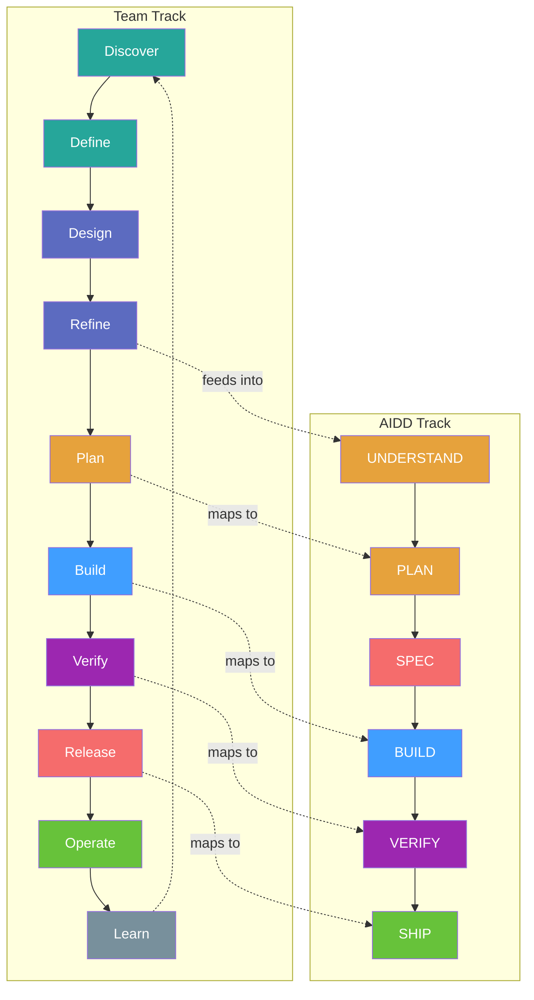
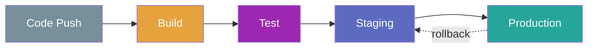

# SDLC Workflow — Full Team Development Lifecycle

> From product discovery to production monitoring — the complete AIDD-enhanced Software Development Lifecycle.

**Last Updated**: 2026-02-19
**Status**: Living Document

---

## Table of Contents

1. [Overview](#1-overview)
2. [Team Roles](#2-team-roles)
3. [Lifecycle Phases](#3-lifecycle-phases)
4. [Phase 1: Discover](#4-phase-1-discover)
5. [Phase 2: Define](#5-phase-2-define)
6. [Phase 3: Design](#6-phase-3-design)
7. [Phase 4: Refine](#7-phase-4-refine)
8. [Phase 5: Plan](#8-phase-5-plan)
9. [Phase 6: Build](#9-phase-6-build)
10. [Phase 7: Verify](#10-phase-7-verify)
11. [Phase 8: Release](#11-phase-8-release)
12. [Phase 9: Operate](#12-phase-9-operate)
13. [Phase 10: Learn](#13-phase-10-learn)
14. [Metrics and KPIs](#14-metrics-and-kpis)
15. [Technical Debt Management](#15-technical-debt-management)
16. [Cross-References](#16-cross-references)

---

## 1. Overview

This document describes the complete Software Development Lifecycle (SDLC) for teams using Agile principles with AIDD (AI-Driven Development). It covers the full path from product discovery through production operations, integrating human team workflows with AI-assisted development phases.

**Audience**: Product Owners, Facilitators, Developers, QA Engineers, UX Designers, DevOps Engineers — everyone involved in the product lifecycle.

**Agile Philosophy**: This guide is methodology-agnostic. It describes principles and ceremonies that work with Scrum, Kanban, SAFe, or any iteration-based approach. Adapt the iteration length, ceremony frequency, and role names to your team's context.

**Relationship to WORKFLOW.md**: [`WORKFLOW.md`](WORKFLOW.md) describes the AI assistant pipeline (Brainstorm → Plan → Execute → Test → Review → Ship). This document wraps around it, covering the full team lifecycle that surrounds and feeds into those AI-assisted development sessions.

### Lifecycle at a Glance


### SDLC-to-AIDD Mapping

| SDLC Phase | AIDD Equivalent | Integration |
|---|---|---|
| Discover | — | Team-only: product discovery |
| Define | — | Team-only: strategy and backlog |
| Design | Full-stack-feature stages 1-4 | AI-assisted architecture and UX |
| Refine | Product workflow (Spec/Gherkin/DoR) | AI-assisted specification |
| Plan | UNDERSTAND + PLAN | AI-assisted decomposition |
| Build | SPEC + BUILD | AI-assisted implementation |
| Verify | VERIFY | AI-assisted testing |
| Release | SHIP + deployment pipeline | AI-assisted commit + team deployment |
| Operate | — | Team-only: production operations |
| Learn | Memory layer + retro artifact | AI memory informs future sessions |

---

## 2. Team Roles

### Role-to-Agent Mapping

Traditional team roles map to AIDD agent equivalents. AI agents augment human roles — they do not replace them.

| Role | Responsibilities | AIDD Agent |
|---|---|---|
| Product Owner | Vision, backlog, priorities, acceptance criteria | Master Orchestrator (intake classification) |
| Facilitator | Process, ceremonies, blockers, team health | Orchestrator (pipeline enforcement) |
| Developer | Implementation, code review, technical decisions | Fullstack Agent, Interface Artisan |
| QA Engineer | Test strategy, automation, coverage, UAT | Quality Engineer |
| UX Designer | User research, wireframes, usability, design systems | Design Architect, Experience Engineer |
| Security Engineer | Threat modeling, audits, compliance | Security Architect |
| DevOps Engineer | CI/CD, infrastructure, monitoring, deployments | Platform Engineer |

### RACI Matrix

**R** = Responsible, **A** = Accountable, **C** = Consulted, **I** = Informed

| Phase | PO | Facilitator | Developer | QA | UX | DevOps |
|---|---|---|---|---|---|---|
| Discover | **A/R** | I | C | C | **R** | I |
| Define | **A/R** | C | C | C | **R** | I |
| Design | C | I | **R** | C | **A/R** | C |
| Refine | **A** | **R** | **R** | **R** | C | I |
| Plan | C | **R** | **A/R** | C | I | C |
| Build | I | I | **A/R** | C | C | C |
| Verify | C | I | **R** | **A/R** | C | C |
| Release | I | I | **R** | **R** | I | **A/R** |
| Operate | I | I | C | C | I | **A/R** |
| Learn | **A/R** | **R** | **R** | **R** | **R** | **R** |

---

## 3. Lifecycle Phases

The lifecycle has two parallel tracks that converge during development:

- **Team Track** (10 phases): Covers the full product lifecycle from discovery to operations. Human-driven with AI assistance where applicable.
- **AIDD Track** (6 phases): Covers the AI-assisted development pipeline from understanding through shipping. Runs inside the team's Build-Verify-Release phases.



The convergence point is **Refine**: once stories meet the Definition of Ready, they enter the AIDD pipeline for AI-assisted development.

---

## 4. Phase 1: Discover

**Purpose**: Validate that a problem worth solving exists before committing resources.

**Participants**: Product Owner, UX Designer, Stakeholders

### Activities

- **User Research**: Conduct interviews, surveys, and analytics reviews to understand real user pain points. Minimum 5 data points per hypothesis.
- **Problem Validation**: Use a Problem/Solution Fit canvas to separate assumptions from evidence. Document the problem statement explicitly.
- **Opportunity Assessment**: Evaluate market size, competitive landscape, and strategic alignment. Not every valid problem is worth building a solution for.
- **Personas and Journeys**: Create user personas grounded in research data (not assumptions). Map their current journey to identify friction points.

### Outputs

- Problem statement (one paragraph, evidence-backed)
- User personas (1-3 primary personas with goals, frustrations, context)
- Opportunity brief (market context, strategic fit, estimated impact)

### Exit Criteria

- [ ] Problem validated with at least 5 user data points
- [ ] Primary personas defined with research backing
- [ ] Opportunity brief written and reviewed
- [ ] Stakeholder alignment confirmed

---

## 5. Phase 2: Define

**Purpose**: Transform validated problems into a product strategy with measurable goals.

**Participants**: Product Owner, UX Designer, Tech Lead

### Activities

**Vision Statement**: Write a one-sentence north star that describes the desired future state. Example: *"Every developer can ship AI-assisted code with confidence and traceability."*

**OKRs / KPIs**: Define success metrics using Objectives and Key Results.

| Component | Description | Example |
|---|---|---|
| Objective | Qualitative goal | Improve developer onboarding experience |
| Key Result 1 | Quantitative measure | Reduce time-to-first-commit from 3 days to 1 day |
| Key Result 2 | Quantitative measure | Achieve 80% satisfaction score in onboarding survey |
| Key Result 3 | Quantitative measure | Zero critical bugs reported in first week |

**Prioritization**: Apply one or more frameworks to order the backlog:

| Framework | Best For | Formula |
|---|---|---|
| MoSCoW | Fixed-scope releases | Must / Should / Could / Won't |
| RICE | Data-driven teams | (Reach x Impact x Confidence) / Effort |
| WSJF | Continuous flow | Cost of Delay / Job Duration |

**Backlog Seeding**: Structure the backlog as a hierarchy:

```
Epic (large initiative, spans multiple iterations)
  └── Feature (user-facing capability)
        └── User Story (As a [persona], I want [goal], so that [benefit])
              └── Task (atomic unit of work)
```

### Outputs

- Vision statement
- OKRs with measurable key results
- Prioritized backlog (epics and initial stories)
- Product roadmap (Now / Next / Later)

### Exit Criteria

- [ ] Vision statement written and shared
- [ ] At least 3 OKRs defined with measurable key results
- [ ] Backlog seeded with prioritized epics and stories
- [ ] Roadmap created with time horizons

---

## 6. Phase 3: Design

**Purpose**: Create the technical and UX architecture before implementation begins.

**Participants**: Developer, UX Designer, Tech Lead

This phase is well-covered by existing AIDD workflows. Use these resources:

| Activity | AIDD Resource |
|---|---|
| System Architecture | [`content/workflows/full-stack-feature.md`](content/workflows/full-stack-feature.md) — Stage 1: system-architect (C4 diagrams, ADRs) |
| API Contract Design | [`content/workflows/full-stack-feature.md`](content/workflows/full-stack-feature.md) — Stage 2: contract-architect (OpenAPI spec) |
| Data Model Design | [`content/workflows/full-stack-feature.md`](content/workflows/full-stack-feature.md) — Stage 3: data-architect (SQL schema) |
| UX/UI Design | [`content/workflows/full-stack-feature.md`](content/workflows/full-stack-feature.md) — Stage 4: design-architect (design tokens) |
| Design System Audit | [`content/workflows/design.md`](content/workflows/design.md) — WCAG + Tailwind audit |

### What This Phase Adds Beyond AIDD

- **Design Reviews**: Schedule team design reviews as a ceremony. Present architecture, API contracts, and UX mockups for feedback before proceeding.
- **Cross-Team Alignment**: If the feature touches multiple teams or services, hold an alignment session to agree on interfaces and contracts.
- **Prototype Validation**: For high-uncertainty features, build a prototype or proof-of-concept and validate with users before committing to full implementation.

---

## 7. Phase 4: Refine

**Purpose**: Ensure every story meets the Definition of Ready before entering development.

**Participants**: Product Owner, Developer, QA Engineer, UX Designer

This phase maps directly to the AIDD product workflow. Use these resources:

| Activity | AIDD Resource |
|---|---|
| Technical Specification | [`content/workflows/product.md`](content/workflows/product.md) — Step 1: Spec template |
| BDD Scenarios | [`content/workflows/product.md`](content/workflows/product.md) — Step 2: Gherkin (Given/When/Then) |
| Ambiguity Removal | [`content/workflows/product.md`](content/workflows/product.md) — Step 3: Refinement checklist |
| Definition of Ready | [`content/workflows/product.md`](content/workflows/product.md) — Step 4: DoR checklist |

### Refinement Ceremony

| Aspect | Guideline |
|---|---|
| Frequency | Once per iteration (or twice for short cycles) |
| Duration | 60 minutes max |
| Participants | PO + Developers + QA + UX |
| Input | Top N stories from the prioritized backlog |
| Process | PO presents story → Team asks questions → Acceptance criteria written → Estimation → DoR checklist reviewed |
| Output | Stories that meet Definition of Ready |

### Acceptance Criteria Format

Use Given/When/Then format (see [`content/specs/aidd-lifecycle.md`](content/specs/aidd-lifecycle.md) UNDERSTAND phase):

```gherkin
Given [precondition]
When [action]
Then [expected result]
```

Stories that do not meet the Definition of Ready return to the backlog for further refinement. Never pull unrefined stories into an iteration.

---

## 8. Phase 5: Plan

**Purpose**: Commit to a set of refined stories for the next iteration cycle.

**Participants**: Facilitator, Developer, QA Engineer

### Iteration Planning Ceremony

| Aspect | Guideline |
|---|---|
| Frequency | Start of each iteration |
| Duration | 60-120 minutes (proportional to iteration length) |
| Input | Refined stories (DoR met), team capacity, velocity data |
| Process | Review iteration goal → Select stories from top of backlog → Decompose into tasks → Estimate effort → Commit |
| Output | Iteration backlog with committed stories and tasks |

**Capacity Planning**: Calculate available capacity based on team size, availability (vacations, meetings, support rotation), and historical velocity. Commit to 80% of calculated capacity to absorb uncertainty.

**Iteration Goal**: Write a single sentence describing what the iteration achieves for the user. Example: *"Users can authenticate via SSO and manage their profile settings."*

### Daily Coordination

| Aspect | Guideline |
|---|---|
| Frequency | Daily (sync or async) |
| Duration | 15 minutes max |
| Format | What did I complete? What will I work on? Any blockers? |
| Async Alternative | Written updates in a shared channel by a fixed time daily |
| Blocker Resolution | Blockers flagged in standup → Facilitator follows up within 2 hours |

### AIDD Integration

This phase maps to AIDD's UNDERSTAND and PLAN phases:

- [`content/specs/aidd-lifecycle.md`](content/specs/aidd-lifecycle.md) — Phases 1-2 (requirements analysis, task decomposition)
- [`content/workflows/orchestrator.md`](content/workflows/orchestrator.md) — Stages 0-3 (intake, brainstorm, research, plan)
- [`WORKFLOW.md`](WORKFLOW.md) — Steps 1-3 (startup, brainstorm, plan)

When a developer picks up a story and starts an AIDD session, the Brainstorm and Plan steps in AIDD correspond to the detailed task decomposition within the already-planned iteration story.

---

## 9. Phase 6: Build

**Purpose**: Implement the committed stories following the approved plan.

**Participants**: Developer (primary), QA Engineer (consulting)

This phase maps to AIDD's SPEC and BUILD phases. Use these resources:

| Activity | AIDD Resource |
|---|---|
| AIDD Lifecycle | [`content/specs/aidd-lifecycle.md`](content/specs/aidd-lifecycle.md) — Phases 3-4 (SPEC + BUILD) |
| Git Workflow | [`content/workflows/feature-branch.md`](content/workflows/feature-branch.md) — Branch → Commit → Push |
| Commit Standards | [`content/rules/git-workflow.md`](content/rules/git-workflow.md) — Conventional Commits |
| Code Style | [`content/rules/code-style.md`](content/rules/code-style.md) — Naming, structure, patterns |
| Required Outputs | [`content/rules/deliverables.md`](content/rules/deliverables.md) — Plan, ADR, diagram, summary |

### What This Phase Adds Beyond AIDD

- **Code Review**: Every PR requires at least one reviewer. See [`content/workflows/feature-branch.md`](content/workflows/feature-branch.md) Step 7 for the review workflow.
- **Pair/Mob Programming**: For complex or high-risk stories, pair programming reduces defects and spreads knowledge. Use it selectively, not as a default.
- **Integration Patterns**: When multiple developers work on related stories in parallel, agree on integration points and merge frequency to avoid divergence.
- **Spec Divergence**: If implementation diverges from the spec, update the spec first, then continue. The spec is always the source of truth.

---

## 10. Phase 7: Verify

**Purpose**: Confirm that the implementation meets acceptance criteria and quality standards.

**Participants**: QA Engineer (primary), Developer (support)

This phase maps to AIDD's VERIFY phase. Use these resources:

| Activity | AIDD Resource |
|---|---|
| AIDD Lifecycle | [`content/specs/aidd-lifecycle.md`](content/specs/aidd-lifecycle.md) — Phase 5 (VERIFY) |
| Test Standards | [`content/rules/testing.md`](content/rules/testing.md) — Pyramid, coverage, AAA pattern |
| Test Workflow | [`content/workflows/test.md`](content/workflows/test.md) — Test generation |
| Security Audit | [`content/workflows/analyze.md`](content/workflows/analyze.md) — OWASP assessment |

### Test Pyramid

Follow the 70/20/10 distribution (see [`content/rules/testing.md`](content/rules/testing.md)):

| Level | Percentage | Focus |
|---|---|---|
| Unit | 70% | Pure functions, business logic, edge cases |
| Integration | 20% | API endpoints, database queries, service interactions |
| E2E | 10% | Critical user flows, cross-system validation |

### UAT (User Acceptance Testing)

| Aspect | Guideline |
|---|---|
| Participants | PO + QA + representative user (if possible) |
| Input | Deployed feature on staging environment |
| Process | Walk through each acceptance criterion → Verify Given/When/Then scenarios → Record pass/fail |
| Criteria | All acceptance criteria pass, no P0/P1 defects open |
| Output | Sign-off from PO |

### Quality Gates

Before moving to Release, verify every item (consolidated from [`content/specs/aidd-lifecycle.md`](content/specs/aidd-lifecycle.md) Section 5):

- [ ] All acceptance criteria from stories met
- [ ] TypeScript compiles with zero errors
- [ ] Linter passes with zero warnings
- [ ] All targeted tests pass
- [ ] No dead code or commented-out blocks
- [ ] Spec document matches final implementation
- [ ] Security review completed (for sensitive features)
- [ ] PO sign-off obtained

---

## 11. Phase 8: Release

**Purpose**: Package, version, and deploy verified software to production.

**Participants**: DevOps Engineer (primary), Developer (support)

### Semantic Versioning

Use [SemVer](https://semver.org/) for all releases:

| Segment | Bump When | Example |
|---|---|---|
| MAJOR | Breaking changes to public API | 2.0.0 |
| MINOR | New features, backward-compatible | 1.3.0 |
| PATCH | Bug fixes, backward-compatible | 1.3.1 |
| Pre-release | Alpha/beta/release candidate | 1.4.0-beta.1 |

Conventional commits (see [`content/rules/git-workflow.md`](content/rules/git-workflow.md)) map to version bumps: `feat:` → MINOR, `fix:` → PATCH, `feat!:` or `BREAKING CHANGE` → MAJOR.

### Changelog

Auto-generate from conventional commits using tools like `conventional-changelog` or `changesets`. Follow [Keep a Changelog](https://keepachangelog.com/) format:

```markdown
## [1.3.0] - 2026-02-19

### Added
- User authentication via SSO (#123)

### Fixed
- Profile image upload timeout on slow connections (#456)

### Changed
- Increased session timeout from 30m to 60m (#789)
```

### Deployment Pipeline



| Stage | Environment | Trigger | Gates |
|---|---|---|---|
| Build | CI | Push to branch | Typecheck, lint, unit tests |
| Test | CI | PR opened | Integration tests, security scan |
| Staging | Pre-production | PR merged to main | E2E tests, smoke tests, PO review |
| Production | Live | Tag / manual approval | Health checks, rollback plan ready |

### Rollback Strategy

Every production deployment must have a rollback plan:

- **Blue-Green**: Two identical environments. Switch traffic from blue (old) to green (new). Roll back by switching traffic back.
- **Canary**: Route a small percentage of traffic (1-5%) to the new version. Monitor error rates. Expand gradually or roll back.
- **Feature Flags**: Deploy code behind flags. Enable for specific users or percentages. Disable instantly if issues arise.

Choose the strategy based on risk tolerance and infrastructure capabilities.

### AIDD Integration

This phase extends AIDD's SHIP phase with deployment operations:

- [`content/specs/aidd-lifecycle.md`](content/specs/aidd-lifecycle.md) — Phase 6 (SHIP)
- [`content/workflows/feature-branch.md`](content/workflows/feature-branch.md) — Steps 6-9 (PR, review, merge, cleanup)

---

## 12. Phase 9: Operate

**Purpose**: Ensure the system runs reliably in production and issues are detected before users report them.

**Participants**: DevOps Engineer (primary), Developer (on-call)

### Monitoring

Track three categories of metrics:

| Category | What to Monitor | Examples |
|---|---|---|
| Application | Error rates, response times, throughput | p95 latency, 5xx rate, request/sec |
| Infrastructure | Resource utilization, saturation, availability | CPU, memory, disk, network |
| Business | User behavior, conversion, engagement | Active users, feature adoption, revenue |

### Alerting

Define severity levels with clear response expectations:

| Severity | Description | Response Time | Escalation |
|---|---|---|---|
| P0 — Critical | Service down, data loss risk | 15 minutes | Immediate page to on-call |
| P1 — Major | Feature degraded, workaround exists | 1 hour | Team lead notification |
| P2 — Minor | Non-critical bug, low impact | 1 business day | Add to backlog |
| P3 — Cosmetic | Visual or UX polish issue | Next iteration | Add to backlog |

**Rule**: Alert on symptoms (error rate spike), not causes. Alerts must be actionable — if nobody needs to do anything, it should not be an alert.

### SLAs, SLOs, and SLIs

| Term | Definition | Example |
|---|---|---|
| SLI (Indicator) | A quantitative measure of service | Request latency, error rate |
| SLO (Objective) | Target value for an SLI | p95 latency < 200ms, error rate < 0.1% |
| SLA (Agreement) | Contractual commitment with consequences | 99.9% uptime or credits issued |

**Error Budget**: If the SLO target is 99.9% uptime (43.8 minutes downtime/month), the remaining 0.1% is the error budget. When budget is exhausted, freeze feature work and focus on reliability.

### Incident Response

Follow a structured lifecycle:

1. **Detect**: Automated alerts or user reports
2. **Triage**: Assign severity (P0-P3), assemble response team
3. **Mitigate**: Restore service first (rollback, scale, failover). Root cause analysis comes later.
4. **Resolve**: Fix the underlying issue with proper testing
5. **Postmortem**: Blameless review within 48 hours. Document: timeline, root cause, impact, action items. Action items go into the backlog.

---

## 13. Phase 10: Learn

**Purpose**: Extract insights from the iteration to improve the product, process, and team.

**Participants**: Entire team

### Feedback Collection

| Channel | Type | Frequency |
|---|---|---|
| In-App Feedback | Direct user input (rating, comment) | Continuous |
| Support Tickets | User-reported issues | Continuous |
| Analytics | Behavioral data (feature usage, funnels, drop-off) | Continuous |
| User Surveys | Structured feedback (NPS, satisfaction) | Quarterly |
| Stakeholder Review | Business context and direction | End of iteration |

**Feedback-to-Backlog Pipeline**: Feedback → Triage (duplicate? valid?) → Categorize (bug, feature request, improvement) → Prioritize (using Define phase frameworks) → Backlog Item → Next iteration.

### Retrospective Ceremony

| Aspect | Guideline |
|---|---|
| Frequency | End of each iteration |
| Duration | 60 minutes |
| Facilitator | Rotates each iteration (not always the same person) |
| Format | What went well? → What needs improvement? → Action items |
| Output | 2-3 concrete action items, each assigned to an owner with a deadline |

**Rules**: Focus on process and system, not individuals. Every action item must be specific, measurable, and assigned. Review last iteration's action items first — if they were not completed, either re-commit or remove.

### AIDD Memory Integration

The AIDD memory layer persists learnings across development sessions:

- **Decisions**: Architectural and technical choices with reasoning → [`content/specs/memory-layer.md`](content/specs/memory-layer.md)
- **Mistakes**: Non-obvious bugs with root cause and prevention → searched before every planning session
- **Conventions**: Project-specific patterns discovered during development → applied in future sessions

The retro artifact created at the end of every AIDD session ([`WORKFLOW.md`](WORKFLOW.md) Section 2, Step 7) maps to the team retrospective. Session-level retros feed into the iteration-level retrospective.

### Continuous Improvement

The Learn phase closes the loop:

1. Feedback from users → informs the next Discover phase
2. Retrospective action items → improve the next iteration's process
3. AIDD memory → AI assistants learn from past sessions
4. Postmortem action items → improve operational reliability
5. Metrics trends → validate whether OKRs are on track

---

## 14. Metrics and KPIs

### DORA Metrics

Four key metrics from the DevOps Research and Assessment (DORA) program:

| Metric | Definition | Elite | High | Medium | Low |
|---|---|---|---|---|---|
| Deployment Frequency | How often code deploys to production | On-demand (multiple/day) | Weekly to monthly | Monthly to biannually | Biannually+ |
| Lead Time for Changes | Time from commit to production | Less than 1 day | 1 day to 1 week | 1 week to 1 month | 1-6 months |
| Change Failure Rate | % of deployments causing failure | 0-15% | 16-30% | 31-45% | 46%+ |
| Mean Time to Recovery | Time to restore service after failure | Less than 1 hour | Less than 1 day | Less than 1 week | 1 week+ |

### Agile Metrics

| Metric | What It Measures | Usage |
|---|---|---|
| Velocity | Story points completed per iteration | Forecasting (trend, not target) |
| Cycle Time | Time from "in progress" to "done" | Flow efficiency |
| Lead Time | Time from "backlog" to "done" | End-to-end responsiveness |
| Throughput | Items completed per iteration | Delivery capacity |
| WIP | Items in progress simultaneously | Bottleneck detection |

### Quality Metrics

| Metric | What It Measures | Target |
|---|---|---|
| Defect Escape Rate | Bugs found post-release vs. pre-release | < 10% |
| Test Coverage | Code covered by automated tests | See [`content/rules/testing.md`](content/rules/testing.md) targets |
| Code Review Turnaround | Time from PR opened to review completed | < 24 hours |
| AIDD Compliance Score | Workflow adherence per session | > 80 (see [`CLAUDE.md`](CLAUDE.md) scoring) |

**Principle**: Metrics drive conversations, not judgments. Trends matter more than absolutes. Never use velocity as a performance measure for individuals.

---

## 15. Technical Debt Management

### Definition

Technical debt is deferred work that will slow future development if not addressed. It is a natural byproduct of iterative development — the goal is to manage it, not eliminate it.

### Identification

| Source | How to Detect |
|---|---|
| Code Complexity | Cyclomatic complexity > 15 (static analysis tools) |
| Outdated Dependencies | Dependency audit (`npm audit`, `pnpm outdated`) |
| Missing Tests | Coverage gaps in high-risk areas (see [`content/rules/testing.md`](content/rules/testing.md) priority matrix) |
| Architecture Violations | Dependency inversions, circular dependencies, layer leaks |
| Markers in Code | TODO, FIXME, HACK comments |
| Developer Friction | Recurring complaints about specific areas during retros |

### Severity Classification

| Severity | Description | Example |
|---|---|---|
| Critical | Blocks feature work or causes outages | Deprecated dependency with known CVE |
| High | Slows development significantly | Missing abstraction causing shotgun surgery |
| Medium | Causes friction, workarounds exist | Inconsistent naming conventions across modules |
| Low | Cosmetic, no impact on delivery speed | Dead code, unused imports |

### Allocation Strategy

- **20% Rule**: Dedicate approximately 20% of each iteration's capacity to debt reduction. Treat it as a non-negotiable investment, not leftover time.
- **Boy Scout Rule**: Leave code better than you found it. When touching a file for feature work, improve one small thing (rename, extract, test).
- **Debt Sprints**: When critical debt accumulates, dedicate a full iteration to debt reduction. This is a team decision, not an individual one.

### AIDD Integration

AIDD's memory layer helps track and surface debt:

- **Mistakes** recorded in `mistakes.json` often indicate systemic debt (e.g., "Must rebuild shared package before core can resolve new imports" → build system debt)
- **Conventions** in `conventions.json` document workarounds that may indicate debt (e.g., "Always run build before typecheck" → coupling debt)
- The **evolution engine** can surface recurring patterns that indicate systemic issues across sessions

---

## 16. Cross-References

| Document | Path | Covers |
|---|---|---|
| AIDD Workflow | [`WORKFLOW.md`](WORKFLOW.md) | User-facing AI pipeline guide |
| AIDD Lifecycle | [`content/specs/aidd-lifecycle.md`](content/specs/aidd-lifecycle.md) | 6-phase technical lifecycle |
| Product Workflow | [`content/workflows/product.md`](content/workflows/product.md) | Spec, Gherkin, refinement, DoR |
| Full-Stack Feature | [`content/workflows/full-stack-feature.md`](content/workflows/full-stack-feature.md) | 10-stage feature implementation |
| Feature Branch | [`content/workflows/feature-branch.md`](content/workflows/feature-branch.md) | Git workflow |
| Orchestrator | [`content/workflows/orchestrator.md`](content/workflows/orchestrator.md) | AI session orchestration |
| Testing Rules | [`content/rules/testing.md`](content/rules/testing.md) | Test pyramid, coverage, AAA |
| Deliverables | [`content/rules/deliverables.md`](content/rules/deliverables.md) | Required outputs per feature |
| Git Workflow | [`content/rules/git-workflow.md`](content/rules/git-workflow.md) | Commits, branches, PRs |
| Documentation | [`content/rules/documentation.md`](content/rules/documentation.md) | Doc structure, ADR template |
| Memory Layer | [`content/specs/memory-layer.md`](content/specs/memory-layer.md) | Cross-session memory |
| Fast-Track | [`content/specs/fast-track.md`](content/specs/fast-track.md) | Trivial task classification |
| Design Audit | [`content/workflows/design.md`](content/workflows/design.md) | WCAG + Tailwind audit |
| Security Audit | [`content/workflows/analyze.md`](content/workflows/analyze.md) | OWASP assessment |
| Test Workflow | [`content/workflows/test.md`](content/workflows/test.md) | Test generation |
| Agent Routing | [`content/routing.md`](content/routing.md) | Agent hierarchy and roles |
