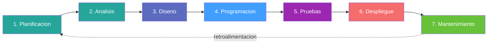
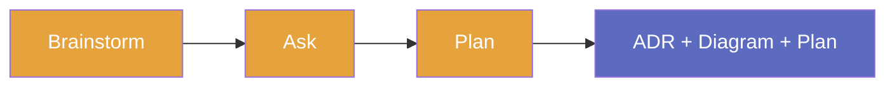
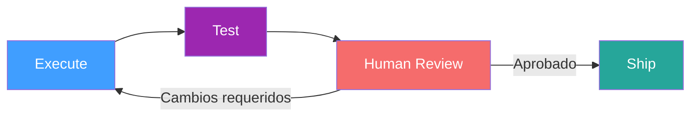
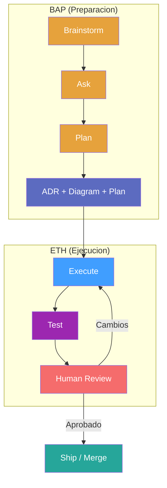
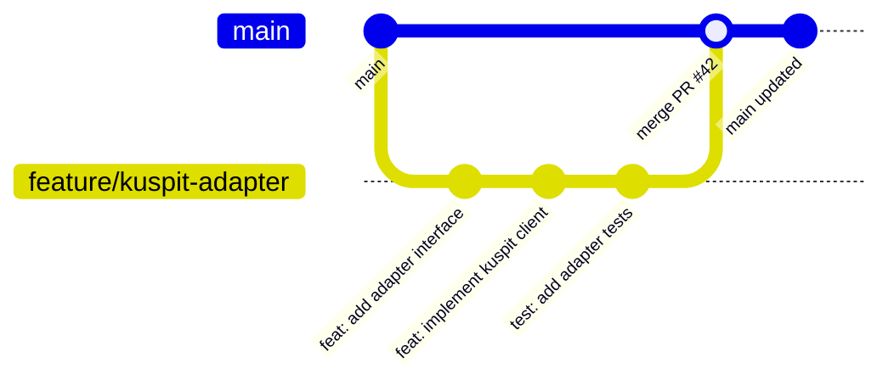
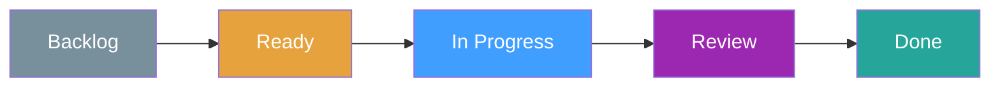
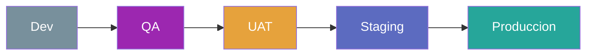
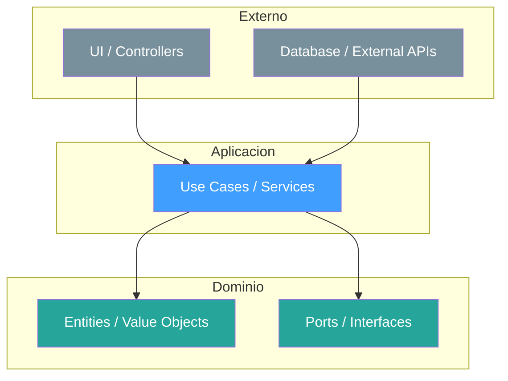

# Presentacion de SDLC / AIDD / AI en Sulfinance

> Guia de referencia del flujo de trabajo completo del equipo de desarrollo.

**Ultima Actualizacion**: 2026-02-19
**Estado**: Documento Vivo

---

## Tabla de Contenidos

1. [Que es Sulfinance?](#1-que-es-sulfinance)
2. [Metodologia SDLC](#2-metodologia-sdlc)
3. [Metodologia AIDD](#3-metodologia-aidd)
4. [GitHub](#4-github)
5. [Ambientes (Environments)](#5-ambientes-environments)
6. [IA: Claude](#6-ia-claude)
7. [Arquitectura](#7-arquitectura)
8. [Demo con Auto-Claude](#8-demo-con-auto-claude)

---

## 1. Que es Sulfinance?

### Plataforma de Gestion Financiera

Sul Finance es una infraestructura avanzada de pagos electronicos y administracion empresarial.

### Objetivo

Simplificar la gestion financiera empresarial proporcionando herramientas avanzadas en un entorno confiable y facil de usar.

### Servicios y Valor Agregado

- **Transacciones Inmediatas**: Conexion directa con proveedores financieros regulados bajo normativas vigentes.
- **Rentabilidad sobre Fondos**: Generacion de rendimientos a traves de casa de bolsa con dinero a la vista y crecimiento seguro.
- **Multicuentas**: Creacion de cuentas personalizadas por proveedor o proyecto para administracion granular.

---

## 2. Metodologia SDLC

### Que es SDLC?

SDLC (Software Development Life Cycle) es el marco que define las fases por las que pasa un proyecto de software desde la idea inicial hasta su mantenimiento en produccion. Es un estandar de la industria que asegura que el desarrollo sea predecible, medible y de calidad.

En Sulfinance usamos SDLC como estructura base y lo potenciamos con AIDD (AI-Driven Development) para acelerar las fases de Diseno a Mantenimiento.

### Las 7 Fases



| #   | Fase          | Que se hace                                              | Salida                                    |
| --- | ------------- | -------------------------------------------------------- | ----------------------------------------- |
| 1   | Planificacion | Identificar alcance, objetivos y requisitos del proyecto | Plan inicial del proyecto                 |
| 2   | Analisis      | Reunir y revisar datos sobre los requerimientos          | Documentacion de requisitos detallada     |
| 3   | Diseno        | Definir la arquitectura del proyecto                     | Documento de Diseno de Software (SDD)     |
| 4   | Programacion  | Escribir el codigo                                       | Prototipo de software funcional           |
| 5   | Pruebas       | Revisar el codigo y eliminar errores                     | Software refinado y optimizado            |
| 6   | Despliegue    | Desplegar codigo en el entorno de produccion             | Software disponible para usuarios finales |
| 7   | Mantenimiento | Arreglos y mejoras continuas                             | Codigo actualizado y optimizado           |

---

## 3. Metodologia AIDD

### 3.1 ¿Qué es AIDD?

**AIDD** (AI-Driven Development) es un estandar abierto para desarrollo guiado por IA con trazabilidad y memoria. No reemplaza al desarrollador — lo potencia.

#### Principios Fundamentales

| Principio      | Significado                                                           |
| -------------- | --------------------------------------------------------------------- |
| Evidence-First | Nunca opiniones, siempre logica/datos/principios. Citar fuentes.      |
| Zero Trust     | Nunca aceptar premisas como verdades absolutas. Validar contra datos. |
| Spec-First     | Documentar antes de implementar. La spec es la fuente de verdad.      |
| Memory-Aware   | La IA recuerda decisiones, errores y convenciones entre sesiones.     |

#### Niveles de Profundidad

AIDD es adaptativo — la profundidad escala con la complejidad de la tarea:

| Nivel    | Cuando usarlo                                       | Ceremonia                       |
| -------- | --------------------------------------------------- | ------------------------------- |
| Minimal  | Tareas triviales: typos, config, fixes de una linea | Solo hazlo. Cero ceremonia.     |
| Standard | Features, bug fixes, cambios multi-archivo          | BAP ligero + ETH                |
| Full     | Cambios de arquitectura, sistemas nuevos            | BAP completo + ETH + artefactos |

### 3.2 BAP: Brainstorm - Ask - Plan

BAP es la fase de **preparacion antes de escribir codigo**. Asegura que se entienda bien el problema y se planifique la solucion antes de tocar una linea de codigo.



#### B — Brainstorm (Lluvia de Ideas)

**Que**: Explorar opciones y alternativas antes de comprometerse con una solucion.

**Como**: Seguir el patron **Diverge → Analyze → Converge → Document**:

1. **Diverge**: Generar multiples opciones sin filtrar. Cantidad sobre calidad.
2. **Analyze**: Evaluar cada opcion con criterios objetivos (costo, complejidad, riesgo, mantenibilidad).
3. **Converge**: Seleccionar la mejor opcion con razonamiento documentado.
4. **Document**: Registrar la decision y las alternativas descartadas.

**Ejemplo Sulfinance**: *"Necesitamos integrar Kuspit como proveedor de fondos de inversion."*
- Opcion A: API directa con Kuspit (simple, acoplada)
- Opcion B: Capa de abstraccion con adapter pattern (mas complejo, desacoplado)
- Opcion C: Event-driven con cola de mensajes (mas resiliente, mayor complejidad)
- **Decision**: Opcion B — balance entre desacoplamiento y complejidad.

#### A — Ask (Preguntar)

**Que**: Eliminar ambiguedades antes de planificar. Si la IA no tiene al menos 90% de claridad, la IA debe hacer preguntas.

**Como**: Aplicar el patron **Listen → Probe → Mirror → Challenge → Converge**:

1. **Listen**: Entender el requerimiento completo.
2. **Probe**: Hacer preguntas sobre lo que falta (constraints, edge cases, integraciones).
3. **Mirror**: Repetir el entendimiento para confirmar.
4. **Challenge**: Cuestionar suposiciones ("¿realmente necesitamos X?").
5. **Converge**: Confirmar scope final con el solicitante.

**Preguntas tipicas**:
- ¿Quien es el usuario final de esta feature?
- ¿Cuales son los criterios de aceptacion?
- ¿Hay dependencias con otros equipos o servicios?
- ¿Cual es la fecha limite?
- ¿Hay restricciones de seguridad o regulatorias?

#### P — Plan (Planificar)

**Que**: Crear un plan atomico con tareas concretas y artefactos de documentacion.

**Artefactos generados**:

| Artefacto   | Contenido                                               | Cuando                   |
| ----------- | ------------------------------------------------------- | ------------------------ |
| **ADR**     | Decision arquitectonica con contexto, opciones, razon   | Siempre (decisions > 0)  |
| **Diagram** | Diagrama C4, secuencia o flujo de datos                 | Cuando hay interacciones |
| **Plan**    | Lista de tareas atomicas con archivos a crear/modificar | Siempre                  |

#### Estructura de Artefactos

Cada feature con complejidad **mayor a 3 story points** debe tener su carpeta:

```
docs/plan/active/<nombre-del-feature>/
|-- 2026.02.19-01-adr.md
|-- 2026.02.19-02-diagram.md
|-- 2026.02.19-03-plan.md
```

- **Root**: `docs/plan/active/<nombre-del-feature>/`
- **Formato**: `<fecha>-<numero>-<tipo>.md`
- **Tipos**: `adr`, `diagram`, `plan`
- **Al terminar**: Mover carpeta a `docs/plan/done/<nombre-del-feature>/`

**Ejemplo completo para Kuspit**:

```
docs/plan/active/kuspit/
|-- 2026.02.19-01-adr.md          # Decision: usar adapter pattern
|-- 2026.02.19-02-diagram.md      # Diagrama de secuencia: flujo de inversion
|-- 2026.02.19-03-plan.md         # 12 tareas atomicas con archivos y tiers
```

### 3.3 ETH: Execute - Test - Human Review

ETH es la fase de **ejecucion una vez que el plan esta aprobado**. Aqui se escribe codigo, se prueba y se revisa.



#### E — Execute (Ejecutar)

**Que**: Implementar el plan tarea por tarea.

**Principios**:
- Seguir el plan aprobado. Si se necesita desviar, actualizar la spec primero.
- Un commit por tarea logica. Nunca meter multiples features en un solo commit.
- Usar conventional commits: `type(scope): description`
- Crear branch desde `main`: `feature/<nombre-del-feature>`

**Flujo de ejecucion**:

```
1. git checkout -b feature/kuspit-adapter
2. Implementar tarea 1 → commit → siguiente tarea
3. Push al remote cuando haya un conjunto coherente de cambios
```

#### T — Test (Probar)

**Que**: Verificar que la implementacion cumple los criterios de aceptacion.

**Piramide de pruebas** (distribucion 70/20/10):

| Nivel       | %   | Que probar                                                   |
| ----------- | --- | ------------------------------------------------------------ |
| Unitarias   | 70% | Funciones puras, logica de negocio, edge cases               |
| Integracion | 20% | Endpoints API, consultas a BD, interacciones entre servicios |
| E2E         | 10% | Flujos criticos de usuario, validacion entre sistemas        |

**Quality gates antes de pasar a review**:
- [ ] TypeScript compila sin errores
- [ ] Linter pasa sin advertencias
- [ ] Pruebas dirigidas pasan
- [ ] Sin codigo muerto o bloques comentados
- [ ] Spec coincide con la implementacion

#### H — Human Review (Revision Humana)

**Que**: Revision de codigo por otro miembro del equipo antes de merge.

**Proceso**:
1. Abrir Pull Request con descripcion clara del cambio
2. Asignar al menos un revisor
3. El revisor verifica: funcionalidad, legibilidad, seguridad, adherencia a patrones
4. Si hay cambios requeridos → el autor los implementa → nueva ronda de review
5. Aprobacion → merge a `main`

**Que buscar en una code review**:
- ¿El codigo hace lo que dice que hace?
- ¿Es legible sin necesitar explicacion?
- ¿Sigue los patrones del proyecto?
- ¿Hay riesgos de seguridad?
- ¿Las pruebas cubren los escenarios criticos?

### 3.4 Pipeline Completo: BAP → ETH



**Resumen del flujo**:

| Paso | Fase | Que pasa                                | Artefacto               |
| ---- | ---- | --------------------------------------- | ----------------------- |
| 1    | BAP  | Brainstorm de opciones y trade-offs     | Notas de brainstorm     |
| 2    | BAP  | Preguntas para eliminar ambiguedad      | Requisitos clarificados |
| 3    | BAP  | Plan atomico con tareas y archivos      | ADR + Diagram + Plan    |
| 4    | ETH  | Implementacion siguiendo el plan        | Codigo + commits        |
| 5    | ETH  | Pruebas unitarias, integracion, E2E     | Test suite              |
| 6    | ETH  | Code review por otro miembro del equipo | PR aprobado             |
| 7    | Ship | Merge a main + despliegue               | Feature en produccion   |

---

## 4. GitHub

### 4.1 Git

#### Conventional Commits

Cada commit sigue el formato: `type(scope): description`

| Tipo       | Cuando usarlo                                  | Ejemplo                                          |
| ---------- | ---------------------------------------------- | ------------------------------------------------ |
| `feat`     | Nueva funcionalidad                            | `feat(kuspit): add investment adapter`           |
| `fix`      | Correccion de bug                              | `fix(auth): resolve token refresh loop`          |
| `docs`     | Solo documentacion                             | `docs(api): update endpoint reference`           |
| `refactor` | Cambio de estructura sin cambiar funcionalidad | `refactor(payments): extract validator service`  |
| `test`     | Agregar o corregir pruebas                     | `test(kuspit): add adapter unit tests`           |
| `chore`    | Tareas de mantenimiento                        | `chore(deps): update dependencies`               |
| `perf`     | Mejora de rendimiento                          | `perf(queries): optimize account balance lookup` |

**Reglas**:
- Mensajes en ingles, tiempo imperativo ("add", no "added" ni "adds")
- Primera linea maximo 72 caracteres
- Nunca incluir secrets o datos sensibles en commits

#### Estrategia de Branches



| Branch            | Proposito                  | Merge a | Quien crea             |
| ----------------- | -------------------------- | ------- | ---------------------- |
| `main`            | Codigo en produccion       | —       | Protegido (solo merge) |
| `feature/<name>`  | Nueva funcionalidad        | `main`  | Desarrollador          |
| `fix/<name>`      | Correccion de bug          | `main`  | Desarrollador          |
| `docs/<name>`     | Solo documentacion         | `main`  | Cualquiera             |
| `refactor/<name>` | Reestructuracion de codigo | `main`  | Desarrollador          |

**Flujo**:
1. Crear branch desde `main`: `git checkout -b feature/kuspit-adapter`
2. Desarrollar con commits atomicos
3. Push y abrir Pull Request
4. Code review + aprobacion
5. Squash and merge a `main`
6. Eliminar branch

### 4.2 Issues

Los issues son la unidad de tracking del trabajo. Todo trabajo debe estar respaldado por un issue.

#### Formato de Issue

```markdown
## Descripcion
[Que se necesita y por que — contexto de negocio, problema a resolver]

## Criterios de Aceptacion (Gherkin)

### Escenario 1: [Nombre del escenario happy path]
Given [precondicion o estado inicial]
When [accion que el usuario realiza]
Then [resultado esperado]

### Escenario 2: [Nombre del escenario alternativo]
Given [precondicion]
And [precondicion adicional]
When [accion]
Then [resultado esperado]

### Escenario 3: [Nombre del escenario de error]
Given [precondicion]
When [accion invalida o edge case]
Then [mensaje de error o comportamiento esperado]

## Contexto Adicional
[Screenshots, links, referencia a diseno, mockups, etc.]
```

**Ejemplo completo** (issue de Sulfinance):

```markdown
## Descripcion
Como usuario de Sulfinance, necesito consultar mi saldo en Kuspit
desde el dashboard para no tener que entrar a otra plataforma.

## Criterios de Aceptacion (Gherkin)

### Escenario 1: Consulta de saldo exitosa
Given el usuario tiene una cuenta vinculada con Kuspit
And la API de Kuspit esta disponible
When el usuario navega al dashboard
Then se muestra el saldo actual en MXN
And se muestra la fecha de ultima actualizacion

### Escenario 2: Cuenta no vinculada
Given el usuario no tiene una cuenta vinculada con Kuspit
When el usuario navega al dashboard
Then se muestra un boton "Vincular cuenta Kuspit"
And no se muestra seccion de saldo

### Escenario 3: API de Kuspit no disponible
Given el usuario tiene una cuenta vinculada con Kuspit
And la API de Kuspit no responde en 5 segundos
When el usuario navega al dashboard
Then se muestra el ultimo saldo conocido con etiqueta "Dato no actualizado"
And se muestra la fecha del ultimo dato exitoso
```

**Regla**: Todo issue debe tener minimo 3 escenarios Gherkin — happy path, alternativo y error. Sin criterios de aceptacion en formato Gherkin, el issue no cumple Definition of Ready.

#### Labels

| Label         | Color    | Uso                              |
| ------------- | -------- | -------------------------------- |
| `bug`         | Rojo     | Algo no funciona correctamente   |
| `feature`     | Verde    | Nueva funcionalidad              |
| `enhancement` | Azul     | Mejora a funcionalidad existente |
| `docs`        | Morado   | Documentacion                    |
| `tech-debt`   | Naranja  | Deuda tecnica                    |
| `P0-critical` | Rojo     | Prioridad maxima                 |
| `P1-high`     | Naranja  | Prioridad alta                   |
| `P2-medium`   | Amarillo | Prioridad media                  |
| `P3-low`      | Gris     | Prioridad baja                   |

#### Vincular Issues con PRs

- En el PR, usar `Closes #42` o `Fixes #42` en la descripcion para auto-cerrar el issue al merge
- En los commits: `feat(kuspit): add adapter (#42)` para referencia

### 4.3 Projects

Usamos GitHub Projects como tablero Kanban para visualizar el trabajo de cada iteracion.

#### Columnas del Board



| Columna         | Significado                                         | Limite WIP    |
| --------------- | --------------------------------------------------- | ------------- |
| **Backlog**     | Historias priorizadas pendientes de planificacion   | Sin limite    |
| **Ready**       | Historias refinadas que cumplen Definition of Ready | Sin limite    |
| **In Progress** | Trabajo activo del desarrollador                    | 2 por persona |
| **Review**      | En code review o QA                                 | Sin limite    |
| **Done**        | Mergeado y desplegado                               | Sin limite    |

**Regla WIP**: Maximo 2 items "In Progress" por desarrollador. Terminar antes de empezar algo nuevo.

---

## 5. Ambientes (Environments)

### Flujo de Despliegue



### Tabla de Ambientes

| #   | Ambiente                   | Proposito                                      | Quien lo usa                 | Cuando se despliega           |
| --- | -------------------------- | ---------------------------------------------- | ---------------------------- | ----------------------------- |
| 1   | **Dev**                    | Entorno de desarrollo para developers          | Desarrolladores              | Cada push a branch de feature |
| 2   | **QA**                     | Pruebas de calidad de la aplicacion            | Ingenieros QA                | Al abrir PR                   |
| 3   | **UAT**                    | Pruebas de aceptacion de usuario               | PO + QA + usuarios de prueba | Antes de cada release         |
| 4   | **Staging**                | Shadow-copy de produccion para pruebas finales | Equipo completo              | Al aprobar UAT                |
| 5   | **Performance** (Opcional) | Pruebas de rendimiento y carga                 | DevOps + QA                  | Antes de releases mayores     |
| 6   | **Produccion**             | Los clientes usan la aplicacion en produccion  | Usuarios finales             | Release aprobado + tag        |

### Reglas

- **Nunca** probar features nuevas directamente en produccion
- **Staging** debe ser lo mas identico posible a produccion (misma infra, datos anonimizados)
- **Enviroments**: Cada ambiente tiene sus propias variables de entorno y secrets
- **Rollback**: si algo falla en produccion, revertir inmediatamente al tag anterior

---

## 6. IA: Claude

### 6.1 Que es Claude?

Claude es el asistente de IA desarrollado por Anthropic. Es el modelo que usamos para desarrollo asistido por IA en Sulfinance a traves de **Claude Code** (la CLI oficial).

Claude Code es una herramienta de linea de comandos que integra Claude directamente en el flujo de desarrollo. Puede leer archivos, ejecutar comandos, editar codigo y mantener contexto de la conversacion.

### 6.2 Modelos: Sistema de Tiers

Claude tiene tres modelos con diferentes capacidades y costos. Usamos un sistema de tiers para asignar el modelo correcto a cada tipo de tarea:

| Tier | Modelo     | Esfuerzo | Tipo de Tarea                                      | Costo |
| ---- | ---------- | -------- | -------------------------------------------------- | ----- |
| T1   | **Opus**   | Alto     | Arquitectura, seguridad, planificacion, analisis   | $$$$  |
| T2   | **Sonnet** | Estandar | Implementacion, integracion, coding autonomo, APIs | $$    |
| T3   | **Haiku**  | Bajo     | Tests, boilerplate, syntax fixes, i18n, formateo   | $     |

**Principio**: Usar el modelo mas economico que pueda hacer el trabajo correctamente. No usar Opus para escribir tests, no usar Haiku para decisiones de arquitectura.

### 6.3 Alucinaciones y Peligros

**Que son las alucinaciones?**

Las alucinaciones son respuestas que suenan correctas pero son inventadas. La IA puede generar:
- APIs que no existen en la version actual de un framework
- Configuraciones con parametros ficticios
- Logica que parece correcta pero tiene errores sutiles

**Protocolo Zero Trust para IA**:

| Regla | Descripcion                                                                                      |
| ----- | ------------------------------------------------------------------------------------------------ |
| 1     | **Nunca copiar-pegar ciegamente**. Leer y entender cada linea.                                   |
| 2     | **Verificar APIs**. Confirmar que existen en la version instalada.                               |
| 3     | **Probar siempre**. Si no tiene test, no esta validado.                                          |
| 4     | **Revisar edge cases**. La IA optimiza el happy path.                                            |
| 5     | **Desconfiar de confianza excesiva**. Si la IA dice "seguramente funciona", verificar dos veces. |

**Cuando NO confiar ciegamente en la IA**:
- Decisiones de seguridad (autenticacion, autorizacion, crypto)
- Queries a base de datos (SQL injection, N+1, data leaks)
- Manejo de datos sensibles (PII, datos financieros)
- Configuraciones de infraestructura (permisos, redes, secrets)

### 6.4 Skills

Los **skills** son habilidades especializadas que extienden las capacidades de Claude Code. Son como plugins que le dan conocimiento profundo sobre temas especificos.

**Skills relevantes para Sulfinance**:

| Skill                     | Que hace                                                     |
| ------------------------- | ------------------------------------------------------------ |
| `brainstorming`           | Guia el proceso BAP con el patron Diverge-Analyze-Converge   |
| `feature-dev`             | Desarrollo guiado de features con entendimiento del codebase |
| `code-review`             | Revision de codigo automatizada con reporte de issues        |
| `systematic-debugging`    | Depuracion sistematica antes de proponer fixes               |
| `test-driven-development` | TDD: escribir tests antes de implementacion                  |
| `cdh-architecture`        | Patrones de arquitectura Clean/DDD/Hexagonal                 |
| `postgres-drizzle`        | Best practices para PostgreSQL y Drizzle ORM                 |

**Como invocar un skill**: `/skill-name` en Claude Code (ejemplo: `/brainstorming`)

### 6.5 MCPs (Model Context Protocol)

Los **MCPs** son servidores que extienden las capacidades de Claude Code con herramientas especializadas. Funcionan como APIs locales que Claude puede invocar.

La memoria persiste entre sesiones — la proxima vez que alguien trabaje en algo similar, la IA tendra contexto de decisiones pasadas.

---

## 7. Arquitectura

### 7.1 Clean Architecture / DDD / Hexagonal

Usamos una combinacion de tres patrones complementarios para organizar el codigo backend:

#### Clean Architecture

La dependencia siempre fluye **hacia adentro**. Las capas externas dependen de las internas, nunca al reves.



| Capa           | Que contiene                                   | Depende de |
| -------------- | ---------------------------------------------- | ---------- |
| **Dominio**    | Entidades, value objects, puertos (interfaces) | Nada       |
| **Aplicacion** | Casos de uso, servicios de aplicacion          | Dominio    |
| **Infra**      | Bases de datos, APIs externas, frameworks      | Aplicacion |
| **UI**         | Controllers, endpoints, CLI                    | Aplicacion |

#### DDD (Domain-Driven Design)

El codigo refleja el lenguaje del negocio:

| Concepto     | Que es                                      | Ejemplo Sulfinance                |
| ------------ | ------------------------------------------- | --------------------------------- |
| Entity       | Objeto con identidad unica                  | `Account`, `Transaction`, `User`  |
| Value Object | Objeto inmutable sin identidad              | `Money`, `CLABE`, `RFC`           |
| Aggregate    | Grupo de entidades con raiz de consistencia | `Account` (raiz) + `Transaction`s |
| Repository   | Abstraccion para persistencia               | `AccountRepository` (interfaz)    |
| Service      | Logica que no pertenece a una entidad       | `TransferService`                 |

#### Hexagonal (Ports & Adapters)

El dominio define **puertos** (interfaces). La infraestructura provee **adaptadores** (implementaciones).

```
domain/
  ports/
    account-repository.ts      # Puerto (interfaz)
    payment-gateway.ts         # Puerto (interfaz)
infrastructure/
  adapters/
    postgres-account-repo.ts   # Adaptador (implementacion)
    kuspit-payment-gateway.ts  # Adaptador (implementacion)
```

**Beneficio**: Cambiar de proveedor (ej. de Kuspit a otro) solo requiere crear un nuevo adaptador — el dominio no se toca.

### 7.2 SOLID

Cinco principios para escribir codigo mantenible:

| Principio                     | Significado                                                 | Ejemplo                                                |
| ----------------------------- | ----------------------------------------------------------- | ------------------------------------------------------ |
| **S** — Single Responsibility | Una clase, una razon para cambiar                           | `TransferService` solo transfiere, no valida cuentas   |
| **O** — Open/Closed           | Abierto a extension, cerrado a modificacion                 | Agregar nuevo gateway sin modificar los existentes     |
| **L** — Liskov Substitution   | Subtipos deben ser sustituibles por su tipo base            | Todo `PaymentGateway` funciona igual desde el use case |
| **I** — Interface Segregation | Interfaces pequenas y especificas, no genericas             | `Readable` y `Writable` separados, no `CRUDRepository` |
| **D** — Dependency Inversion  | Depender de abstracciones, no de implementaciones concretas | Use case recibe `AccountRepository`, no `PostgresRepo` |

### 7.3 DRY (Don't Repeat Yourself)

**Principio**: Cada pieza de conocimiento debe tener una unica representacion en el sistema.

**Aplicar cuando**:
- La misma logica aparece en 3+ lugares → extraer a funcion/servicio
- Las mismas constantes se repiten → extraer a archivo de constantes
- Los mismos patrones de validacion se repiten → extraer a schema Zod compartido

**No abusar**:
- Tres lineas similares no requieren una abstraccion prematura
- Si dos funciones hacen cosas *parecidas* pero no *iguales*, probablemente no son DRY candidates
- La abstraccion incorrecta es peor que la duplicacion

---

## 8. Demo con Auto-Claude

Demostracion en vivo del flujo BAP → ETH usando Claude Code