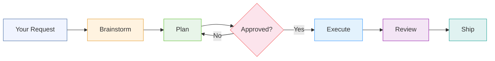
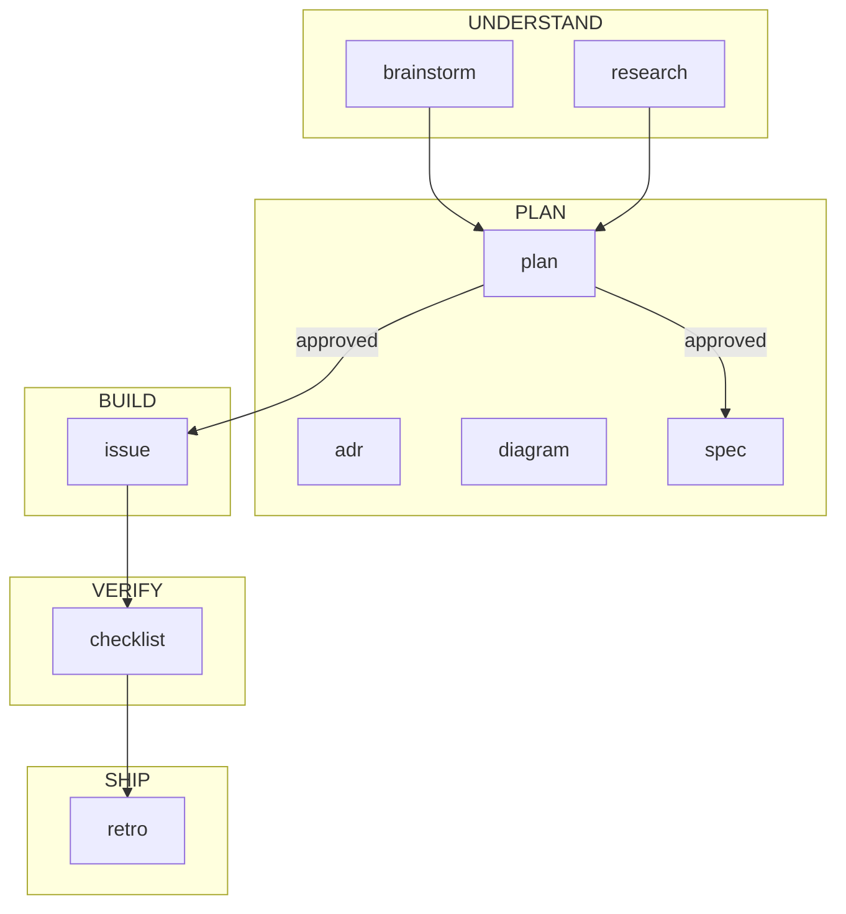
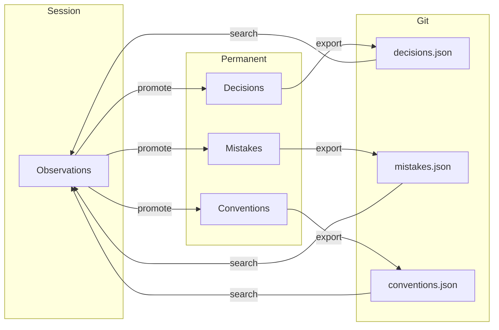

# AIDD Workflow — User Guide

> How the AI-Driven Development framework works — tool and AI agnostic

**Last Updated**: 2026-02-08
**Status**: Reference

---

## 1. What is AIDD

AIDD (AI-Driven Development) is a framework that structures how AI assistants develop software. It provides:

- **Mandatory workflow pipeline** — Every session follows Brainstorm → Plan → Execute → Review → End with artifacts at every step
- **Session tracking** — Every conversation is a tracked development session with decisions, errors, and outcomes
- **Memory persistence** — Learnings from past sessions inform future work (decisions, mistakes, conventions)
- **Quality enforcement** — Automated validation, pattern detection, and compliance checks
- **Self-improvement** — The framework evolves based on usage patterns and outcomes

AIDD works with any AI-powered development tool that supports the MCP protocol (Claude Code, Cursor, Gemini, etc.).

---

## 2. The Workflow

Every session follows a structured pipeline. Artifacts (versioned documents) are created at every step and session state is updated throughout.

```
Your Request → Brainstorm → Planning → [Iterate] → Approved → Execution → Review → Done
```

### Pipeline Diagram



### Artifact Flow



### Step by Step

| Step | What Happens | What You See |
|------|-------------|-------------|
| **1. Startup** | Session initialized, memory loaded | Conversation begins |
| **2. Brainstorm** | Memory searched, options explored, trade-offs considered | Ideas, options, and trade-offs presented |
| **3. Plan** | Plan mode entered, detailed task plan created | You review and approve/reject the plan |
| **4. Execute** | Approved plan implemented | Code changes, file edits, tests |
| **5. Review** | Typecheck, tests, build run; verification checklist created | Results of quality checks |
| **6. Ship** | Learnings recorded, retrospective created, session closed | Summary of work done |

### Skipping Steps

The brainstorm and planning steps are mandatory by default. To skip them, say any of these explicitly:

- "Skip brainstorm"
- "Just implement this"
- "No planning needed"

Artifacts are still created for the steps that do execute.

### Plan Iterations

If you reject a plan:

1. Tell the AI what to change
2. It updates the plan and presents it again
3. You can iterate as many times as needed
4. Each iteration is tracked for compliance scoring

---

## 3. Artifacts

Artifacts are versioned documents the AI creates at each workflow step. They capture thinking, decisions, and results.

| Type | Created During | What It Contains |
|------|---------------|-----------------|
| **Brainstorm** | Understanding | Ideas, options, trade-offs explored |
| **Research** | Understanding | Technical investigation findings |
| **Plan** | Planning | Task decomposition and approach |
| **ADR** | Planning | Architecture decision with reasoning |
| **Diagram** | Planning | System/component/flow diagrams |
| **Spec** | After plan approval | Formal specification with acceptance criteria |
| **Issue** | Execution | Bugs, blockers, problems discovered |
| **Checklist** | Review | Verification steps and results |
| **Retro** | Ship | What worked, what didn't, lessons learned |

All artifacts are stored in the project's `.aidd/` database and can be viewed in the Hub app.

---

## 4. Memory

AIDD remembers across conversations through three layers:

### What Gets Remembered

- **Decisions** — Why something was built a certain way (e.g., "Chose SQLite over PostgreSQL for local-first storage")
- **Mistakes** — Errors and how to prevent them (e.g., "Must rebuild shared package before core can resolve new imports")
- **Conventions** — Project-specific rules discovered (e.g., "All hook scripts use .cjs extension for CommonJS compatibility")

### How It Works



1. During a session, observations are recorded (learnings, decisions, patterns)
2. At session end, significant observations are promoted to permanent memory
3. In future sessions, memory is searched before planning to avoid repeating mistakes and follow established conventions
4. Memory can be exported to JSON files for Git visibility (`decisions.json`, `mistakes.json`, `conventions.json`)

---

## 5. Sessions

Every conversation is a tracked session with:

- **Input** — Your initial request (refined after brainstorming)
- **Tasks** — Pending and completed work items
- **Files** — All files modified during the session
- **Decisions** — Choices made with reasoning
- **Errors** — Problems encountered and how they were resolved
- **Outcome** — Tests passing, compliance score, reverts, reworks, your feedback

Sessions provide continuity. If a conversation is compacted or resumed, session state is recovered automatically.

---

## 6. Getting Best Results

1. **Be specific** — The more context you provide upfront, the better the brainstorm and plan will be.

2. **Engage with the brainstorm** — Add your own ideas or constraints. The AI explores options, but you know the domain best.

3. **Review plans carefully** — Approve, reject with feedback, or request changes. First-try approvals indicate good alignment.

4. **Skip when appropriate** — For trivial changes or when you know exactly what you want, say "skip brainstorm" to go straight to implementation.

5. **Trust the memory** — When a past decision or convention is referenced, it came from a previous session's recorded memory.

6. **Give feedback** — At session end, feedback (positive/neutral/negative) drives framework evolution.

---

## 7. File Structure

```
.aidd/                    Project AIDD state
├── config.json           Framework configuration
├── data.db               SQLite database (sessions, memory, artifacts)
├── memory/               Exported memory (committed to Git)
│   ├── decisions.json    Architecture decisions
│   ├── mistakes.json     Errors and fixes
│   └── conventions.json  Project conventions
└── state/                Runtime state (gitignored)
    ├── insights.md       Auto-generated dashboard
    └── state-dump.sql    SQL state for debugging
```

---

## 8. Cross-References

- **AIDD Lifecycle Spec**: `content/specs/aidd-lifecycle.md`
- **Memory Layer Spec**: `content/specs/memory-layer.md`
- **Adapters**: `adapters/README.md` (Claude Code, Cursor, Gemini, Warp)
- **MCP Architecture**: `mcps/README.md`
