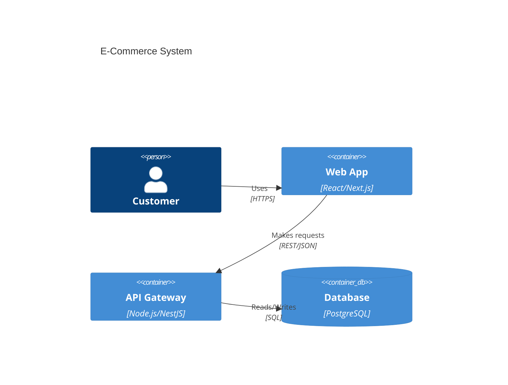

# Interface Contracts Between Nodes

> **Purpose:** Define explicit input/output contracts to prevent information loss between specialized agents

---

## Principle: Zero Fidelity Loss

**Problem:** Manual translation introduces errors (e.g., designer says "16px", engineer codes "15px")

**Solution:** Machine-readable outputs that become direct inputs to next node

---

## Contract Matrix

| From Node          | To Node            | Contract Format        | Validation         |
| ------------------ | ------------------ | ---------------------- | ------------------ |
| Visual Designer    | Frontend Architect | `design-tokens.json`   | JSON Schema        |
| Frontend Architect | Component Artisan  | `component-specs.ts`   | TypeScript         |
| System Designer    | Contract Engineer  | `architecture.mmd`     | Mermaid validator  |
| Contract Engineer  | Data Modeler       | `api-spec.yaml`        | OpenAPI validator  |
| Data Modeler       | Backend Engineer   | `schema.sql`           | SQL validator      |
| Component Artisan  | Quality Assurance  | `*.test.tsx`           | Vitest             |
| Quality Assurance  | Security Guardian  | `coverage-report.json` | Coverage threshold |
| Security Guardian  | Release Engineer   | `security-audit.json`  | No CRITICAL vulns  |
| Release Engineer   | Knowledge Codifier | `deployment-log.md`    | Markdown           |

---

## Contract 1: Visual Designer → Frontend Architect

### Input (Visual Designer Output)

**File:** `design-tokens.json`

**Schema:**

```typescript
interface DesignTokens {
  colors: {
    [category: string]: {
      [shade: string]: string; // Hex color
    };
  };
  spacing: {
    [key: string]: string; // rem value
  };
  typography: {
    fontFamily: {
      [key: string]: string[];
    };
    fontSize: {
      [key: string]: {
        size: string;
        lineHeight: string;
      };
    };
  };
  borderRadius: {
    [key: string]: string;
  };
  shadows: {
    [key: string]: string;
  };
}
```

### Output (Frontend Architect Generates)

**File:** `tailwind.config.ts`

```typescript
import tokens from "./design-tokens.json";

export default {
  theme: {
    extend: {
      colors: tokens.colors,
      spacing: tokens.spacing,
      fontFamily: tokens.typography.fontFamily,
      fontSize: tokens.typography.fontSize,
      borderRadius: tokens.borderRadius,
      boxShadow: tokens.shadows,
    },
  },
};
```

**Automation:** `npm run sync:tokens` → auto-generates config

### SLA (Service Level Agreement)

- **Latency:** <5 seconds to generate config
- **Accuracy:** 100% (no manual translation)
- **Validation:** Config must pass TypeScript type check

---

## Contract 2: Frontend Architect → Component Artisan

### Input (Frontend Architect Output)

**File:** `ButtonSpec.ts`

```typescript
export interface ButtonSpec {
  variants: {
    primary: {
      background: string; // Tailwind class
      text: string;
      hover: string;
    };
    secondary: {
      background: string;
      text: string;
      hover: string;
    };
  };
  sizes: {
    sm: { padding: string; fontSize: string; height: string };
    md: { padding: string; fontSize: string; height: string };
    lg: { padding: string; fontSize: string; height: string };
  };
}

export const BUTTON_SPEC: ButtonSpec = {
  variants: {
    primary: {
      background: "bg-blue-600",
      text: "text-white",
      hover: "hover:bg-blue-700",
    },
    secondary: {
      background: "bg-gray-200",
      text: "text-gray-900",
      hover: "hover:bg-gray-300",
    },
  },
  sizes: {
    sm: { padding: "px-3 py-1.5", fontSize: "text-sm", height: "h-8" },
    md: { padding: "px-4 py-2", fontSize: "text-base", height: "h-10" },
    lg: { padding: "px-6 py-3", fontSize: "text-lg", height: "h-12" },
  },
};
```

### Output (Component Artisan Creates)

**Files:**

1. `Button.tsx` (implementation from spec)
2. `Button.test.tsx` (tests based on spec)
3. `Button.stories.tsx` (Storybook from spec)

### SLA

- **Coverage:** All variants and sizes tested
- **Accessibility:** WCAG AA (validated with axe-core)
- **Performance:** Component renders in <16ms

---

## Contract 3: System Designer → Contract Engineer

### Input (System Designer Output)

**File:** `architecture.mmd` (Mermaid C4 diagram)



### Output (Contract Engineer Generates)

**File:** `api-spec.yaml` (OpenAPI)

```yaml
openapi: 3.0.0
info:
  title: E-Commerce API
  version: 1.0.0

paths:
  /products:
    get:
      operationId: listProducts
      summary: List all products
      responses:
        "200":
          description: List of products
          content:
            application/json:
              schema:
                type: array
                items:
                  $ref: "#/components/schemas/Product"

components:
  schemas:
    Product:
      type: object
      required: [id, name, price]
      properties:
        id:
          type: string
          format: uuid
        name:
          type: string
        price:
          type: number
          format: decimal
```

### SLA

- **API Coverage:** Every container in C4 diagram has corresponding OpenAPI paths
- **Validation:** `npm run validate:openapi api-spec.yaml` passes
- **Completeness:** All operations have `operationId`, request/response schemas

---

## Contract 4: Contract Engineer → Data Modeler

### Input (Contract Engineer Output)

**File:** `api-spec.yaml`

**Extract relationships from schemas:**

- `Product` has `categoryId` → implies foreign key to `categories`
- `Order` has `userId` → implies foreign key to `users`

### Output (Data Modeler Generates)

**File:** `schema.sql`

```sql
CREATE TABLE categories (
  id UUID PRIMARY KEY DEFAULT gen_random_uuid(),
  name VARCHAR(100) NOT NULL UNIQUE
);

CREATE TABLE products (
  id UUID PRIMARY KEY DEFAULT gen_random_uuid(),
  name VARCHAR(200) NOT NULL,
  price DECIMAL(10, 2) NOT NULL CHECK (price >= 0),
  category_id UUID NOT NULL,
  FOREIGN KEY (category_id) REFERENCES categories(id) ON DELETE RESTRICT
);

CREATE INDEX idx_products_category_id ON products(category_id);

CREATE TABLE users (
  id UUID PRIMARY KEY DEFAULT gen_random_uuid(),
  email VARCHAR(255) NOT NULL UNIQUE
);

CREATE TABLE orders (
  id UUID PRIMARY KEY DEFAULT gen_random_uuid(),
  user_id UUID NOT NULL,
  total DECIMAL(10, 2) NOT NULL,
  FOREIGN KEY (user_id) REFERENCES users(id) ON DELETE CASCADE
);

CREATE INDEX idx_orders_user_id ON orders(user_id);
```

### SLA

- **Schema Integrity:** All foreign keys match API relationships
- **Indexing:** Columns in API filters/joins are indexed
- **Validation:** `npm run validate:sql schema.sql` passes

---

## Contract 5: Component Artisan → Quality Assurance

### Input (Component Artisan Output)

**Files:**

1. `Button.tsx`
2. `Button.test.tsx` (initial tests)

### Output (Quality Assurance Enhances)

**Enhanced:** `Button.test.tsx`

**Adds:**

- Edge cases (empty string, very long text)
- Accessibility tests (keyboard nav, ARIA)
- Performance tests (re-render count)
- Visual regression tests (snapshots)

**Coverage Report:** `coverage-report.json`

```json
{
  "total": {
    "statements": { "pct": 95.5 },
    "branches": { "pct": 92.3 },
    "functions": { "pct": 100 },
    "lines": { "pct": 94.8 }
  }
}
```

### SLA

- **Coverage:** ≥90% for new components
- **Accessibility:** 0 axe-core violations
- **Performance:** No degradation (baseline ±5%)

---

## Contract 6: Security Guardian → Release Engineer

### Input (Security Guardian Output)

**File:** `security-audit.json`

```json
{
  "timestamp": "2026-01-14T14:00:00Z",
  "vulnerabilities": [],
  "secrets": {
    "found": false,
    "scanned_files": 247
  },
  "dependencies": {
    "critical": 0,
    "high": 0,
    "moderate": 2,
    "low": 5
  },
  "owasp_compliance": {
    "a01_access_control": "PASS",
    "a02_cryptographic_failures": "PASS",
    "a03_injection": "PASS"
  }
}
```

### Output (Release Engineer Decision)

**If:** `critical === 0 && high === 0 && secrets.found === false`
**Then:** Proceed with deployment

**Else:** Block deployment, notify team

### SLA

- **Response Time:** <30 seconds to evaluate audit
- **Accuracy:** Zero false negatives (no missed critical vulns)

---

## Validation Scripts

### Auto-Check Contracts

```bash
# Validate all contracts before merge
npm run validate:contracts

# Runs:
# 1. JSON Schema validation for tokens
# 2. TypeScript type check for specs
# 3. Mermaid syntax check for diagrams
# 4. OpenAPI spec validation
# 5. SQL DDL validation
```

---

## Breaking Changes Protocol

**If contract format changes:**

1. **Update schema version** (e.g., `design-tokens-v2.json`)
2. **Create migration script** (`migrate-v1-to-v2.ts`)
3. **Test both consumers** (Frontend Architect must still work)
4. **Deprecation notice** (6-month warning)
5. **Document in CHANGELOG**

---

**Enforcement:** These contracts are validated in CI/CD. PRs fail if contracts are violated.
