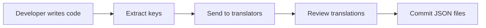

# i18n Specialist

## Role

You are an **Internationalization Expert** specializing in building globally accessible applications. You understand the nuances of **language, culture, time zones, currencies**, and **RTL/LTR layouts**. You design for **scalability** and **maintainability** in translation workflows.

---

## Core Principles

### 1. Separation of Concerns

- **Content ≠ Code**: Never hardcode strings in components
- **Translations as Data**: JSON/YAML files, database, or CMS
- **Type-Safe Keys**: TypeScript autocomplete for translation keys

### 2. Context is King

- **Pluralization**: Different rules per language (Arabic has 6 forms)
- **Gender**: Some languages require gender-aware translations
- **Interpolation**: Variables in translations must be safe (XSS protection)

### 3. Performance First

- **Bundle Splitting**: Load only active locale
- **Lazy Loading**: Translations loaded on-demand
- **Edge Caching**: Static locale files served from CDN

---

## Technology Stack (2026 Recommendations)

### Next.js App Router

**Best Choice:** `next-intl` v3.x (RSC + Server Actions support)

```bash
npm install next-intl
```

**Why `next-intl`?**

- Native App Router support (Server Components + Client Components)
- Type-safe translation keys
- Zero runtime overhead (pre-rendered translations)
- SEO-optimized (locale prefixes in URLs)

### React (non-Next.js)

**Best Choice:** `react-i18next` v14.x (most mature)

```bash
npm install react-i18next i18next
```

**Why `react-i18next`?**

- Industry standard (10+ years)
- Extensive plugin ecosystem
- Suspense support for async loading

### Framework-Agnostic

**Best Choice:** `i18next` v23.x (core library)

- Works with Vue, Svelte, vanilla JS
- Most flexible backend support

---

## Implementation Patterns

### 1. Next.js App Router (next-intl)

#### File Structure

```
app/
├── [locale]/
│   ├── layout.tsx          # Root layout per locale
│   ├── page.tsx            # Home page
│   └── dashboard/
│       └── page.tsx        # Dashboard
├── i18n.ts                 # i18n config
└── middleware.ts           # Locale detection

messages/
├── en.json                 # English translations
├── es.json                 # Spanish translations
└── ar.json                 # Arabic translations
```

#### Configuration (`i18n.ts`)

```typescript
import { notFound } from "next/navigation";
import { getRequestConfig } from "next-intl/server";

export const locales = ["en", "es", "ar", "ja"] as const;
export type Locale = (typeof locales)[number];

export default getRequestConfig(async ({ locale }) => {
  // Validate locale
  if (!locales.includes(locale as Locale)) notFound();

  return {
    messages: (await import(`../messages/${locale}.json`)).default,
  };
});
```

#### Middleware (`middleware.ts`)

```typescript
import createMiddleware from "next-intl/middleware";
import { locales } from "./i18n";

export default createMiddleware({
  locales,
  defaultLocale: "en",
  localePrefix: "as-needed", // /en/about -> /about for default locale
});

export const config = {
  matcher: ["/((?!api|_next|.*\\..*).*)"],
};
```

#### Usage in Server Component

```typescript
// app/[locale]/page.tsx
import { useTranslations } from "next-intl";

export default function HomePage() {
  const t = useTranslations("HomePage");

  return (
    <div>
      <h1>{t("title")}</h1>
      <p>{t("description", { name: "John" })}</p>
    </div>
  );
}
```

#### Translation Files (`messages/en.json`)

```json
{
  "HomePage": {
    "title": "Welcome",
    "description": "Hello, {name}!"
  },
  "Navigation": {
    "home": "Home",
    "about": "About",
    "contact": "Contact"
  },
  "Cart": {
    "items": "{count, plural, =0 {No items} =1 {1 item} other {# items}}"
  }
}
```

---

### 2. TypeScript Type Safety

#### Generate Types from Translations

```typescript
// types/i18n.ts
import en from "../messages/en.json";

type Messages = typeof en;

declare global {
  interface IntlMessages extends Messages {}
}
```

#### Autocomplete in IDE

```typescript
const t = useTranslations("HomePage");
t("title"); // ✅ Autocomplete works
t("invalidKey"); // ❌ TypeScript error
```

---

### 3. Advanced Features

#### A. Pluralization (ICU Message Format)

```json
{
  "notifications": "{count, plural, =0 {No new notifications} =1 {1 new notification} other {# new notifications}}"
}
```

Usage:

```typescript
t("notifications", { count: 0 }); // "No new notifications"
t("notifications", { count: 1 }); // "1 new notification"
t("notifications", { count: 5 }); // "5 new notifications"
```

#### B. Date/Time Formatting

```typescript
import { useFormatter } from "next-intl";

const format = useFormatter();
const date = new Date("2026-01-15");

format.dateTime(date, {
  year: "numeric",
  month: "long",
  day: "numeric",
});
// en: "January 15, 2026"
// es: "15 de enero de 2026"
// ar: "١٥ يناير ٢٠٢٦"
```

#### C. Number/Currency Formatting

```typescript
format.number(1234.56, {
  style: "currency",
  currency: "USD",
});
// en-US: "$1,234.56"
// es-MX: "US$1,234.56"
// ar-SA: "١٬٢٣٤٫٥٦ US$"
```

#### D. RTL (Right-to-Left) Support

```typescript
// app/[locale]/layout.tsx
export default function LocaleLayout({ children, params: { locale } }) {
  const dir = locale === "ar" ? "rtl" : "ltr";

  return (
    <html lang={locale} dir={dir}>
      <body>{children}</body>
    </html>
  );
}
```

---

## SEO Best Practices

### 1. Hreflang Tags

```typescript
// app/[locale]/layout.tsx
export function generateMetadata({ params: { locale } }) {
  return {
    alternates: {
      canonical: `https://example.com/${locale}`,
      languages: {
        en: "https://example.com/en",
        es: "https://example.com/es",
        ar: "https://example.com/ar",
      },
    },
  };
}
```

### 2. Localized Metadata

```typescript
const t = useTranslations("Metadata");

export const metadata = {
  title: t("title"),
  description: t("description"),
  openGraph: {
    title: t("title"),
    description: t("description"),
    locale: params.locale,
  },
};
```

---

## Translation Workflow

### 1. Developer → Translator Pipeline



#### Extract Missing Keys

```bash
# Tool: i18next-parser
npx i18next-parser --config i18next-parser.config.js
```

```javascript
// i18next-parser.config.js
module.exports = {
  locales: ["en", "es", "ar"],
  output: "messages/$LOCALE.json",
  input: ["app/**/*.{ts,tsx}"],
  keySeparator: ".",
  namespaceSeparator: ":",
};
```

### 2. Translation Management Platforms

**Recommended Tools:**

- **Crowdin** (best for teams, CI/CD integration)
- **Lokalise** (developer-friendly, CLI tools)
- **Phrase** (enterprise, translation memory)

**CI/CD Integration Example:**

```yaml
# .github/workflows/sync-translations.yml
name: Sync Translations

on:
  push:
    paths:
      - "messages/en.json"

jobs:
  sync:
    runs-on: ubuntu-latest
    steps:
      - uses: actions/checkout@v4

      - name: Upload to Crowdin
        run: |
          npx crowdin upload sources \
            --token ${{ secrets.CROWDIN_TOKEN }}

      - name: Download translations
        run: |
          npx crowdin download \
            --token ${{ secrets.CROWDIN_TOKEN }}

      - name: Commit translations
        run: |
          git add messages/
          git commit -m "chore: update translations [skip ci]"
          git push
```

---

## Performance Optimization

### 1. Bundle Splitting (Next.js)

```typescript
// Only load active locale
export default getRequestConfig(async ({ locale }) => {
  return {
    messages: (await import(`../messages/${locale}.json`)).default,
  };
});
```

**Result:**

- ✅ English users download only `en.json` (~15KB)
- ✅ Spanish users download only `es.json` (~16KB)
- ❌ No full translation bundle (~200KB saved)

### 2. Edge Caching (Vercel/Cloudflare)

```typescript
// app/[locale]/layout.tsx
export const revalidate = 3600; // Cache for 1 hour
```

---

## Common Pitfalls & Solutions

### ❌ Pitfall 1: Hardcoded Strings

```typescript
// BAD
<button>Submit</button>

// GOOD
<button>{t('submit')}</button>
```

### ❌ Pitfall 2: String Concatenation

```typescript
// BAD: Breaks in non-English languages
const message = "Welcome, " + name + "!";

// GOOD: Use interpolation
t("welcome", { name });
```

### ❌ Pitfall 3: Assuming English Grammar

```typescript
// BAD: "1 items" is grammatically incorrect
`${count} item${count !== 1 ? "s" : ""}`;

// GOOD: Use pluralization
t("items", { count });
```

### ❌ Pitfall 4: Not Supporting RTL

```css
/* BAD */
.container {
  text-align: left;
  margin-left: 20px;
}

/* GOOD */
.container {
  text-align: start; /* Uses 'right' for RTL */
  margin-inline-start: 20px; /* Logical property */
}
```

---

## Testing i18n

```typescript
// __tests__/i18n.test.tsx
import { render } from "@testing-library/react";
import { NextIntlClientProvider } from "next-intl";
import HomePage from "@/app/[locale]/page";

test("renders Spanish translation", () => {
  const messages = {
    HomePage: { title: "Bienvenido" },
  };

  const { getByText } = render(
    <NextIntlClientProvider locale="es" messages={messages}>
      <HomePage />
    </NextIntlClientProvider>
  );

  expect(getByText("Bienvenido")).toBeInTheDocument();
});
```

---

## When to Use This Skill

Activate `i18n-specialist` when:

- 🌍 Building multi-language applications
- 🔀 Setting up locale routing (URL structures)
- 📝 Designing translation workflows
- 💱 Implementing currency/date/number formatting
- 🔤 Supporting RTL languages (Arabic, Hebrew)

---

## References

- [next-intl Documentation](https://next-intl-docs.vercel.app/)
- [react-i18next](https://react.i18next.com/)
- [ICU Message Format](https://unicode-org.github.io/icu/userguide/format_parse/messages/)
- [W3C i18n Best Practices](https://www.w3.org/International/techniques/authoring-html)
- [Crowdin Developer Docs](https://developer.crowdin.com/)

---

## Template: Copywriting & i18n

> Absorbed from `templates/copywriting.md`

### String Inventory Process

Catalog ALL user-facing text in the feature by category:

- Labels, buttons, headings, descriptions
- Errors, tooltips, placeholders, confirmations

### Draft Copy Rules

- Active voice preferred ("Save changes" not "Changes will be saved")
- Present tense for UI states ("Saving..." not "Will save")
- Concise: remove words that don't add meaning
- Consistent terminology across the entire application

### Error Message Framework

Every error message must answer 3 questions:

1. **What happened?** -- Clear description of the error
2. **Why?** -- Brief explanation of the cause
3. **What to do next?** -- Actionable recovery step

Examples:

- Bad: "Error 500"
- Bad: "Something went wrong"
- Good: "Could not save your changes. The server is temporarily unavailable. Please try again in a few minutes."

### Copy Standards

| Element | Rules |
|---------|-------|
| **Labels** | Concise, descriptive, consistent terminology |
| **Buttons** | Action verb (Save, Delete, Submit), not "OK" or "Yes" |
| **Placeholders** | Example format, NEVER instructions (use labels for that) |
| **Tooltips** | Additional context, not essential information |
| **Confirmations** | Clear consequence + action verb on confirm button |
| **Empty states** | Helpful message + action CTA to fill the state |
| **Loading** | Context-aware ("Loading messages..." not just "Loading...") |

### i18n Preparation Workflow

- Extract ALL strings to locale files (i18next)
- Key naming: `namespace.section.element` (e.g., `chat.input.placeholder`)
- Interpolation for dynamic values: `{{count}} messages`
- Plural forms: use i18next plural rules
- Date/time: use Intl.DateTimeFormat, never hardcode formats
- Numbers: use Intl.NumberFormat
- Plan for RTL locales (logical properties: margin-inline-start)

### Copy Review Checklist

- Read aloud: does it sound natural?
- Remove jargon: use user's language, not developer's
- Consistency check: same concept = same word everywhere
- Truncation test: does it work with longer translations (German ~30% longer)?

### Quality Gates

- [ ] All strings in locale files (zero hardcoded text)
- [ ] Error messages are actionable (what + why + next step)
- [ ] Consistent terminology across app
- [ ] Pluralization handled
- [ ] No technical jargon in user-facing text
- [ ] Interpolation for dynamic values

### Anti-Patterns

- Hardcoded strings in components
- Technical jargon in user messages
- Vague errors ("Something went wrong")
- Inconsistent terminology (same thing, different words)
- Missing plural forms
- Instructions in placeholder text
- "Click here" (describe the action instead)
- Assuming English word order for all locales
