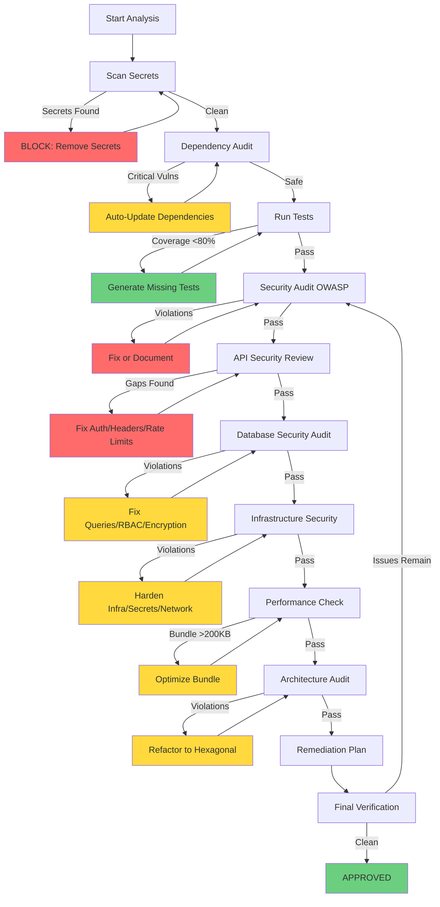

# Security & Quality Audit

> **Purpose:** Comprehensive code integrity, security, and quality evaluation with automatic remediation across the entire application stack — from code to infrastructure.

**Architecture:** Directed graph with recursive feedback (self-healing), multi-phase approach: Scan, Identify, Remediate, Verify.

## Invocation

| Type            | Items                              |
| --------------- | ---------------------------------- |
| **Skills**      | systematic-debugging, verification |
| **Specialized** | clean-ddd-hexagonal                |
| **MCPs**        | WebSearch                          |

**Use when:**

- Preparing for production deployment
- Post-incident security review
- Quarterly security audits
- Compliance requirements (SOC 2, PCI-DSS, GDPR)
- After major feature releases
- Pull request quality gates

---

## Workflow Architecture (Mermaid)



---

## Prerequisites

- [ ] Code committed in Git (for change analysis)
- [ ] Dependencies installed (`pnpm install`)
- [ ] TypeScript/ESLint configured
- [ ] OpenAPI spec available (for API review)
- [ ] Infrastructure-as-Code accessible (for infra audit)

---

## Phase 1: Initial Scanning (Tier 1)

**Indicator**: `[aidd.md] Workflow - analyze (Initial Scanning)`

### Node A: Scan Secrets

**Skill:** `security-architect` | **Tier:** 1

**Action:**

```bash
npm run scan:secrets src/
```

**Decision Logic:**

```typescript
if (secretsFound) {
  return {
    status: "BLOCKED",
    action: "Remove hardcoded secrets",
    severity: "CRITICAL",
    loop_to: "NodeA", // Re-scan after fix
  };
} else {
  return { status: "PASS", next: "NodeB" };
}
```

**Check:**

- Hardcoded credentials
- API keys in code
- Database connection strings
- Private keys or certificates

**Feedback Loop:** If secrets found, user fixes, re-run scan, loop until clean.

---

### Node B: Dependency Audit

**Tier:** 2

**Action:**

```bash
npm audit --audit-level=high --json > audit.json
```

**Decision Logic:**

```typescript
const audit = JSON.parse(fs.readFileSync("audit.json"));
const criticalCount = audit.metadata.vulnerabilities.critical;

if (criticalCount > 0) {
  // Attempt auto-fix via npm audit fix
  return {
    status: "AUTO_REMEDIATE",
    action: "Updating dependencies",
    loop_to: "NodeB", // Re-audit after update
  };
} else {
  return { status: "PASS", next: "NodeC" };
}
```

**Check:**

- Critical vulnerabilities in dependencies
- Outdated packages with security patches
- Vulnerable components (OWASP A06)

**Feedback Loop:** Try `npm audit fix`, re-audit, loop until safe.

---

## Phase 2: Domain-Specific Analysis (Tier 1 + Tier 2)

**Indicator**: `[aidd.md] Workflow - analyze (Domain-Specific Analysis)`

### Node C: Test Coverage

**Skill:** `quality-engineer` | **Tier:** 3
**Task:** Identify untested code paths, especially security-critical functions.
**Action:**

```bash
npm run test:coverage --json > coverage.json
```

**Decision Logic:**

```typescript
const coverage = JSON.parse(fs.readFileSync("coverage.json"));
const statementsCoverage = coverage.total.statements.pct;

if (statementsCoverage < 80) {
  const uncovered = findUncoveredFiles(coverage);
  activateSkill("quality-engineer", { files: uncovered });

  return {
    status: "GENERATING_TESTS",
    action: `Creating tests for ${uncovered.length} files`,
    loop_to: "NodeC", // Re-run tests
  };
} else {
  return { status: "PASS", next: "NodeD" };
}
```

**Targets:**

- Domain logic: 100%
- Services: >=90%
- Controllers: >=70%
- Security-critical functions: >=80%

**Output:**

- Coverage gaps report
- Security-critical functions without tests
- Recommended test additions

**Feedback Loop:** Generate tests, re-run coverage, loop until >=80%.

---

### Node D: OWASP Top 10 Security Audit

**Skill:** `security-architect` | **Tier:** 1

**Task:** Comprehensive vulnerability scan against OWASP Top 10 (2025).

**Input:** Complete codebase, configuration files.

**Action:**

```bash
activateSkill('security-architect', { mode: 'owasp-audit' });
```

**Decision Logic:**

```typescript
const securityReport = await runOWASPAudit();
const criticalVulns = securityReport.filter((v) => v.severity === "CRITICAL");

if (criticalVulns.length > 0) {
  const fixable = criticalVulns.filter(isAutoFixable);
  fixable.forEach((vuln) => applyFix(vuln));

  const remaining = criticalVulns.length - fixable.length;

  if (remaining > 0) {
    return {
      status: "MANUAL_FIX_REQUIRED",
      action: `${remaining} vulnerabilities need manual review`,
      vulns: criticalVulns,
      next: null, // Must fix before proceeding
    };
  } else {
    return {
      status: "AUTO_FIXED",
      loop_to: "NodeD", // Re-audit to verify
    };
  }
} else {
  return { status: "PASS", next: "NodeD2" };
}
```

**Output:**

- `owasp-scan-report.json` — categorized vulnerabilities
- Priority matrix (P0-critical, P1-high, P2-medium, P3-low)
- Attack vectors identified

**Auto-Fixable Patterns:**

- SQL injection — parameterized queries
- XSS — sanitize user input, use safe rendering APIs
- Missing `helmet` middleware — add to Express app

**Feedback Loop:** Auto-fix, re-audit, loop until OWASP compliant.

---

### Node D2: API Security Review

**Skill:** `contract-architect` | **Tier:** 1

**Task:** Validate API security (authentication, authorization, rate limiting).

**Input:** OpenAPI spec, authentication implementation.

**Output:**

- `api-security-report.md` — security assessment
- Missing security headers
- Authentication/authorization gaps
- Rate limiting recommendations

**Key checks:**

- Content-Security-Policy header present
- X-Frame-Options configured
- X-Content-Type-Options set
- Rate limiting on sensitive endpoints (login, checkout, etc.)
- CORS properly restricted

---

### Node D3: Database Security Audit

**Skill:** `data-architect` | **Tier:** 2

**Task:** SQL injection prevention, access control, encryption verification.

**Input:** Database schema, query patterns, access controls.

**Output:**

- `db-security-report.md` — database vulnerabilities
- Parameterized query validation
- Role-based access control (RBAC) review
- Encryption at rest/in transit status

---

### Node D4: Infrastructure Security

**Skill:** `platform-engineer` | **Tier:** 2

**Task:** Infrastructure hardening (Docker, K8s, CI/CD security).

**Input:** Infrastructure as Code, deployment configs.

**Output:**

- `infra-security-report.md` — infrastructure vulnerabilities
- Secrets management review
- Network policy recommendations
- Container security scan

---

## Phase 3: Performance & Architecture (Tier 2)

**Indicator**: `[aidd.md] Workflow - analyze (Performance & Architecture)`

### Node E: Performance Check (Frontend)

**Skill:** `experience-engineer` | **Tier:** 2

**Action:**

```bash
npm run build
npx vite-bundle-visualizer --json > bundle-analysis.json
```

**Decision Logic:**

```typescript
const bundleSize = getBundleSizeGzipped();
const TARGET_SIZE = 200 * 1024; // 200KB

if (bundleSize > TARGET_SIZE) {
  const largeChunks = findChunksOver(50 * 1024);

  const optimizations = [
    "Enable tree-shaking",
    "Code-split routes",
    "Lazy-load heavy components",
    "Minify images",
  ];

  applyOptimizations(optimizations);

  return {
    status: "OPTIMIZING",
    action: `Reducing bundle by ~${bundleSize - TARGET_SIZE}KB`,
    loop_to: "NodeE", // Re-build and check
  };
} else {
  return { status: "PASS", next: "NodeF" };
}
```

**Check:**

- Bundle size < 200KB (gzipped)
- Code splitting implemented
- Lazy loading of routes

**Automatic Optimizations:**

- Convert images to WebP
- Enable Brotli compression
- Tree-shake unused code
- Split vendor bundle

**Feedback Loop:** Optimize, re-build, loop until <200KB.

---

### Node F: Architecture Audit

**Skill:** `system-architect` | **Tier:** 1

**Action:**

```bash
activateSkill('system-architect', { mode: 'hexagonal-audit' });
```

**Decision Logic:**

```typescript
const archReport = await auditHexagonalArchitecture();
const violations = archReport.violations;

if (violations.length > 0) {
  const critical = violations.filter((v) => v.type === "DOMAIN_DEPENDENCY");

  if (critical.length > 0) {
    return {
      status: "ARCHITECTURE_VIOLATION",
      action: "Domain layer has infrastructure dependencies",
      violations: critical,
      recommendation: "Refactor to use repository pattern",
      next: null, // Must refactor
    };
  } else {
    return {
      status: "WARNINGS_ONLY",
      warnings: violations,
      next: "NodeG",
    };
  }
} else {
  return { status: "PASS", next: "NodeG" };
}
```

**Key Questions:**

- Hexagonal architecture respected?
- Domain is pure (no infrastructure dependencies)?
- DTOs used for validation?
- Separation of concerns?

**Auto-Detectable Violations:**

```bash
grep -r "import.*from.*infrastructure" src/domain/
grep -r "import.*express" src/domain/
grep -r "import.*prisma" src/domain/
```

**Feedback Loop:** Refactor, re-audit, loop until architecture is clean.

---

## Phase 4: Remediation & Verification (Tier 1)

**Indicator**: `[aidd.md] Workflow - analyze (Remediation & Verification)`

### Node G: Generate Remediation Plan

**Skill:** `security-architect` | **Tier:** 1

**Task:** Synthesize all findings, create prioritized remediation roadmap.

**Input:** All security reports from Phases 1-3.

**Output:**

- `security-remediation-plan.md` — complete remediation guide
- Prioritized action items with timelines
- Code snippets for common fixes
- Verification checklist

---

### Node H: Final Verification

**Skill:** `security-architect` | **Tier:** 1

**Task:** Re-scan after remediation, validate all fixes.

**Input:** Updated codebase, remediation evidence.

**Output:**

- `final-security-report.md` — post-remediation status
- Remaining issues (if any)
- Compliance certification readiness
- Security posture score

If issues remain after verification, loop back to Phase 2 (Node D) for targeted re-analysis.

---

## Remediation Workflow

### Critical (P0) — Immediate Fix Required

```markdown
1. **Plaintext Passwords**
   - Current: `db.users.insert({ password: req.body.password })`
   - Fixed: `db.users.insert({ password: await bcrypt.hash(req.body.password, 12) })`
   - Verification: Re-hash all existing passwords

2. **SQL Injection**
   - Current: `db.query('SELECT * FROM orders WHERE id = ' + id)`
   - Fixed: `db.query('SELECT * FROM orders WHERE id = ?', [id])`
   - Verification: Static analysis confirms all queries parameterized
```

### High (P1) — Fix Within 7 Days

```markdown
1. **Missing Security Headers**
   - Add Helmet middleware
   - Configure CSP policy
   - Test with security headers analyzer

2. **Rate Limiting**
   - Implement express-rate-limit
   - Configure per-endpoint limits
   - Monitor rate limit hits
```

---

## Artifacts Produced

### Scan Reports

- `owasp-scan-report.json` — initial vulnerability findings
- `coverage-gaps-report.md` — testing gaps
- `api-security-report.md` — API-specific vulnerabilities
- `db-security-report.md` — database security issues
- `infra-security-report.md` — infrastructure vulnerabilities

### Remediation

- `security-remediation-plan.md` — complete fix roadmap
- `code-fixes/` — sample code snippets for common issues
- `remediation-checklist.md` — step-by-step verification

### Final Report

- `final-security-report.md` — post-remediation assessment
- `compliance-status.md` — compliance readiness (SOC 2, PCI-DSS, etc.)
- `security-scorecard.md` — overall security posture

---

## Final Report Format

```markdown
# Security & Quality Analysis

## Approved

- Test coverage: 92%
- No critical vulnerabilities
- Bundle size: 180KB
- OWASP Top 10 fully assessed

## Warnings

- 3 dependencies with available updates
- High complexity in `UserService.processOrder()` (CC: 18)

## Critical

- **FOUND:** API key hardcoded in `config.ts:12`
- **ACTION:** Move to environment variable immediately

## Recommendations

1. Refactor `UserService.processOrder()` (too complex)
2. Update `lodash` to version without vulnerability
3. Add tests for edge cases in `calculateDiscount()`
```

---

## Blocking Criteria (NO MERGE)

If any of these exist, **BLOCK merge:**

- Hardcoded secrets
- CRITICAL vulnerabilities in dependencies
- Coverage <60% on modified files
- Tests failing
- Lint errors (not warnings)
- Zero P0 (critical) vulnerabilities remain unresolved

---

## Success Criteria

### Scanning

- [ ] OWASP Top 10 fully assessed
- [ ] All security-critical code paths identified
- [ ] Attack surface mapped

### Analysis

- [ ] API authentication/authorization verified
- [ ] Database queries validated (no SQL injection)
- [ ] Infrastructure secrets properly managed
- [ ] Network policies reviewed

### Remediation

- [ ] All P0 (critical) vulnerabilities fixed
- [ ] All P1 (high) vulnerabilities addressed or accepted with risk
- [ ] Security headers implemented
- [ ] Input validation enforced

### Verification

- [ ] Re-scan shows zero P0 vulnerabilities
- [ ] Test coverage >=80% for security-critical functions
- [ ] All fixes validated
- [ ] Compliance requirements met

---

## OWASP Top 10 (2025) Coverage

| Category                         | Checked | Remediation                             |
| -------------------------------- | ------- | --------------------------------------- |
| A01: Broken Access Control       | Yes     | Authorization checks, IDOR prevention   |
| A02: Cryptographic Failures      | Yes     | Proper hashing, encryption at rest      |
| A03: Injection                   | Yes     | Parameterized queries, input validation |
| A04: Insecure Design             | Yes     | Threat modeling, secure defaults        |
| A05: Security Misconfiguration   | Yes     | Secure headers, minimal permissions     |
| A06: Vulnerable Components       | Yes     | Dependency scanning, updates            |
| A07: Auth and Session Failures   | Yes     | MFA, session management                 |
| A08: Software and Data Integrity | Yes     | Code signing, integrity checks          |
| A09: Security Logging Failures   | Yes     | Audit logging, monitoring               |
| A10: Server-Side Request Forgery | Yes     | URL validation, allowlists              |

---

## Compliance Mapping

**PCI-DSS:**

- Requirement 6.5: Secure coding (OWASP coverage)
- Requirement 11.2: Vulnerability scanning (quarterly)

**SOC 2:**

- CC6.1: Logical access controls
- CC7.1: Vulnerability detection

**GDPR:**

- Article 32: Security of processing
- Article 25: Data protection by design

---

## Cost Estimation

| Tier       | Stages                                          | Est. Tokens        | Cost                | Total      |
| ---------- | ----------------------------------------------- | ------------------ | ------------------- | ---------- |
| **Tier 1** | 4 (Scan, API Review, Remediation, Verification) | ~30,000            | See model-matrix.md | ~$0.25     |
| **Tier 2** | 3 (DB Audit, Infrastructure, Performance)       | ~20,000            | See model-matrix.md | ~$0.07     |
| **Tier 3** | 1 (Coverage Analysis)                           | ~5,000             | See model-matrix.md | ~$0.01     |
| **Total**  | **8+ stages**                                   | **~55,000 tokens** | **Mixed**           | **~$0.33** |

---

## Example Execution

### Input

```
Application: E-commerce platform
Tech Stack: Next.js, Node.js, PostgreSQL, Docker, K8s
Compliance: PCI-DSS Level 1
```

### Stage-by-Stage Findings

**Phase 1 — OWASP Scan:**

```json
{
  "P0_critical": [
    {
      "category": "A02:2025 - Cryptographic Failures",
      "issue": "Passwords stored in plaintext",
      "location": "src/auth/users.ts:45",
      "severity": "CRITICAL"
    }
  ],
  "P1_high": [
    {
      "category": "A03:2025 - Injection",
      "issue": "SQL injection vulnerability",
      "location": "src/db/orders.ts:89",
      "severity": "HIGH"
    }
  ]
}
```

**Phase 2 — API Security:**

```markdown
# API Security Issues

## Missing Security Headers

- [ ] Content-Security-Policy
- [ ] X-Frame-Options
- [ ] X-Content-Type-Options

## Rate Limiting

- No rate limiting on `/api/checkout` endpoint
- Risk: DDoS, credential stuffing
```

**(continues through all phases)**

---

## CI/CD Integration

```yaml
# .github/workflows/analyze.yml
name: Analyze (Security & Quality)

on: [pull_request]

jobs:
  analyze:
    runs-on: ubuntu-latest
    steps:
      - uses: actions/checkout@v4
      - run: npm ci

      - name: Run Analyze Workflow
        run: npx tsx workflows/scripts/analyze.ts
        timeout-minutes: 10

      - name: Upload Results
        if: failure()
        uses: actions/upload-artifact@v3
        with:
          name: analyze-report
          path: analyze-results.json
```

---

## Automation Script

**Create:** `workflows/scripts/analyze.ts`

```typescript
async function runAnalyze() {
  const context = {
    currentNode: "START",
    loopCount: 0,
    maxLoops: 5, // Prevent infinite loops
  };

  while (context.currentNode !== "SUCCESS") {
    const result = await executeNode(context.currentNode);

    if (result.loop_to && context.loopCount < context.maxLoops) {
      context.currentNode = result.loop_to;
      context.loopCount++;
    } else if (result.next) {
      context.currentNode = result.next;
      context.loopCount = 0; // Reset on progress
    } else {
      // Blocked - requires manual intervention
      console.error(`Blocked at ${context.currentNode}`);
      console.error(result.action);
      process.exit(1);
    }
  }

  console.log("Analysis complete - All checks passed!");
}

runAnalyze();
```

---

## Skills Used

- `security-architect` — OWASP audits, secret scanning, remediation planning, final verification
- `quality-engineer` — coverage analysis, test generation
- `contract-architect` — API security review, authentication/authorization
- `data-architect` — database security, schema validation
- `platform-engineer` — infrastructure hardening, secrets management, container security
- `system-architect` — architectural review
- `experience-engineer` — bundle optimization, performance

---

**This workflow combines self-healing CI/CD pipelines with comprehensive security hardening to ensure production-ready security posture.**
