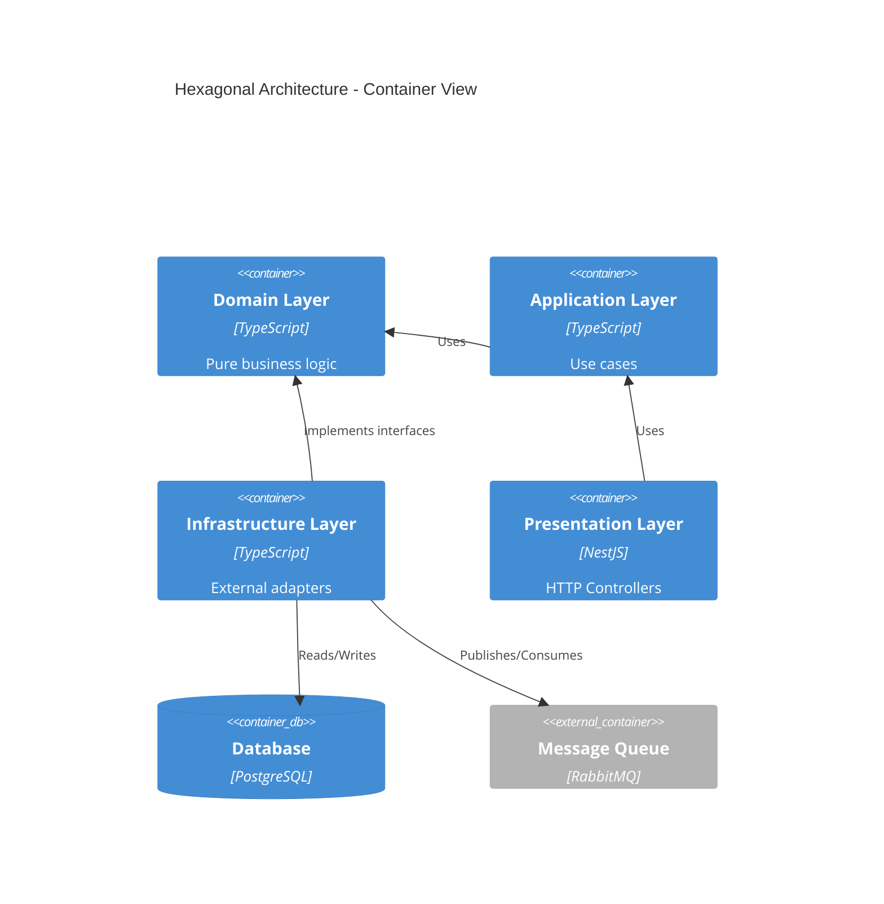

# 🏗️ Workflow: Audit (Hexagonal Architecture)

> **Purpose:** Complete hexagonal architecture, monorepo boundaries, and decoupling audit

---

## 📋 Audit Scope

- **Hexagonal Architecture:** Domain → Application → Infrastructure
- **Monorepo Boundaries:** Package dependencies, shared code
- **Framework Agnosticism:** Framework independence, database abstraction
- **Decoupling:** Interfaces, Dependency Injection

---

## 🏛️ Step 1: Hexagonal Architecture Audit

### Verify Directory Structure

**Expected structure:**

```
src/
├── domain/              ← PURE (no dependencies)
│   ├── entities/
│   ├── value-objects/
│   └── repositories/    (interfaces only)
├── application/         ← Use Cases
│   └── use-cases/
├── infrastructure/      ← External adapters
│   ├── persistence/     (DB implementation)
│   ├── http/            (API clients)
│   └── messaging/       (Queues)
└── presentation/        ← Controllers
    └── http/
```

### Rule #1: Domain depends on nothing

**Activate skill:** `system-architect`

**Verify:**

```bash
# Search for prohibited imports in domain/
grep -r "import.*from.*infrastructure" src/domain/
grep -r "import.*from.*presentation" src/domain/
grep -r "import.*express" src/domain/
grep -r "import.*prisma" src/domain/
```

**If matches found:** ❌ CRITICAL VIOLATION

**Valid example (Domain):**

```typescript
// ✅ domain/repositories/user.repository.ts
export interface UserRepository {
  findById(id: string): Promise<User | null>;
  save(user: User): Promise<void>;
}
```

**Invalid example:**

```typescript
// ❌ domain/user.service.ts
import { PrismaClient } from "@prisma/client"; // VIOLATION!

export class UserService {
  constructor(private prisma: PrismaClient) {} // Direct DB dependency
}
```

---

### Rule #2: Dependency Injection

**Verify:**

- [ ] Infrastructure implements Domain interfaces
- [ ] Controllers receive services via constructor
- [ ] Database clients injected, not hardcoded

**Valid example:**

```typescript
// ✅ infrastructure/persistence/prisma-user.repository.ts
import { UserRepository } from "../../domain/repositories/user.repository";
import { PrismaClient } from "@prisma/client";

export class PrismaUserRepository implements UserRepository {
  constructor(private prisma: PrismaClient) {}

  async findById(id: string): Promise<User | null> {
    const data = await this.prisma.user.findUnique({ where: { id } });
    return data ? this.toDomain(data) : null;
  }
}
```

---

## 🔗 Step 2: Monorepo Boundaries Audit

**If using monorepo (Nx, Turborepo, Lerna):**

### Verify Package Dependencies

```bash
# Analyze dependency graph
npx nx graph

# View circular dependencies
npx madge --circular packages/
```

**Rules:**

- ✅ `@shared/ui` can be used by `@app/web` and `@app/mobile`
- ✅ `@shared/types` can be used by all
- ❌ `@app/web` cannot import from `@app/mobile`
- ❌ Application packages do NOT import from each other

**Valid example:**

```typescript
// ✅ packages/web/src/components/Button.tsx
import { ButtonProps } from "@shared/types";
import { useTheme } from "@shared/ui";
```

**Invalid example:**

```typescript
// ❌ packages/web/src/utils/auth.ts
import { mobileAuthHelper } from "@app/mobile"; // VIOLATION!
```

---

### Create Dependency Constraints

**Nx example (nx.json):**

```json
{
  "tasksRunnerOptions": {
    "default": {
      "options": {
        "cacheableOperations": ["build", "test"]
      }
    }
  },
  "targetDefaults": {
    "build": {
      "dependsOn": ["^build"]
    }
  }
}
```

**project.json constraints:**

```json
{
  "name": "web",
  "tags": ["type:app", "scope:web"],
  "implicitDependencies": []
}
```

---

## 🔓 Step 3: Decoupling Audit

### Framework Agnosticism

**Verify that business logic does NOT depend on:**

- Express/Fastify/NestJS
- React/Vue/Angular
- Prisma/TypeORM (in domain)

**Decoupling test:**

```typescript
// ✅ GOOD: Pure function, framework-agnostic
export function calculateDiscount(price: number, tier: string): number {
  // No imports from frameworks
  const discounts = { gold: 0.15, silver: 0.1, bronze: 0.05 };
  return price * (1 - (discounts[tier] || 0));
}

// ❌ BAD: Coupled to Express
import { Request, Response } from "express";

export function calculateDiscount(req: Request, res: Response) {
  const { price, tier } = req.body; // Framework dependency!
  // ...
}
```

---

### Database Agnosticism (Repository Pattern)

**Verify:**

```typescript
// ✅ domain/repositories/user.repository.ts
export interface UserRepository {
  findById(id: string): Promise<User | null>;
  findByEmail(email: string): Promise<User | null>;
  save(user: User): Promise<void>;
  delete(id: string): Promise<void>;
}

// ✅ infrastructure/persistence/prisma-user.repository.ts
export class PrismaUserRepository implements UserRepository {
  // Prisma-specific implementation
}

// ✅ infrastructure/persistence/typeorm-user.repository.ts
export class TypeORMUserRepository implements UserRepository {
  // TypeORM-specific implementation
}
```

**Ability to change DB without touching domain:**

```typescript
// main.ts - Easy swap
const userRepo =
  process.env.DB === "postgres"
    ? new PrismaUserRepository(prisma)
    : new TypeORMUserRepository(dataSource);

const userService = new UserService(userRepo);
```

---

## 📐 Step 4: Blueprint Generation

**Generate architecture diagram:**

**Activate skill:** `system-architect`

**Prompt:**

```
Generate a C4 Container diagram showing:
1. Domain layer (pure business logic)
2. Application layer (use cases)
3. Infrastructure layer (DB, HTTP, Queue adapters)
4. Presentation layer (Controllers)

Show dependency direction: Presentation → Application → Domain
Infrastructure implements Domain interfaces

Use Mermaid C4 syntax.
```

**Expected output:**



---

## 🔍 Step 5: Decouple Action Plan

**If violations found:**

### Action Plan Template

```markdown
# Decoupling - Action Plan

## 🚨 Violations Found

### 1. Domain depends on Prisma

**File:** `src/domain/user.service.ts:12`
**Issue:** Direct import of `@prisma/client`
**Impact:** Cannot change DB without modifying domain

**Fix:**

1. Create interface `UserRepository` in `domain/repositories/`
2. Implement `PrismaUserRepository` in `infrastructure/persistence/`
3. Inject repository via constructor

**Estimated:** 2 hours

---

### 2. Circular dependency in monorepo

**Issue:** `@app/web` ↔ `@app/admin`
**Impact:** Build failures, coupling

**Fix:**

1. Extract shared code to `@shared/common`
2. Update imports
3. Add Nx constraint tags

**Estimated:** 4 hours
```

---

## ✅ Hexagonal Architecture Checklist

- [ ] **Domain Layer**

  - [ ] No framework imports
  - [ ] No infrastructure imports
  - [ ] Only interfaces for dependencies
  - [ ] Entities are POJOs/pure classes

- [ ] **Application Layer**

  - [ ] Use cases use domain interfaces
  - [ ] No DB/HTTP details known
  - [ ] Orchestrates domain entities

- [ ] **Infrastructure Layer**

  - [ ] Implements domain interfaces
  - [ ] Contains specific adapters (Prisma, TypeORM)
  - [ ] Dependency Injection configured

- [ ] **Presentation Layer**

  - [ ] Thin controllers (validation + delegation only)
  - [ ] DTOs for input/output
  - [ ] No business logic

- [ ] **Monorepo (if applicable)**
  - [ ] No circular dependencies
  - [ ] Clear boundaries between packages
  - [ ] Shared code in dedicated packages

---

## 🤖 Automation (Linting)

**Custom ESLint rule:**

```javascript
// .eslintrc.js
module.exports = {
  rules: {
    "no-restricted-imports": [
      "error",
      {
        patterns: [
          {
            group: ["**/infrastructure/**", "**/presentation/**"],
            message: "Domain cannot import from infrastructure or presentation",
          },
        ],
      },
    ],
  },
  overrides: [
    {
      files: ["src/domain/**/*"],
      rules: {
        "no-restricted-imports": [
          "error",
          {
            patterns: ["@prisma/*", "express", "typeorm"],
          },
        ],
      },
    },
  ],
};
```

---

## 📚 Skills & References

- **Skill:** `system-architect` - For blueprint and C4 diagrams
- **References:**
  - [Hexagonal Architecture](https://alistair.cockburn.us/hexagonal-architecture/)
  - [Clean Architecture (Uncle Bob)](https://blog.cleancoder.com/uncle-bob/2012/08/13/the-clean-architecture.html)
  - [Nx Boundary Rules](https://nx.dev/concepts/decisions/project-dependency-rules)
