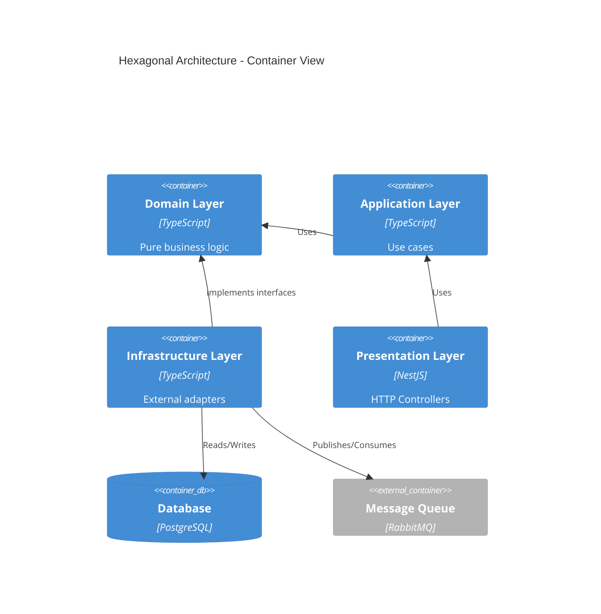

# Workflow: CDH Architecture (Clean + DDD + Hexagonal)

> Verify and enforce Clean Architecture, Domain-Driven Design, and Hexagonal Architecture patterns.

## Purpose

Ensure domain purity, proper dependency injection, framework agnosticism, and correct layer boundaries. This workflow provides a structured audit and enforcement protocol for CDH (Clean + DDD + Hexagonal) architecture patterns.

**Use when:**

- DDD/Hexagonal patterns are detected or required in the project
- Conducting architecture audits (pre-merge, quarterly, post-refactor)
- Verifying domain purity after new feature implementation
- Setting up a new backend service with CDH patterns
- Reviewing dependency direction compliance

## Invocation

| Type       | Items            |
| ---------- | ---------------- |
| **Skills** | system-architect |
| **MCPs**   | Context7         |

---

## Prerequisites

- [ ] Backend codebase with layered architecture (or intent to establish one)
- [ ] Clear understanding of domain boundaries
- [ ] Dependencies installed and project buildable

---

## Step 1: Directory Structure Verification

**Indicator**: `[aidd.md] Workflow - cdh-architecture (Directory Structure)`

**Expected structure:**

```
src/
├── domain/              ← PURE (no dependencies)
│   ├── entities/
│   ├── value-objects/
│   └── repositories/    (interfaces only)
├── application/         ← Use Cases
│   └── use-cases/
├── infrastructure/      ← External adapters
│   ├── persistence/     (DB implementation)
│   ├── http/            (API clients)
│   └── messaging/       (Queues)
└── presentation/        ← Controllers
    └── http/
```

Verify the directory structure exists and follows the expected pattern. Flag any deviations.

---

## Step 2: Domain Purity Rules

**Indicator**: `[aidd.md] Workflow - cdh-architecture (Domain Purity)`

**Rule: Domain depends on nothing.**

**Detection commands:**

```bash
# Search for prohibited imports in domain/
grep -r "import.*from.*infrastructure" src/domain/
grep -r "import.*from.*presentation" src/domain/
grep -r "import.*express" src/domain/
grep -r "import.*prisma" src/domain/
grep -r "import.*typeorm" src/domain/
```

**If matches found:** CRITICAL VIOLATION — domain layer has external dependencies.

**Valid example (Domain):**

```typescript
// domain/repositories/user.repository.ts
export interface UserRepository {
  findById(id: string): Promise<User | null>;
  save(user: User): Promise<void>;
}
```

**Invalid example:**

```typescript
// domain/user.service.ts
import { PrismaClient } from "@prisma/client"; // VIOLATION!

export class UserService {
  constructor(private prisma: PrismaClient) {} // Direct DB dependency
}
```

---

## Step 3: Dependency Injection Checks

**Indicator**: `[aidd.md] Workflow - cdh-architecture (Dependency Injection)`

**Verify:**

- [ ] Infrastructure implements Domain interfaces
- [ ] Controllers receive services via constructor
- [ ] Database clients injected, not hardcoded

**Valid example:**

```typescript
// infrastructure/persistence/prisma-user.repository.ts
import { UserRepository } from "../../domain/repositories/user.repository";
import { PrismaClient } from "@prisma/client";

export class PrismaUserRepository implements UserRepository {
  constructor(private prisma: PrismaClient) {}

  async findById(id: string): Promise<User | null> {
    const data = await this.prisma.user.findUnique({ where: { id } });
    return data ? this.toDomain(data) : null;
  }
}
```

---

## Step 4: Framework Agnosticism

**Indicator**: `[aidd.md] Workflow - cdh-architecture (Framework Agnosticism)`

**Verify that business logic does NOT depend on:**

- Express/Fastify/NestJS (HTTP frameworks)
- React/Vue/Angular (UI frameworks)
- Prisma/TypeORM (ORMs — only in infrastructure layer)

**Decoupling test:**

```typescript
// GOOD: Pure function, framework-agnostic
export function calculateDiscount(price: number, tier: string): number {
  const discounts = { gold: 0.15, silver: 0.1, bronze: 0.05 };
  return price * (1 - (discounts[tier] || 0));
}

// BAD: Coupled to Express
import { Request, Response } from "express";

export function calculateDiscount(req: Request, res: Response) {
  const { price, tier } = req.body; // Framework dependency!
}
```

---

## Step 5: Repository Pattern (Database Agnosticism)

**Indicator**: `[aidd.md] Workflow - cdh-architecture (Repository Pattern)`

**Verify:**

```typescript
// domain/repositories/user.repository.ts (interface)
export interface UserRepository {
  findById(id: string): Promise<User | null>;
  findByEmail(email: string): Promise<User | null>;
  save(user: User): Promise<void>;
  delete(id: string): Promise<void>;
}

// infrastructure/persistence/prisma-user.repository.ts (implementation)
export class PrismaUserRepository implements UserRepository {
  // Prisma-specific implementation
}

// infrastructure/persistence/typeorm-user.repository.ts (alternative)
export class TypeORMUserRepository implements UserRepository {
  // TypeORM-specific implementation
}
```

**Easy-swap test — ability to change DB without touching domain:**

```typescript
// main.ts
const userRepo =
  process.env.DB === "postgres"
    ? new PrismaUserRepository(prisma)
    : new TypeORMUserRepository(dataSource);

const userService = new UserService(userRepo);
```

---

## Step 6: Blueprint Generation

**Indicator**: `[aidd.md] Workflow - cdh-architecture (Blueprint Generation)`

Generate a C4 Container diagram showing layer boundaries:



**Dependency direction:** Presentation → Application → Domain. Infrastructure implements Domain interfaces (inward dependency).

---

## Step 7: Decouple Action Plan

**Indicator**: `[aidd.md] Workflow - cdh-architecture (Decouple Action Plan)`

**If violations found, generate an action plan:**

```markdown
# Decoupling - Action Plan

## Violations Found

### 1. Domain depends on Prisma

**File:** `src/domain/user.service.ts:12`
**Issue:** Direct import of `@prisma/client`
**Impact:** Cannot change DB without modifying domain

**Fix:**
1. Create interface `UserRepository` in `domain/repositories/`
2. Implement `PrismaUserRepository` in `infrastructure/persistence/`
3. Inject repository via constructor

**Estimated:** 2 hours
```

---

## Hexagonal Architecture Checklist

- [ ] **Domain Layer**
  - [ ] No framework imports
  - [ ] No infrastructure imports
  - [ ] Only interfaces for dependencies
  - [ ] Entities are POJOs/pure classes

- [ ] **Application Layer**
  - [ ] Use cases use domain interfaces
  - [ ] No DB/HTTP details known
  - [ ] Orchestrates domain entities

- [ ] **Infrastructure Layer**
  - [ ] Implements domain interfaces
  - [ ] Contains specific adapters (Prisma, TypeORM)
  - [ ] Dependency Injection configured

- [ ] **Presentation Layer**
  - [ ] Thin controllers (validation + delegation only)
  - [ ] DTOs for input/output
  - [ ] No business logic

---

## Automation (Linting)

**Custom ESLint rule for domain purity:**

```javascript
// eslint.config.js (flat config)
export default [
  {
    files: ["src/domain/**/*"],
    rules: {
      "no-restricted-imports": [
        "error",
        {
          patterns: [
            {
              group: ["**/infrastructure/**", "**/presentation/**"],
              message: "Domain cannot import from infrastructure or presentation",
            },
            {
              group: ["@prisma/*", "express", "typeorm", "fastify"],
              message: "Domain must be framework-agnostic",
            },
          ],
        },
      ],
    },
  },
];
```

---

## Success Criteria

- [ ] Domain layer is pure (zero external dependencies)
- [ ] Dependency Injection properly configured
- [ ] Framework-agnostic business logic
- [ ] Repository pattern implemented for data access
- [ ] No circular dependencies between layers
- [ ] C4 diagram generated showing layer boundaries
- [ ] All violations documented with action plan

---

## Anti-Patterns

| Anti-Pattern                  | Description                                                    | Mitigation                                                       |
| ----------------------------- | -------------------------------------------------------------- | ---------------------------------------------------------------- |
| **Fat Domain**                | Domain entities with database logic                            | Keep domain pure; move persistence to infrastructure             |
| **Anemic Domain**             | Domain entities as plain data bags with no behavior            | Add business methods to entities; keep logic in domain           |
| **Leaky Abstraction**         | Infrastructure details bleeding into domain interfaces         | Review interface parameters — should use domain types only       |
| **God Service**               | Single service handling all business logic                     | Split by aggregate root / bounded context                        |
| **Direct Infrastructure**     | Business logic calling DB/HTTP directly                        | Always use ports (interfaces) defined in domain                  |
| **Circular Dependencies**     | Layers importing from each other                              | Dependencies flow inward only: Presentation → App → Domain      |

---

## Cross-References

- **Full audit workflow**: `workflows/audit.md`
- **Security + architecture analysis**: `workflows/analyze.md`
- **Pre-merge review**: `workflows/review.md`
- **System Architect skill**: `skills/system-architect/SKILL.md`
- **Hexagonal Architecture**: https://alistair.cockburn.us/hexagonal-architecture/
- **Clean Architecture**: https://blog.cleancoder.com/uncle-bob/2012/08/13/the-clean-architecture.html
