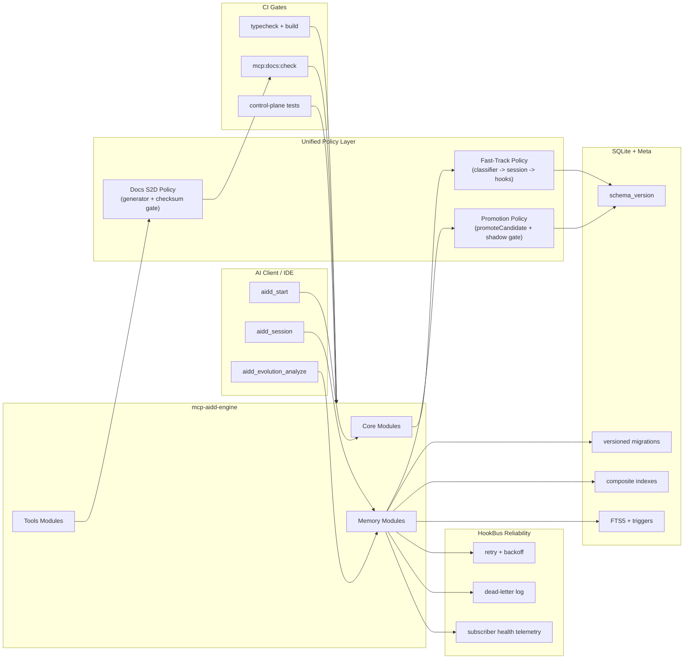
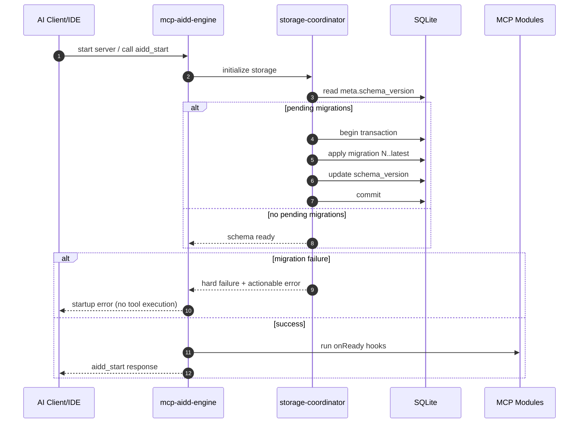
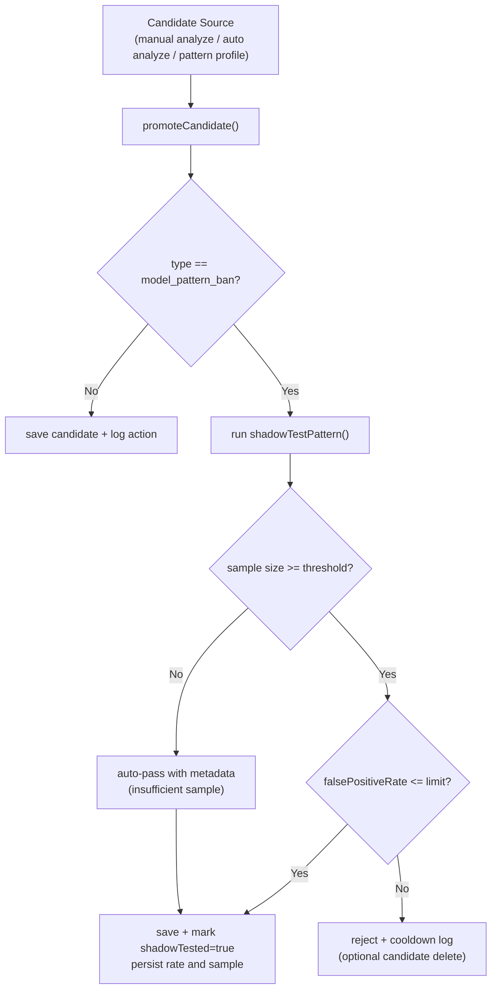
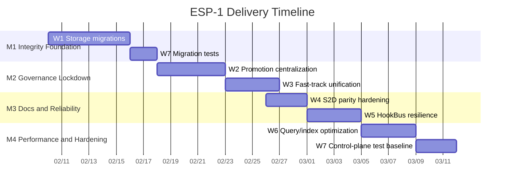

# ESP-1 Architecture and Delivery Diagrams

## 1) Target Control-Plane Architecture

## 2) Startup and Migration Sequence

## 3) Pattern Candidate Promotion Gate

## 4) Delivery Timeline (Milestones)

