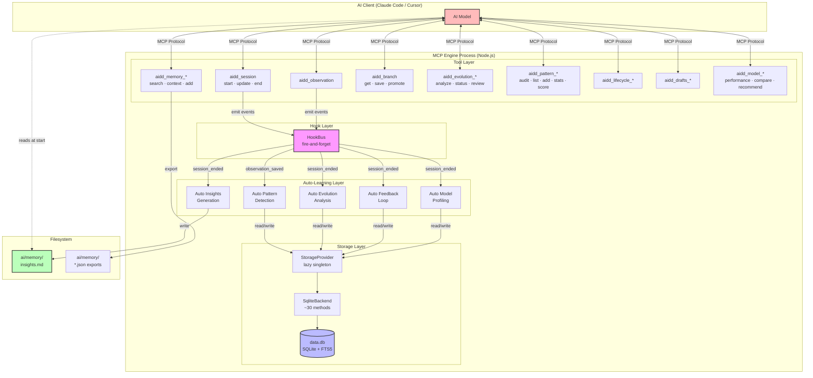
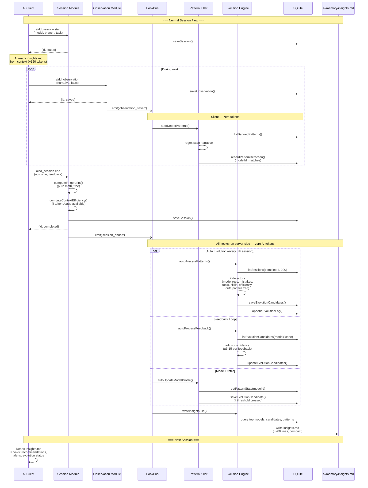
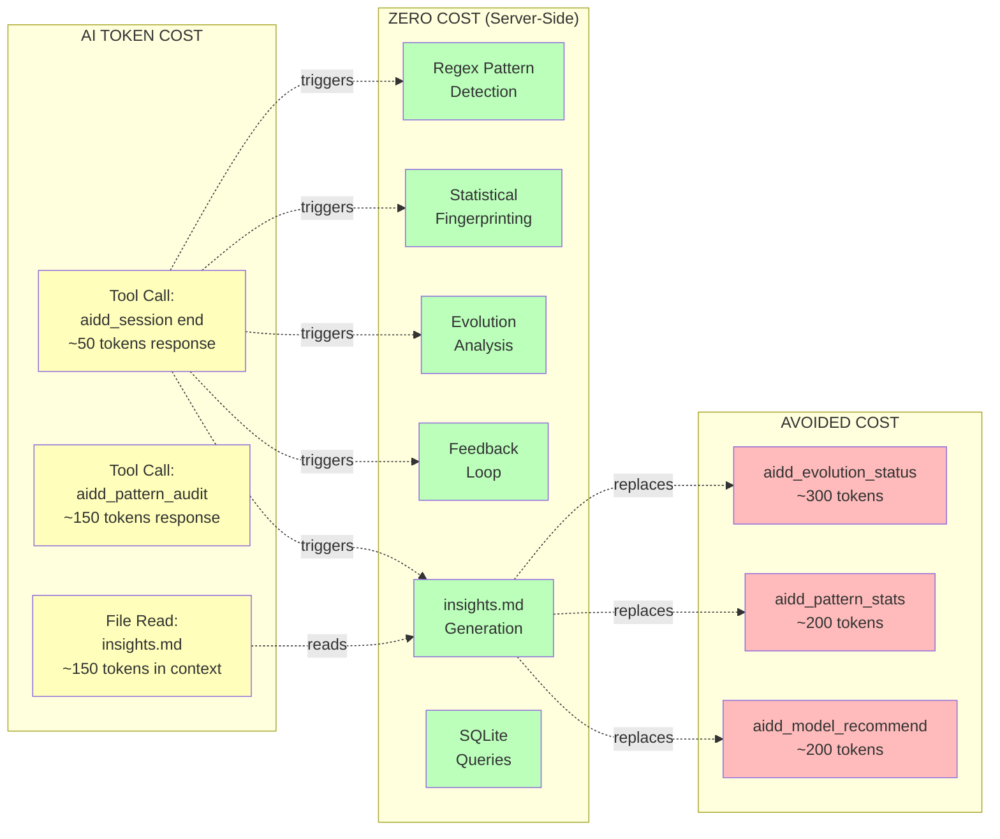
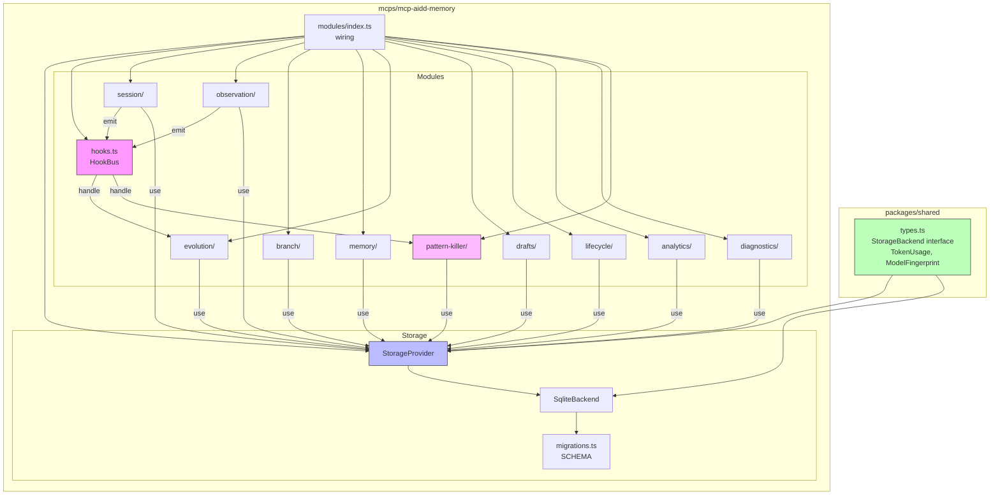
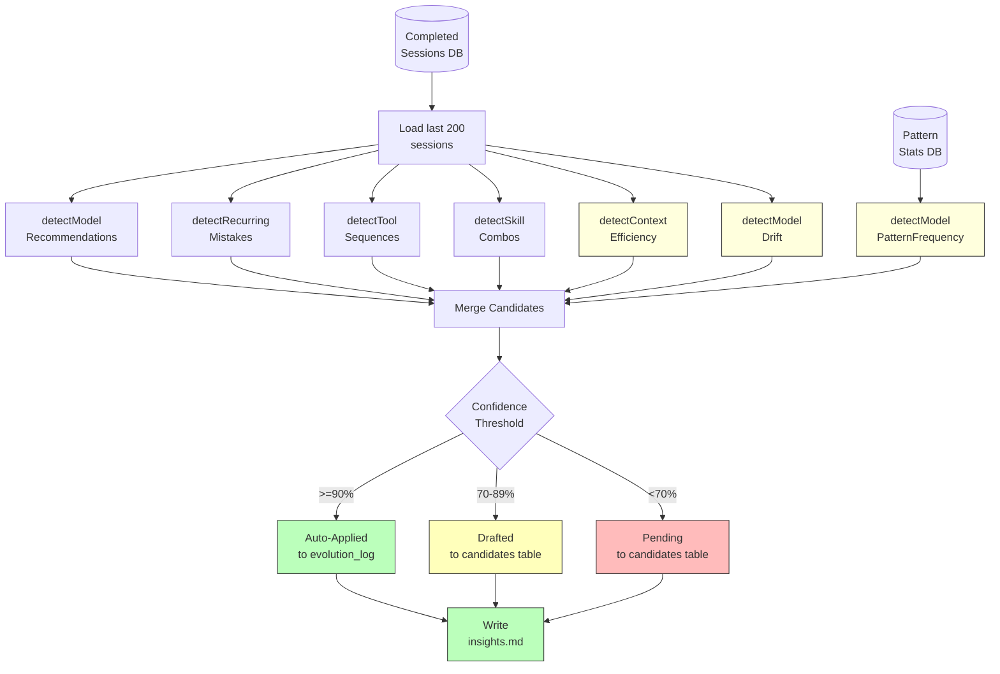
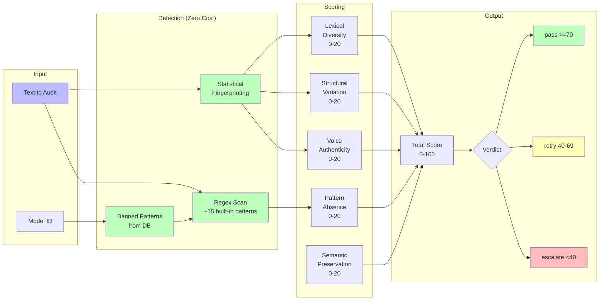
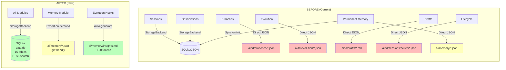

# Architecture Diagrams: SQLite-First Storage + Model-Aware Auto-Learning

> Mermaid diagrams for the AIDD MCP memory system.
> **Last Updated**: 2026-02-06

---

## 1. High-Level Architecture

---

## 2. Storage Schema (Entity Relationship)

```mermaid
erDiagram
    sessions {
        TEXT id PK
        TEXT branch
        TEXT status
        TEXT model_id
        TEXT started_at
        TEXT ended_at
        TEXT data "JSON blob"
    }

    observations {
        TEXT id PK
        TEXT session_id FK
        TEXT type
        TEXT title
        TEXT data "JSON blob"
        TEXT created_at
    }

    observations_fts {
        TEXT title
        TEXT content
    }

    permanent_memory {
        TEXT id PK
        TEXT type
        TEXT data "JSON blob"
        TEXT created_at
    }

    permanent_memory_fts {
        TEXT title
        TEXT content
    }

    tool_usage {
        INTEGER id PK
        TEXT session_id FK
        TEXT name
        TEXT result_quality
        TEXT timestamp
    }

    branches {
        TEXT name PK
        TEXT data "JSON blob"
        INTEGER archived
        TEXT updated_at
    }

    evolution_candidates {
        TEXT id PK
        TEXT type
        TEXT title
        REAL confidence
        TEXT model_scope
        TEXT status
        TEXT data "JSON blob"
        TEXT created_at
        TEXT updated_at
    }

    evolution_log {
        TEXT id PK
        TEXT candidate_id FK
        TEXT action
        TEXT title
        REAL confidence
        TEXT timestamp
    }

    evolution_snapshots {
        TEXT id PK
        TEXT candidate_id FK
        TEXT before_state "JSON blob"
        TEXT applied_at
    }

    drafts {
        TEXT id PK
        TEXT category
        TEXT title
        TEXT content
        TEXT status
        TEXT data "JSON blob"
        TEXT created_at
        TEXT updated_at
    }

    lifecycle_sessions {
        TEXT id PK
        TEXT session_id FK
        TEXT feature
        TEXT current_phase
        TEXT status
        TEXT phases "JSON blob"
        TEXT created_at
        TEXT updated_at
    }

    banned_patterns {
        TEXT id PK
        TEXT category
        TEXT pattern
        TEXT type
        TEXT severity
        TEXT model_scope
        TEXT origin
        INTEGER active
        INTEGER use_count
        TEXT hint
        TEXT created_at
    }

    pattern_detections {
        INTEGER id PK
        TEXT session_id FK
        TEXT model_id
        TEXT pattern_id FK
        TEXT matched_text
        TEXT context
        TEXT source
        TEXT created_at
    }

    audit_scores {
        INTEGER id PK
        TEXT session_id FK
        TEXT model_id
        TEXT input_hash
        TEXT scores "JSON blob"
        TEXT verdict
        TEXT created_at
    }

    sessions ||--o{ observations : "has"
    sessions ||--o{ tool_usage : "records"
    sessions ||--o{ lifecycle_sessions : "linked to"
    sessions ||--o{ pattern_detections : "generates"
    sessions ||--o{ audit_scores : "scored in"
    evolution_candidates ||--o{ evolution_log : "tracked by"
    evolution_candidates ||--o{ evolution_snapshots : "snapshot of"
    banned_patterns ||--o{ pattern_detections : "matched by"
```

---

## 3. Auto-Learning Data Flow

---

## 4. Token Budget Flow

---

## 5. Module Dependency Graph

---

## 6. Evolution Detector Pipeline

---

## 7. Pattern Killer Pipeline

---

## 8. Before vs After: Storage Architecture

