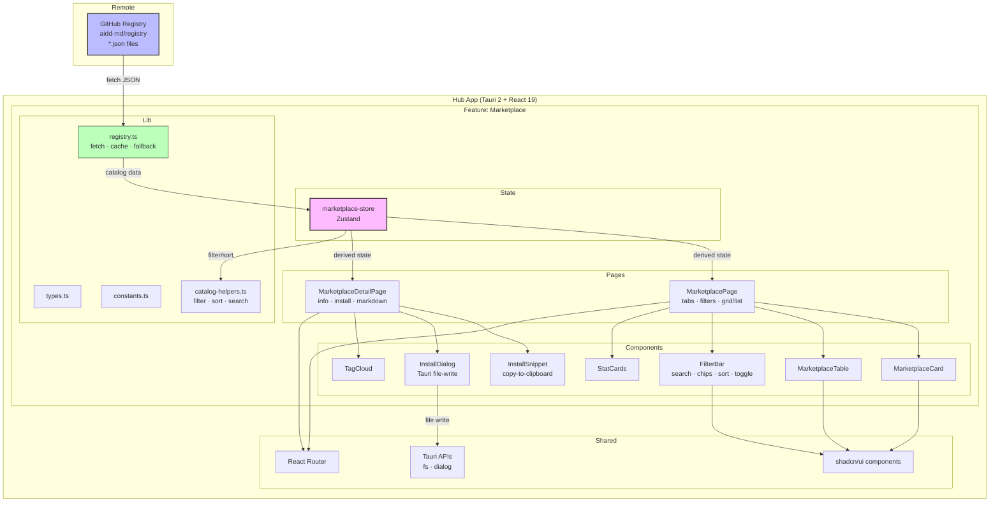
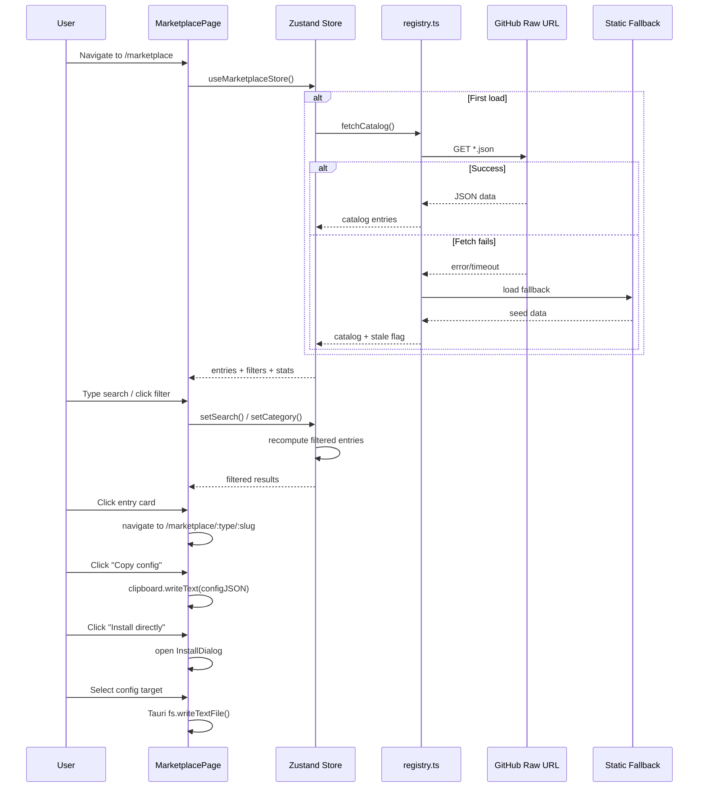
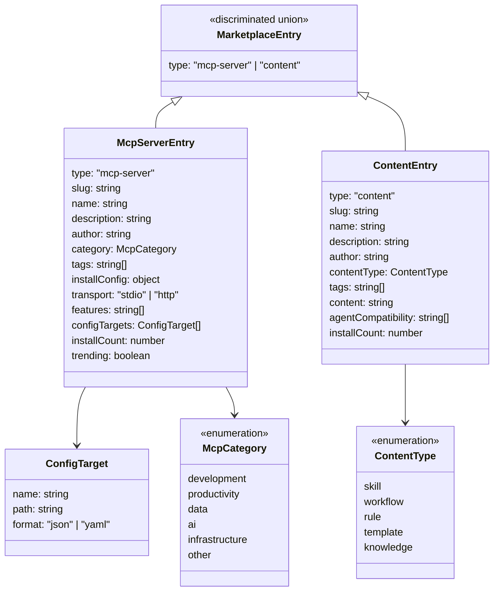
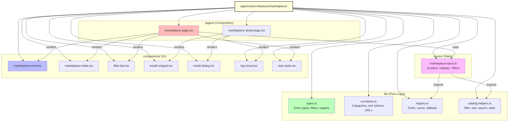
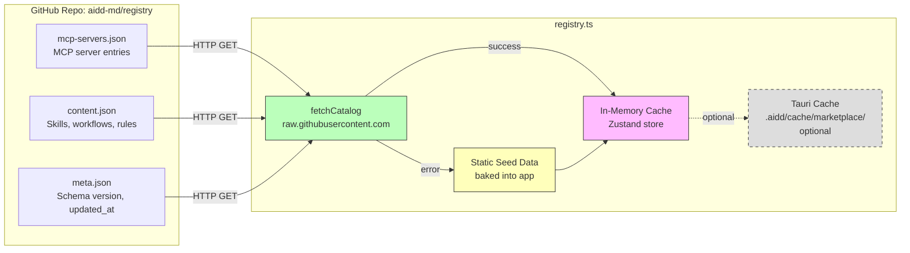
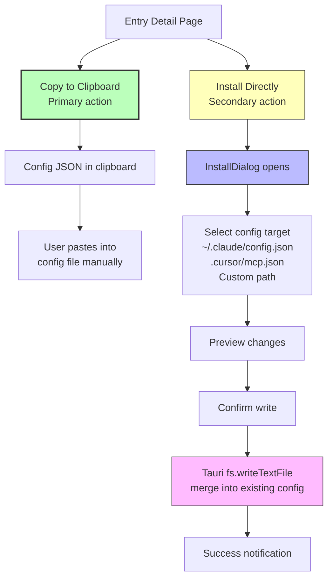
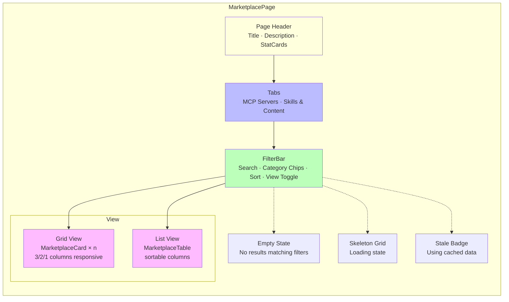

# Architecture Diagrams: Hub Marketplace

> Mermaid diagrams for the AIDD Hub Marketplace feature.
> **Last Updated**: 2026-02-06

---

## 1. High-Level Architecture

---

## 2. Data Flow

---

## 3. Type System

---

## 4. File Structure

---

## 5. Registry Architecture

---

## 6. Install Flow

---

## 7. Page Layout — Marketplace

