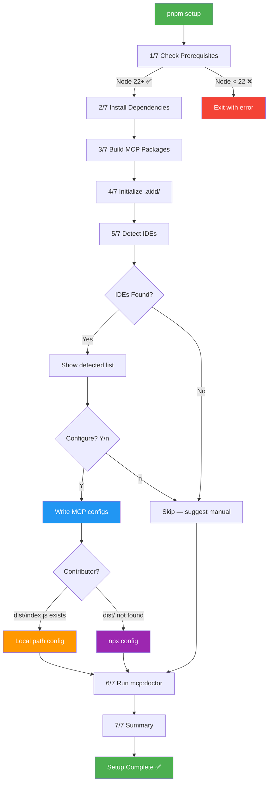
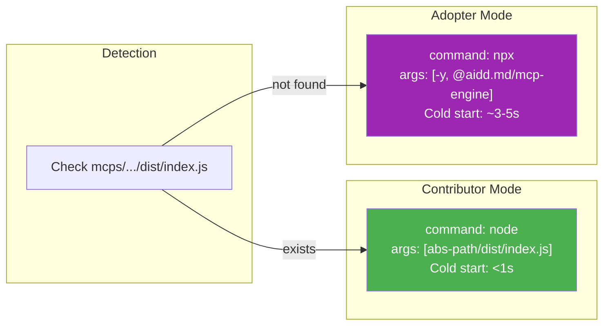
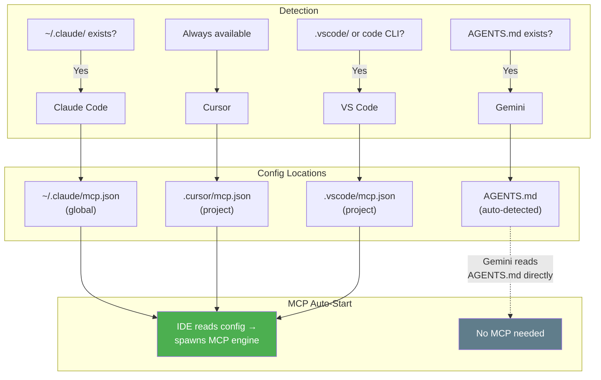
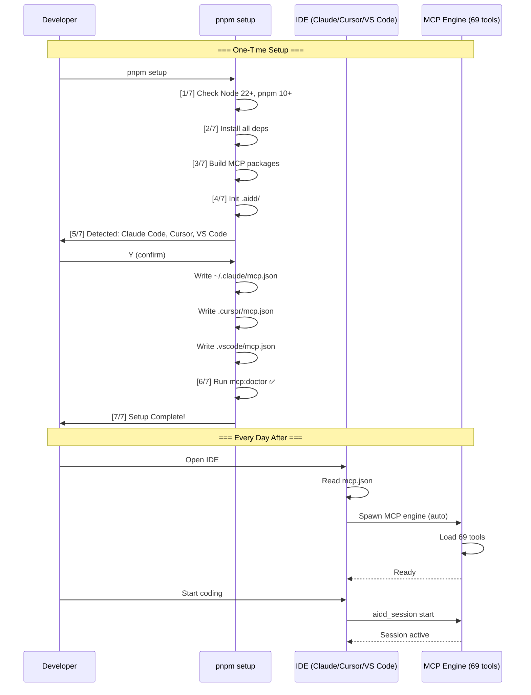
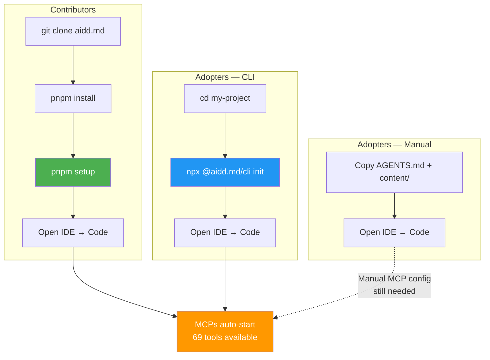

# Diagrams: Best DX — Zero-Friction Developer Experience

> Mermaid diagrams for the unified setup flow.
> **Date**: 2026-02-07

---

## 1. Setup Flow

---

## 2. Smart Path Detection

---

## 3. IDE Config Flow

---

## 4. Developer Journey

---

## 5. Entry Points

