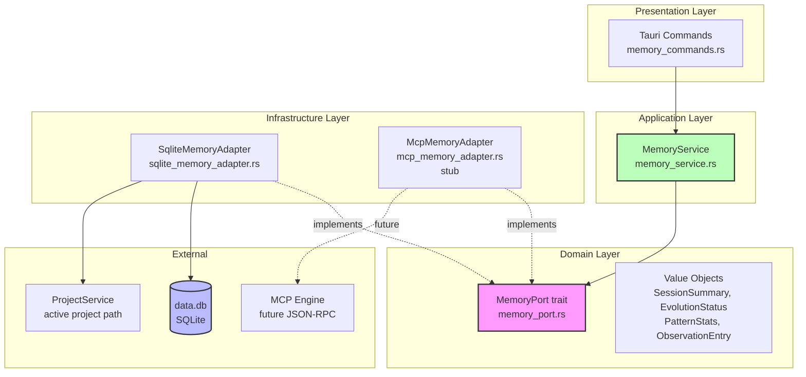
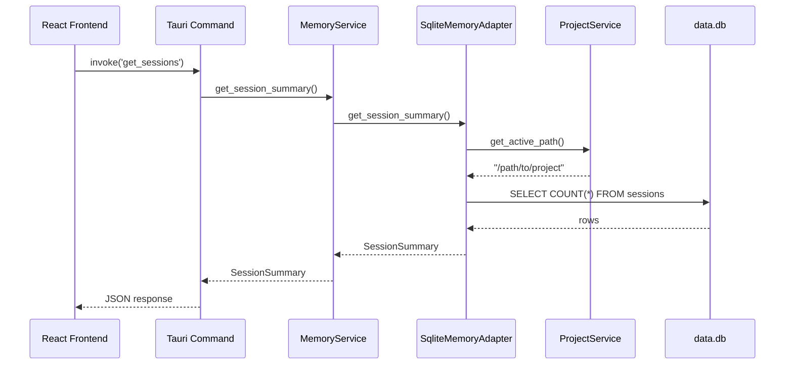
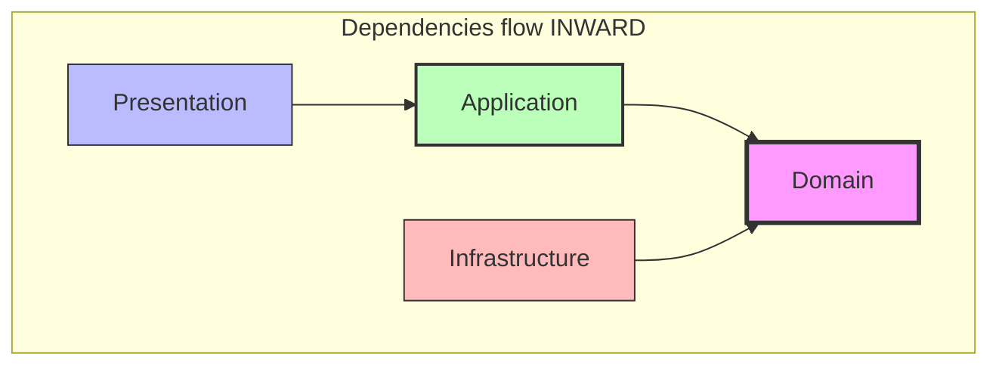
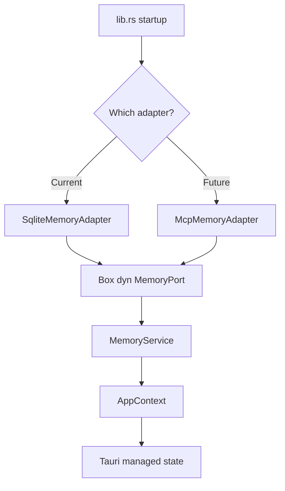
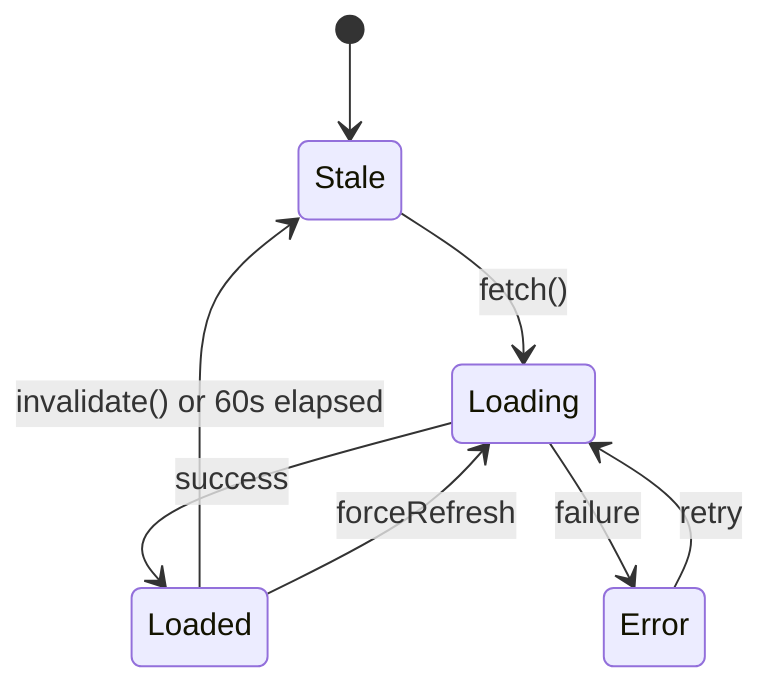

# Architecture Diagrams: Hub Memory Service — DDD + Hexagonal

> Mermaid diagrams for the Hub memory bounded context.
> **Last Updated**: 2026-02-07

---

## 1. Hexagonal Architecture (Layers)

---

## 2. Data Flow (Request Lifecycle)

---

## 3. Dependency Direction (Clean Architecture Rule)

**Rule**: Domain has zero dependencies. Everything points inward.

---

## 4. Adapter Selection (Runtime)

---

## 5. Frontend Store (Zustand)

Cache: 60-second TTL. Graceful fallback on all errors.
