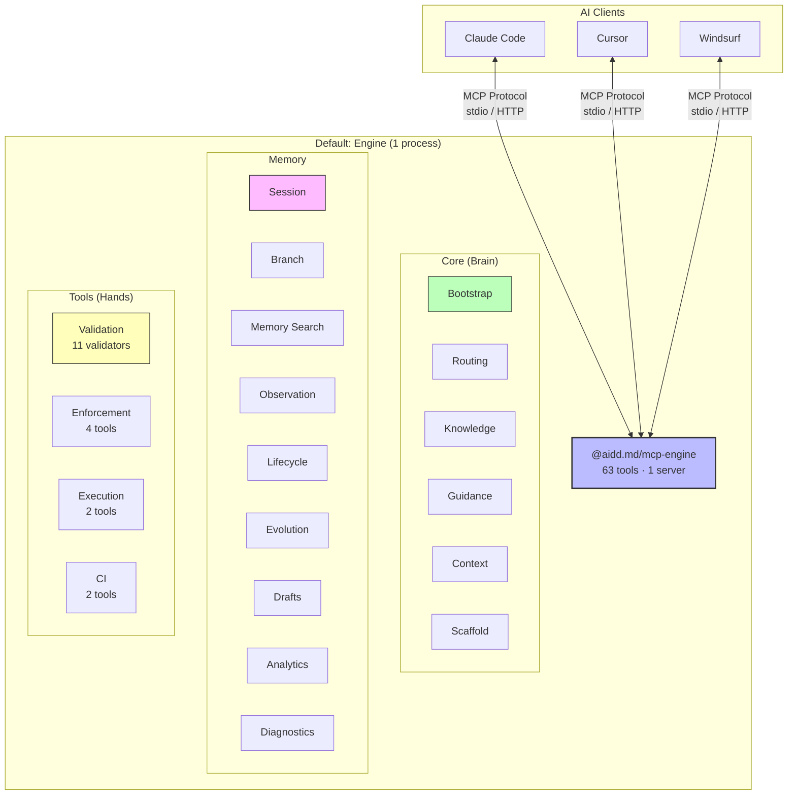
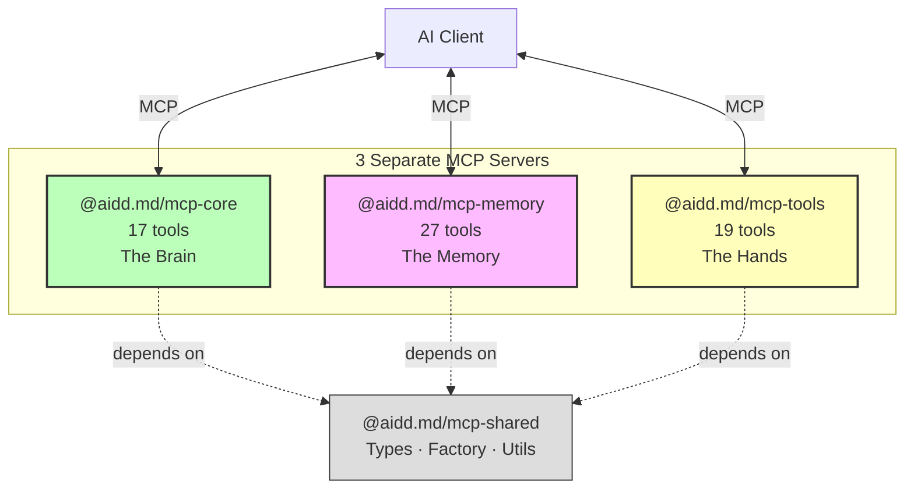
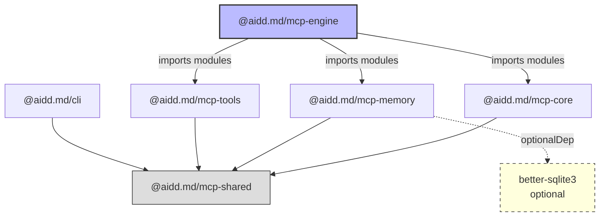
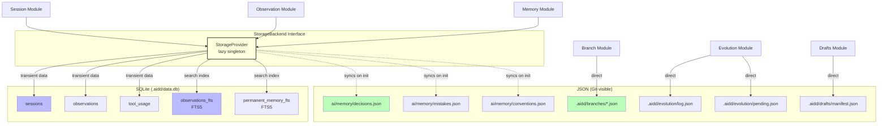
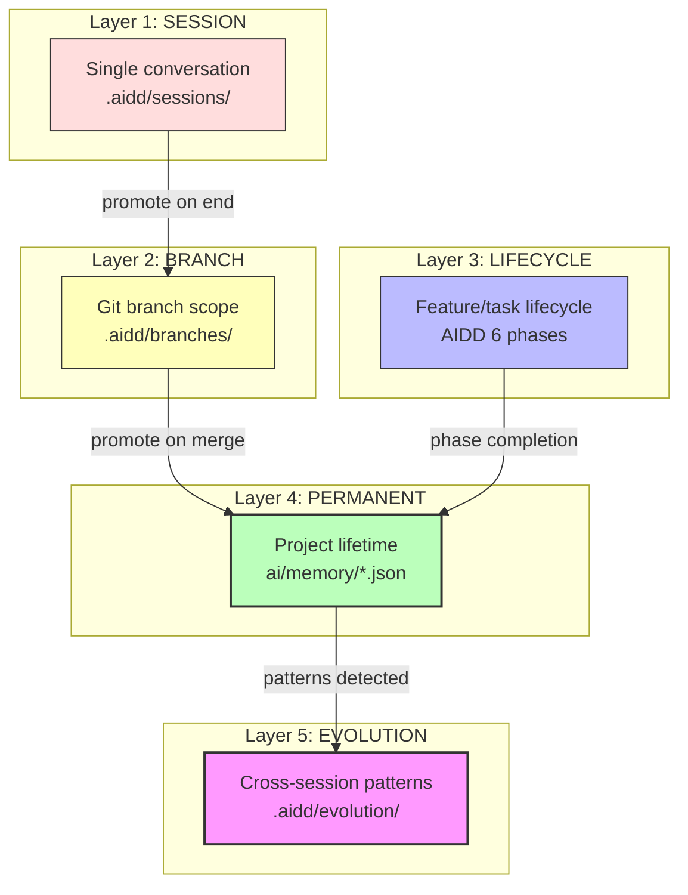
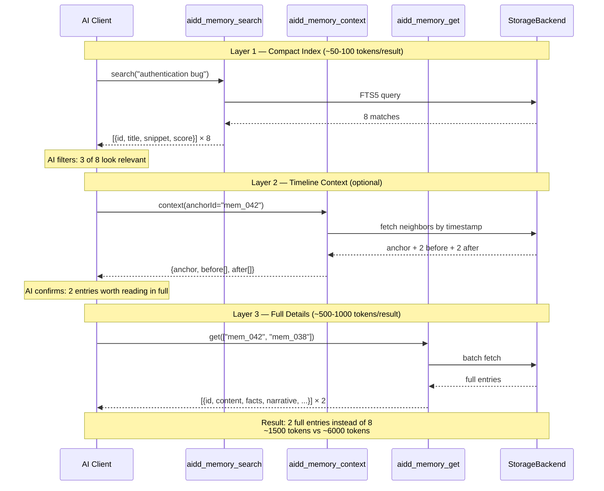
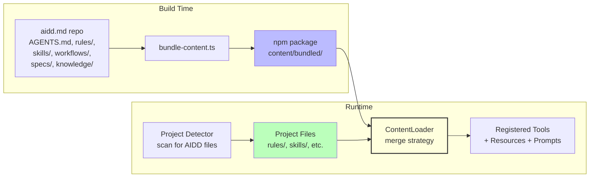
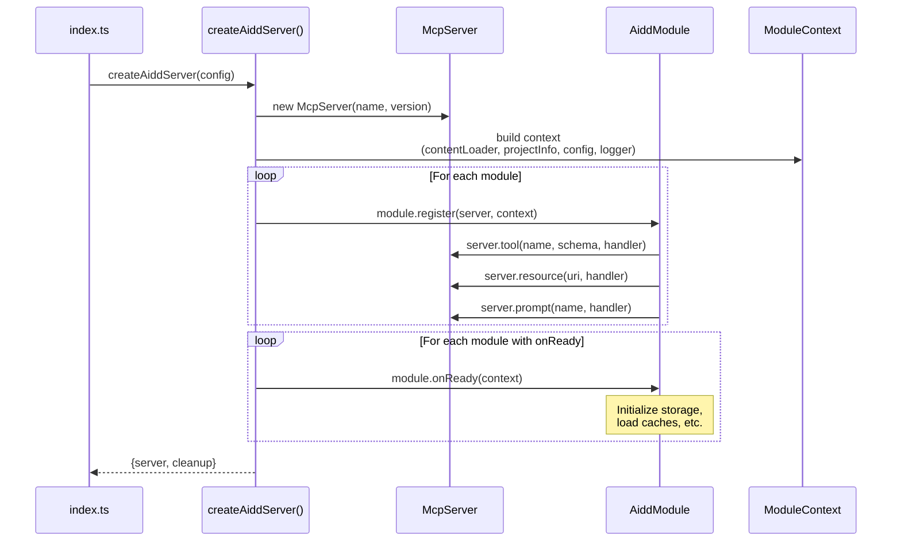
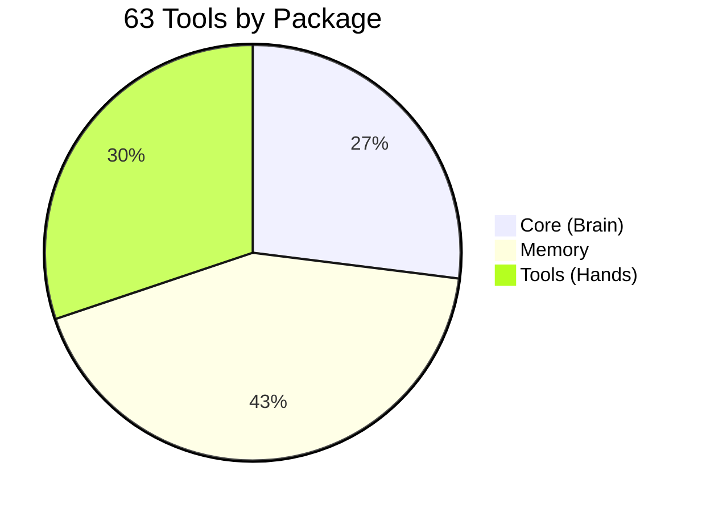
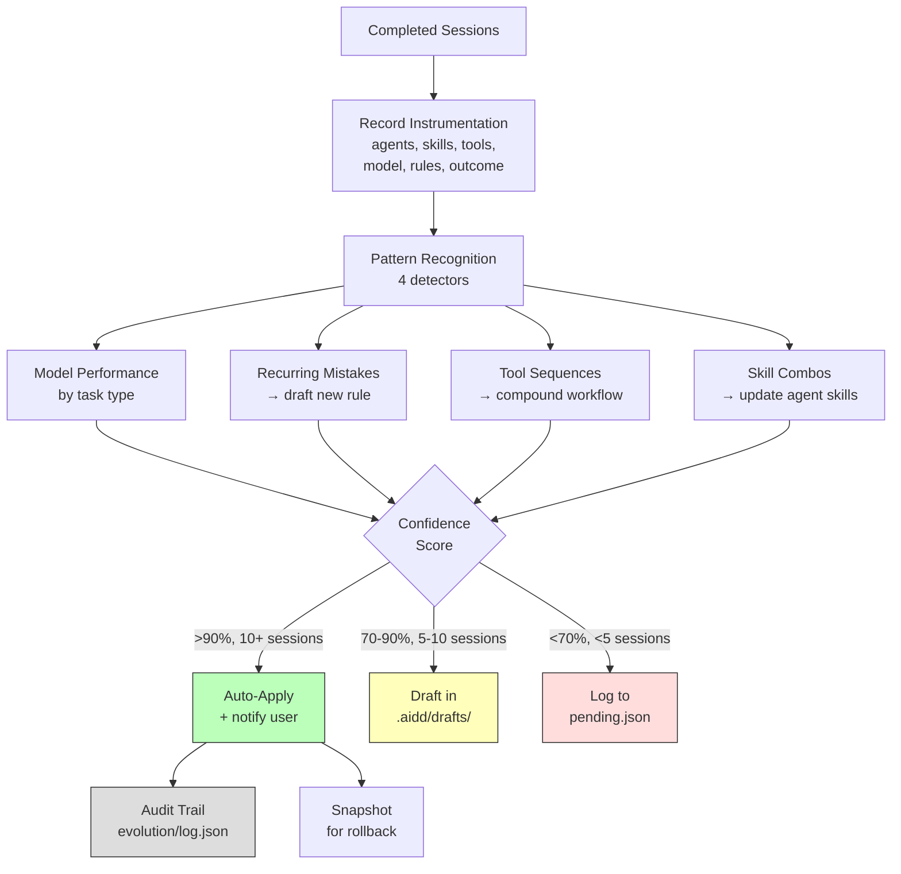

# Architecture Diagrams: AIDD MCP Ecosystem

> Mermaid diagrams for the AIDD MCP ecosystem plan.
> **Last Updated**: 2026-02-05

---

## 1. High-Level Architecture — Engine + Split

---

## 2. Split Mode Architecture

---

## 3. Package Dependency Graph

---

## 4. Storage Architecture (Hybrid)

---

## 5. 5-Layer Memory Model

---

## 6. 3-Layer Search Pattern

---

## 7. Content Loading Pipeline

---

## 8. Module Registration Flow

---

## 9. Tool Inventory Distribution

---

## 10. Evolution Engine Flow

