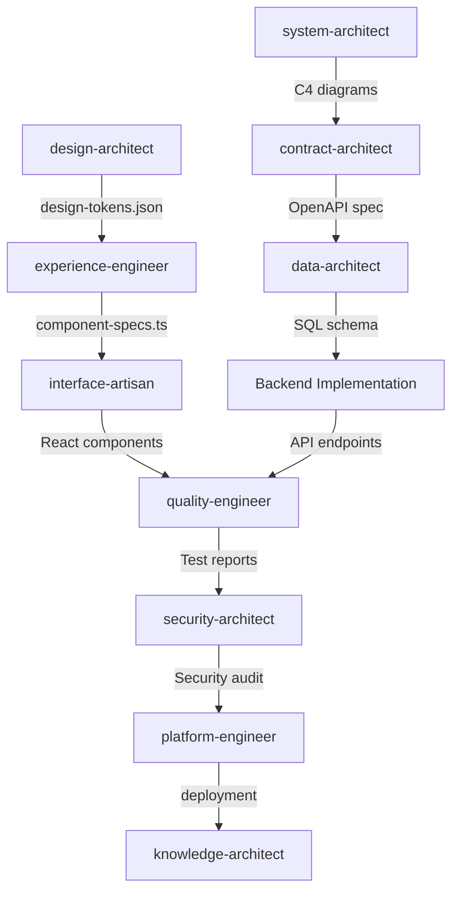

# Decision Tree: Automated Node Selection

> **Purpose:** Eliminate ambiguity in which skill/node to activate based on user request analysis

---

## Pre-Check: Context Sufficiency

Before entering the main decision tree, assess whether the request has enough context to proceed:

1. **Scan** for brainstorming trigger keywords (see `rules/orchestrator.md` Section 4 — Auto-Trigger Keywords)
2. **Assess** context clarity: does the request specify what, why, who, constraints?
3. If clarity < 90% (fewer than 3 of: what, why, who, constraints, scope): → `templates/brainstorming.md` Step 0 (Elicit Requirements)
4. If clarity >= 90%: → Continue to the Pattern Matching below

---

## Principle: Pattern Matching → Node Activation

**Input:** User request (natural language)
**Process:** Extract keywords/intent → Match to decision rules
**Output:** Activate specific node(s) in optimal sequence

---

## Decision Algorithm

```typescript
interface UserRequest {
  text: string;
  keywords: string[];
  intent: string;
}

function selectNodes(request: UserRequest): string[] {
  const activatedNodes: string[] = [];

  // Layer 1: Design Phase Detection
  if (matchesPattern(request, DESIGN_PATTERNS)) {
    if (contains(request, ["Figma", "design tokens", "color", "typography"])) {
      activatedNodes.push("design-architect");
    }
    if (contains(request, ["architecture", "system", "C4", "diagram"])) {
      activate system-architect");
    }
  }

  // Layer 2: Implementation Phase Detection
  if (matchesPattern(request, IMPLEMENTATION_PATTERNS)) {
    if (contains(request, ["state", "performance", "frontend architecture"])) {
      activate system-architect");
    }
    if (contains(request, ["component", "React", "UI"])) {
      // Check dependency
      if (!hasDesignSystem()) {
        activatedNodes.unshift("design-architect"); // Run FIRST
      }
      activatedNodes.push("component-artisan");
    }
  }

  return activatedNodes;
}
```

---

## Pattern Matrix

### Level 1: Phase Identification

| User Request Contains            | Primary Phase      | SubPhase |
| -------------------------------- | ------------------ | -------- |
| "design", "plan", "architect"    | **DESIGN**         | System   |
| "implement", "build", "create"   | **IMPLEMENTATION** | Code     |
| "test", "coverage", "validation" | **QUALITY**        | Testing  |
| "deploy", "CI/CD", "Docker"      | **RELEASE**        | Platform |
| "document", "wiki", "guide"      | **KNOWLEDGE**      | Docs     |

### Level 2: Node Selection (DESIGN Phase)

```
IF phase == DESIGN:

  IF keywords IN ['system', 'architecture', 'microservices', 'C4']:
    → activate: 'system-architect' (System Designer)
    → output: C4 diagrams (.mmd), ADRs (.md)
    → next: 'contract-architect' (if API needed)

  ELSE IF keywords IN ['API', 'OpenAPI', 'endpoints', 'REST']:
    → activate: 'contract-architect' (Contract Engineer)
    → output: OpenAPI spec (.yaml)
    → next: 'data-architect' (if DB needed)

  ELSE IF keywords IN ['database', 'schema', 'SQL', 'tables']:
    → activate: 'data-architect' (Data Modeler)
    → output: SQL DDL (.sql)
    → next: Backend implementation

  ELSE IF keywords IN ['design system', 'tokens', 'Figma', 'colors']:
    → activate: 'design-architect'
    → output: design-tokens.json
    → next: 'experience-engineer'
```

### Level 3: Node Selection (IMPLEMENTATION Phase)

```
IF phase == IMPLEMENTATION:

  IF keywords IN ['frontend', 'state', 'performance', 'Web APIs']:
    → activate: 'experience-engineer'
    → prereq: design-architect (if design system missing)
    → output: Component specs (.ts)
    → next: 'interface-artisan' (Component Artisan)

  ELSE IF keywords IN ['component', 'React', 'UI', 'Tailwind']:
    → activate: 'interface-artisan' (Component Artisan)
    → prereq: experience-engineer (if spec missing)
    → output: .tsx + .test.tsx + .stories.tsx
    → next: 'quality-engineer' (Quality Assurance)

  ELSE IF keywords IN ['backend', 'API implementation', 'NestJS']:
    → Note: Backend implementation is cross-skill collaboration
    → prereq: contract-architect + data-architect
    → output: Controller + Service + Repository
    → next: 'quality-engineer'
```

### Level 4: Node Selection (QUALITY Phase)

```
IF phase == QUALITY:

  IF keywords IN ['test', 'coverage', 'unit test']:
    → activate: 'quality-engineer' (Quality Assurance)
    → output: Test suites (.test.tsx)
    → next: 'security-architect' (if tests pass)

  ELSE IF keywords IN ['security', 'OWASP', 'vulnerabilities']:
    → activate: 'security-architect' (Security Guardian)
    → output: security-audit.json
    → next: 'platform-engineer' (if no critical vulns)

  ELSE IF keywords IN ['review', 'audit', 'code quality']:
    → activate workflow: '/review'
    → sequence: ['system-architect', 'security-architect', 'quality-engineer']
```

### Level 5: Node Selection (RELEASE Phase)

```
IF phase == RELEASE:

  IF keywords IN ['deploy', 'CI/CD', 'Docker', 'Kubernetes']:
    → activate: 'platform-engineer' (Release Engineer)
    → prereq: security audit passed
    → output: Dockerfile, CI/CD yml, K8s manifests
    → next: 'knowledge-architect' (after deployment)

  ELSE IF keywords IN ['document', 'README', 'API docs']:
    → activate: 'knowledge-architect' (Knowledge Codifier)
    → output: Markdown docs, API references
    → next: None (end of cycle)
```

---

## Dependency Graph



---

## Context-Aware Selection

### Example 1: "Design a blog platform"

**Analysis:**

- Keywords: `design`, `platform`
- Phase: **DESIGN**
- Intent: **System architecture**

**Activated Nodes (Sequence):**

1. `system-architect` - Create C4 Context diagram
2. `contract-architect` - Define `/posts`, `/comments` endpoints
3. `data-architect` - Create `posts`, `comments` tables
4. `design-architect` - Define design system
5. `experience-engineer` - Plan state management

**Reason:** Broad request → Start with high-level design

---

### Example 2: "Create a Button component"

**Analysis:**

- Keywords: `create`, `Button`, `component`
- Phase: **IMPLEMENTATION**
- Intent: **UI component**

**Dependency Check:**

- Design system exists? **NO**

**Activated Nodes (Sequence):**

1. `design-architect` - Generate design tokens (colors, spacing)
2. `experience-engineer` - Create ButtonSpec (variants, sizes)
3. `interface-artisan` - Implement Button.tsx + tests + story

**Reason:** Missing prerequisite (design system) → Activate dependencies first

---

### Example 3: "Optimize frontend performance"

**Analysis:**

- Keywords: `optimize`, `frontend`, `performance`
- Phase: **IMPLEMENTATION** (refactor)
- Intent: **Performance tuning**

**Activated Nodes (Sequence):**

1. `experience-engineer` - Analyze bundle, identify bottlenecks
2. `quality-engineer` - Create performance benchmarks
3. `platform-engineer` - Update webpack/Vite config

**Reason:** Performance is cross-cutting → Multiple specialized nodes

---

## Disambiguation Rules

### Ambiguous Request: "Design an API"

**Possible Meanings:**

1. **Architecture:** C4 diagram showing API in system context
2. **Contract:** OpenAPI spec with endpoints
3. **Implementation:** Backend code

**Disambiguation:**

```
Agent asks: "Do you want:
A) System architecture diagram (C4)
B) API contract (OpenAPI spec)
C) Backend implementation (code)
"
```

**OR auto-select based on project state:**

- If no architecture exists → Choose A
- If architecture exists, no spec → Choose B
- If spec exists → Choose C

---

## Override Mechanism

**User can force specific node:**

```
"activate system-architecture"
```

**Parser recognizes:**

- Explicit skill mention: `system-architect`
- Override auto-selection

**Flow:**

1. Skip decision tree
2. activate system-architect` directly
3. Load `rules/backend.md` + `rules/global.md`

---

## Learning Loop (Future Enhancement)

**Track patterns:**

```json
{
  "request": "Create login form",
  "nodes_activated": ["system-architect", "interface-artisan"],
  "success": true,
  "feedback": "User accepted all outputs"
}
```

**Use for:**

- Refining keyword patterns
- Adjusting dependency rules
- Predicting node sequences

---

## Validation

**Test Cases:**

```typescript
describe("Decision Tree", () => {
  it("selects architect for system design", () => {
    const request = "Design a microservices architecture";
    expect(selectNodes(request)).toEqual(["system-architect"]);
  });

  it("selects design-architect before component creation", () => {
    const request = "Create a Button component";
    expect(selectNodes(request)).toEqual([
      "design-architect",
      "experience-engineer",
      "interface-artisan",
    ]);
  });

  it("selects security-architect for audit request", () => {
    const request = "Scan code for vulnerabilities";
    expect(selectNodes(request)).toEqual(["security-architect"]);
  });
});
```

---

**Enforcement:** This decision tree is embedded in `AGENTS.md` as the "Node Selection Protocol" section.
