# 🛡️ Workflow: Analyze (Security & Quality Audit)

> **💡 Pro Tip:** For comprehensive end-to-end security, see [`/orchestrate security-hardening`](./orchestrators/security-hardening.md)

> **Purpose:** Comprehensive code integrity, security and quality evaluation with automatic remediation

**Architecture:** Directed graph with recursive feedback (self-healing)

---

## � Workflow Architecture (Mermaid)

```mermaid
graph TD
    START[Start Analysis] --> A[Scan Secrets]

    A -->|Secrets Found| A1[BLOCK: Remove Secrets]
    A1 --> A
    A -->|Clean| B[Dependency Audit]

    B -->|Critical Vulns| B1[Auto-Update Dependencies]
    B1 --> B
    B -->|Safe| C[Run Tests]

    C -->|Coverage <80%| C1[Generate Missing Tests]
    C1 --> C
    C -->|Pass| D[Security Audit OWASP]

    D -->|Violations| D1[Fix or Document]
    D1 --> D
    D -->|Pass| E[Performance Check]

    E -->|Bundle >200KB| E1[Optimize Bundle]
    E1 --> E
    E -->|Pass| F[Architecture Audit]

    F -->|Violations| F1[Refactor to Hexagonal]
    F1 --> F
    F -->|Pass| SUCCESS[✅ APPROVED]

    style A1 fill:#ff6b6b
    style B1 fill:#ffd93d
    style C1 fill:#6bcf7f
    style D1 fill:#ff6b6b
    style E1 fill:#ffd93d
    style F1 fill:#ffd93d
    style SUCCESS fill:#6bcf7f
```



---

## 📋 Prerequisites

- [ ] Code committed in Git (for change analysis)
- [ ] Dependencies installed (`npm install`)
- [ ] TypeScript/ESLint configured

---

## � Execution Flow (6 Nodes)

### Node A: Scan Secrets

**Action:**

```bash
npm run scan:secrets src/
```

**Decision Logic:**

```typescript
if (secretsFound) {
  return {
    status: "BLOCKED",
    action: "Remove hardcoded secrets",
    severity: "CRITICAL",
    loop_to: "NodeA", // Re-scan after fix
  };
} else {
  return { status: "PASS", next: "NodeB" };
}
```

**Check:**

- ❌ Hardcoded credentials
- ❌ API keys in code
- ❌ Database connection strings

**Activate skill:** `security-architect` for manual code analysis

**Feedback Loop:** If secrets found → User fixes → Re-run scan → Loop until clean

---

### Node B: Dependency Audit

**Action:**

```bash
npm audit --audit-level=high --json > audit.json
```

**Decision Logic:**

```typescript
const audit = JSON.parse(fs.readFileSync("audit.json"));
const criticalCount = audit.metadata.vulnerabilities.critical;

if (criticalCount > 0) {
  exec("npm audit fix --force"); // Attempt auto-fix

  return {
    status: "AUTO_REMEDIATE",
    action: "Updating dependencies",
    loop_to: "NodeB", // Re-audit after update
  };
} else {
  return { status: "PASS", next: "NodeC" };
}
```

**Check:**

- ❌ Critical vulnerabilities in dependencies
- ⚠️ Outdated packages with security patches

**Feedback Loop:** Try `npm audit fix` → Re-audit → Loop until safe

---

### Node C: Test Coverage

**Action:**

```bash
npm run test:coverage --json > coverage.json
```

**Decision Logic:**

```typescript
const coverage = JSON.parse(fs.readFileSync("coverage.json"));
const statementsCoverage = coverage.total.statements.pct;

if (statementsCoverage < 80) {
  const uncovered = findUncoveredFiles(coverage);

  activateSkill("quality-engineer", { files: uncovered }); // Auto-generate tests

  return {
    status: "GENERATING_TESTS",
    action: `Creating tests for ${uncovered.length} files`,
    loop_to: "NodeC", // Re-run tests
  };
} else {
  return { status: "PASS", next: "NodeD" };
}
```

**Targets:**

- Domain logic: 100%
- Services: ≥90%
- Controllers: ≥70%

**Activate skill:** `quality-engineer` to generate missing tests

**Feedback Loop:** Generate tests → Re-run coverage → Loop until ≥80%

---

### Node D: OWASP Security Audit

**Action:**

```bash
activateSkill('security-architect', { mode: 'owasp-audit' });
```

**Decision Logic:**

```typescript
const securityReport = await runOWASPAudit();
const criticalVulns = securityReport.filter((v) => v.severity === "CRITICAL");

if (criticalVulns.length > 0) {
  const fixable = criticalVulns.filter(isAutoFixable);
  fixable.forEach((vuln) => applyFix(vuln)); // Auto-fix known patterns

  const remaining = criticalVulns.length - fixable.length;

  if (remaining > 0) {
    return {
      status: "MANUAL_FIX_REQUIRED",
      action: `${remaining} vulnerabilities need manual review`,
      vulns: criticalVulns,
      next: null, // Must fix before proceeding
    };
  } else {
    return {
      status: "AUTO_FIXED",
      loop_to: "NodeD", // Re-audit to verify
    };
  }
} else {
  return { status: "PASS", next: "NodeE" };
}
```

**Auto-Fixable Patterns:**

- SQL injection → Parameterized queries
- XSS → Add `dangerouslySetInnerHTML` safeguards
- Missing `helmet` middleware → Add to Express app

**Feedback Loop:** Auto-fix → Re-audit → Loop until OWASP compliant

---

### Node E: Performance Check (Frontend)

**Action:**

```bash
npm run build
npx vite-bundle-visualizer --json > bundle-analysis.json
```

**Decision Logic:**

```typescript
const bundleSize = getBundleSizeGzipped();
const TARGET_SIZE = 200 * 1024; // 200KB

if (bundleSize > TARGET_SIZE) {
  const largeChunks = findChunksOver(50 * 1024);

  const optimizations = [
    "Enable tree-shaking",
    "Code-split routes",
    "Lazy-load heavy components",
    "Minify images",
  ];

  applyOptimizations(optimizations);

  return {
    status: "OPTIMIZING",
    action: `Reducing bundle by ~${bundleSize - TARGET_SIZE}KB`,
    loop_to: "NodeE", // Re-build and check
  };
} else {
  return { status: "PASS", next: "NodeF" };
}
```

**Check:**

- Bundle size < 200KB (gzipped)
- Code splitting implemented
- Lazy loading of routes

**Automatic Optimizations:**

- Convert images to WebP
- Enable Brotli compression
- Tree-shake unused code
- Split vendor bundle

**Feedback Loop:** Optimize → Re-build → Loop until <200KB

---

### Node F: Architecture Audit

**Action:**

```bash
activateSkill('system-architect', { mode: 'hexagonal-audit' });
```

**Decision Logic:**

```typescript
const archReport = await auditHexagonalArchitecture();
const violations = archReport.violations;

if (violations.length > 0) {
  const critical = violations.filter((v) => v.type === "DOMAIN_DEPENDENCY");

  if (critical.length > 0) {
    return {
      status: "ARCHITECTURE_VIOLATION",
      action: "Domain layer has infrastructure dependencies",
      violations: critical,
      recommendation: "Refactor to use repository pattern",
      next: null, // Must refactor
    };
  } else {
    return {
      status: "WARNINGS_ONLY",
      warnings: violations,
      next: "SUCCESS",
    };
  }
} else {
  return { status: "PASS", next: "SUCCESS" };
}
```

**Key Questions:**

- ✅ Hexagonal architecture respected?
- ✅ Domain is pure (no infrastructure dependencies)?
- ✅ DTOs used for validation?
- ✅ Separation of concerns?

**Auto-Detectable Violations:**

```bash
grep -r "import.*from.*infrastructure" src/domain/
grep -r "import.*express" src/domain/
grep -r "import.*prisma" src/domain/
```

**Activate skill:** `system-architect` for design review

---

## 📊 Final Report Format

```markdown
# Security & Quality Analysis

## ✅ Approved

- Test coverage: 92%
- No critical vulnerabilities
- Bundle size: 180KB

## ⚠️ Warnings

- 3 dependencies with available updates
- High complexity in `UserService.processOrder()` (CC: 18)

## ❌ Critical

- **FOUND:** API key hardcoded in `config.ts:12`
- **ACTION:** Move to environment variable immediately

## 🎯 Recommendations

1. Refactor `UserService.processOrder()` (too complex)
2. Update `lodash` to version without vulnerability
3. Add tests for edge cases in `calculateDiscount()`
```

---

## 🚨 Blocking Criteria (NO MERGE)

If any of these exist, **BLOCK merge:**

- 🔴 Hardcoded secrets
- 🔴 CRITICAL vulnerabilities in dependencies
- 🔴 Coverage <60% on modified files
- 🔴 Tests failing
- 🔴 Lint errors (not warnings)

---

## 🔧 CI/CD Integration

```yaml
# .github/workflows/analyze.yml
name: Analyze (Recursive)

on: [pull_request]

jobs:
  analyze:
    runs-on: ubuntu-latest
    steps:
      - uses: actions/checkout@v4
      - run: npm ci

      - name: Run Analyze Workflow
        run: npx tsx workflows/scripts/analyze.ts
        timeout-minutes: 10

      - name: Upload Results
        if: failure()
        uses: actions/upload-artifact@v3
        with:
          name: analyze-report
          path: analyze-results.json
```

---

## 🤖 Automation Script

**Create:** `workflows/scripts/analyze.ts`

```typescript
import { execSync } from "child_process";

async function runAnalyze() {
  const context = {
    currentNode: "START",
    loopCount: 0,
    maxLoops: 5, // Prevent infinite loops
  };

  while (context.currentNode !== "SUCCESS") {
    const result = await executeNode(context.currentNode);

    if (result.loop_to && context.loopCount < context.maxLoops) {
      context.currentNode = result.loop_to;
      context.loopCount++;
    } else if (result.next) {
      context.currentNode = result.next;
      context.loopCount = 0; // Reset on progress
    } else {
      // Blocked - requires manual intervention
      console.error(`❌ Blocked at ${context.currentNode}`);
      console.error(result.action);
      process.exit(1);
    }
  }

  console.log("✅ Analysis complete - All checks passed!");
}

runAnalyze();
```

---

## 📚 Skills Used

- `security-architect` - OWASP audits, secret scanning
- `quality-engineer` - Coverage analysis, test generation
- `system-architect` - Architectural review
- `data-architect` - Schema validation (if applicable)
- `experience-engineer` - Bundle optimization

---

**This workflow represents the future of CI/CD: self-healing pipelines with recursive feedback.**
