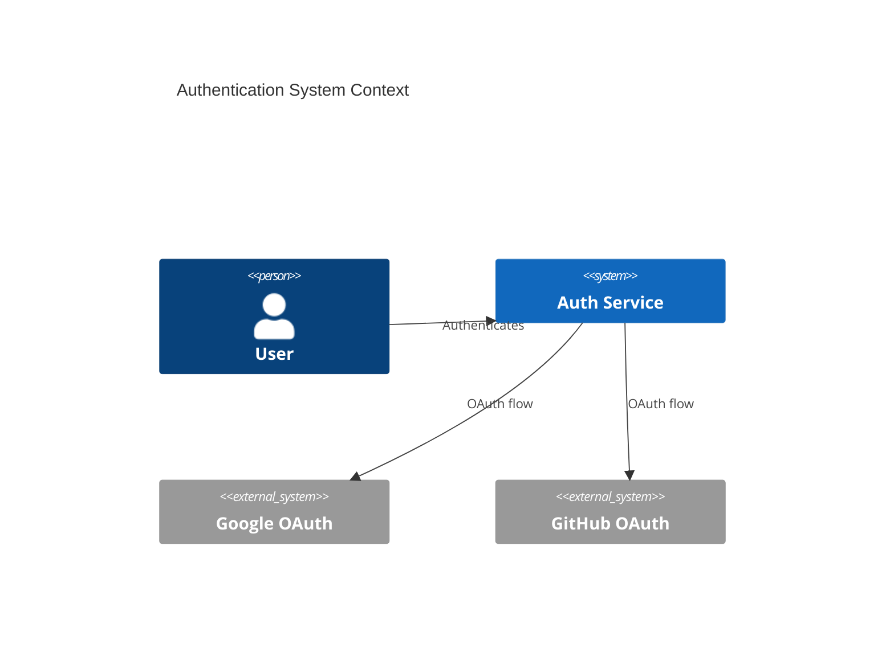

# Full-Stack Feature Orchestrator

## Purpose

Coordinate end-to-end development of a complete feature from initial architecture design through deployment and documentation. This orchestrator ensures consistency, quality, and security at every phase while optimizing model usage for cost efficiency.

**Use when:**

- Building a new user-facing feature
- Implementing complete API + UI workflows
- Need comprehensive testing and documentation
- Require security validation before deployment

---

## Workflow Stages

### Phase 1: Architecture & Design (Opus)

**1. System Architecture:** `system-architect` (Opus)

- **Task:** Create C4 Context and Container diagrams, document architectural decisions
- **Input:** Feature requirements (user stories, acceptance criteria)
- **Output:**
  - `architecture.mmd` - C4 diagrams
  - `ADR-XXX.md` - Architectural Decision Records
  - Component interaction map

**2. API Contract Design:** `contract-architect` (Opus)

- **Task:** Define OpenAPI 3.1 specification with complete schemas and endpoints
- **Input:** Architecture diagrams, component requirements
- **Output:**
  - `api-spec.yaml` - OpenAPI specification
  - Endpoint documentation
  - Request/response examples

**3. Data Schema Design:** `data-architect` (Sonnet)

- **Task:** Create normalized database schema (3NF), define migrations
- **Input:** API specification, data requirements
- **Output:**
  - `schema.sql` - DDL with tables, indexes, constraints
  - `migrations/` - Versioned migration scripts
  - Data model ERD

### Phase 2: UI/UX Design (Sonnet)

**4. Design System:** `design-architect` (Sonnet)

- **Task:** Generate design tokens, component specifications, accessibility targets
- **Input:** Feature mockups, brand guidelines
- **Output:**
  - `design-tokens.json` - Colors, typography, spacing
  - Component specs (variants, states)
  - WCAG 2.1 compliance checklist

**5. Component Architecture:** `experience-engineer` (Sonnet)

- **Task:** Define state management, performance budgets, routing strategy
- **Input:** Design tokens, API contract
- **Output:**
  - Component architecture diagram
  - State management plan (Zustand/Redux)
  - Performance budget (bundle size, LCP, FID)

### Phase 3: Implementation (Haiku)

**6. UI Components:** `interface-artisan` (Haiku)

- **Task:** Build React components with WCAG compliance, Tailwind styling
- **Input:** Design specs, component architecture
- **Output:**
  - `Component.tsx` - Accessible React components
  - `Component.stories.tsx` - Storybook stories
  - Component documentation

### Phase 4: Quality Assurance (Haiku + Opus)

**7. Test Suites:** `quality-engineer` (Haiku)

- **Task:** Generate comprehensive tests (unit, integration, e2e)
- **Input:** Components, API endpoints, business logic
- **Output:**
  - `*.test.tsx` - Vitest unit tests
  - `*.spec.ts` - Integration tests
  - Coverage report (target: ≥80%)

**8. Security Audit:** `security-architect` (Opus)

- **Task:** OWASP Top 10 vulnerability scan, secret detection, dependency audit
- **Input:** Complete codebase, API spec, database schema
- **Output:**
  - `security-audit.json` - Vulnerability report
  - `security-remediation.md` - Fix recommendations
  - Compliance checklist (OWASP 2025)

### Phase 5: Deployment & Operations (Sonnet + Haiku)

**9. CI/CD Pipeline:** `platform-engineer` (Sonnet)

- **Task:** Configure automated deployment with health checks and rollback
- **Input:** Application code, tests, infrastructure requirements
- **Output:**
  - `.github/workflows/deploy.yml` - CI/CD configuration
  - `Dockerfile` - Container definition
  - Health check endpoints
  - Rollback strategy

**10. Documentation:** `knowledge-architect` (Haiku)

- **Task:** Generate API docs, user guides, runbooks, changelog
- **Input:** All artifacts from previous stages
- **Output:**
  - `README.md` - Feature overview
  - `API_DOCS.md` - Endpoint documentation
  - `USER_GUIDE.md` - End-user instructions
  - `RUNBOOK.md` - Operational procedures
  - `CHANGELOG.md` - Version history

---

## Artifacts Produced

### Architecture

- `docs/architecture.mmd` - C4 diagrams (Context, Container)
- `docs/decisions/ADR-XXX.md` - Architectural Decision Records

### API

- `docs/api-spec.yaml` - OpenAPI 3.1 specification
- `docs/API_DOCS.md` - Human-readable API documentation

### Database

- `db/schema.sql` - Complete database schema
- `db/migrations/` - Versioned migration scripts

### Design

- `design/design-tokens.json` - Design system tokens
- `design/component-specs.md` - Component specifications

### Code

- `src/components/*.tsx` - React components
- `src/components/*.stories.tsx` - Storybook stories
- `src/api/*.ts` - API client/server code

### Tests

- `tests/unit/*.test.tsx` - Unit tests (Vitest)
- `tests/integration/*.spec.ts` - Integration tests
- Coverage report (≥80% target)

### Security

- `security/audit-report.json` - Vulnerability findings
- `security/remediation-plan.md` - Security fixes

### Infrastructure

- `.github/workflows/deploy.yml` - CI/CD workflow
- `Dockerfile` - Container configuration
- `k8s/` or `terraform/` - Infrastructure as Code

### Documentation

- `README.md` - Feature overview
- `docs/USER_GUIDE.md` - End-user documentation
- `docs/RUNBOOK.md` - Operational guide
- `CHANGELOG.md` - Version history

---

## Success Criteria

### Architecture

- [ ] C4 diagrams validated (Context + Container levels)
- [ ] All architectural decisions documented in ADRs
- [ ] Component dependencies clearly mapped

### API

- [ ] OpenAPI spec validated (no errors)
- [ ] All endpoints have complete schemas
- [ ] Request/response examples provided

### Database

- [ ] Schema validated (3NF compliance)
- [ ] Migrations tested (up + down)
- [ ] Indexes optimized for query patterns

### UI/UX

- [ ] Design tokens generated
- [ ] All components meet WCAG 2.1 AA
- [ ] Performance budgets defined

### Code Quality

- [ ] Components fully typed (TypeScript)
- [ ] Test coverage ≥80%
- [ ] Linting passes (zero errors)

### Security

- [ ] Zero critical vulnerabilities
- [ ] No hardcoded secrets
- [ ] OWASP Top 10 compliance verified

### Deployment

- [ ] CI/CD pipeline configured
- [ ] Health checks implemented
- [ ] Rollback strategy documented

### Documentation

- [ ] README complete
- [ ] API docs generated
- [ ] User guide written
- [ ] Runbook created

---

## Cost Estimation

| Model      | Stages                                 | Est. Tokens        | Cost (per 1M)         | Total      |
| ---------- | -------------------------------------- | ------------------ | --------------------- | ---------- |
| **Opus**   | 3 (Architecture, Contract, Security)   | ~25,000            | $5 input / $25 output | ~$0.20     |
| **Sonnet** | 4 (Data, Design, Experience, Platform) | ~30,000            | $3 input / $15 output | ~$0.10     |
| **Haiku**  | 3 (Interface, Quality, Knowledge)      | ~20,000            | $1 input / $5 output  | ~$0.02     |
| **Total**  | **10 stages**                          | **~75,000 tokens** | **Mixed**             | **~$0.32** |

**Notes:**

- Costs assume typical feature complexity
- Opus stages are critical decision points
- Sonnet handles complex implementation
- Haiku executes well-defined tasks

---

## Example Execution

### Input

```
Feature: User Authentication with OAuth2

Requirements:
- Login with Google, GitHub
- JWT token management
- Role-based access control (RBAC)
- Session persistence
```

### Stage-by-Stage Output

**Stage 1 (system-architect):**



**Stage 2 (contract-architect):**

```yaml
paths:
  /auth/login:
    post:
      summary: Initiate OAuth login
      parameters:
        - name: provider
          in: query
          schema:
            type: string
            enum: [google, github]
```

**... (continues through all 10 stages)**

---

## Notes

### Dependencies Between Stages

- **Data Schema** depends on **API Contract** (foreign keys, data types)
- **Components** depend on **Design Tokens** (styling consistency)
- **Tests** depend on **Components + API** (integration testing)
- **Deployment** depends on **Security Audit** (block if critical vulns)

### Failure Handling

- **Critical failure:** Stop orchestration (e.g., security audit finds P0 vulnerability)
- **Non-critical:** Log warning, continue (e.g., test coverage 75% instead of 80%)

### Parallel Optimization

Some stages can run in parallel:

- **Stage 3 (Data)** + **Stage 4 (Design)** → Independent
- **Stage 6 (Interface)** + **Stage 7 (Tests)** → Tests can start early

---

**This orchestrator represents the gold standard for full-stack feature development.**
